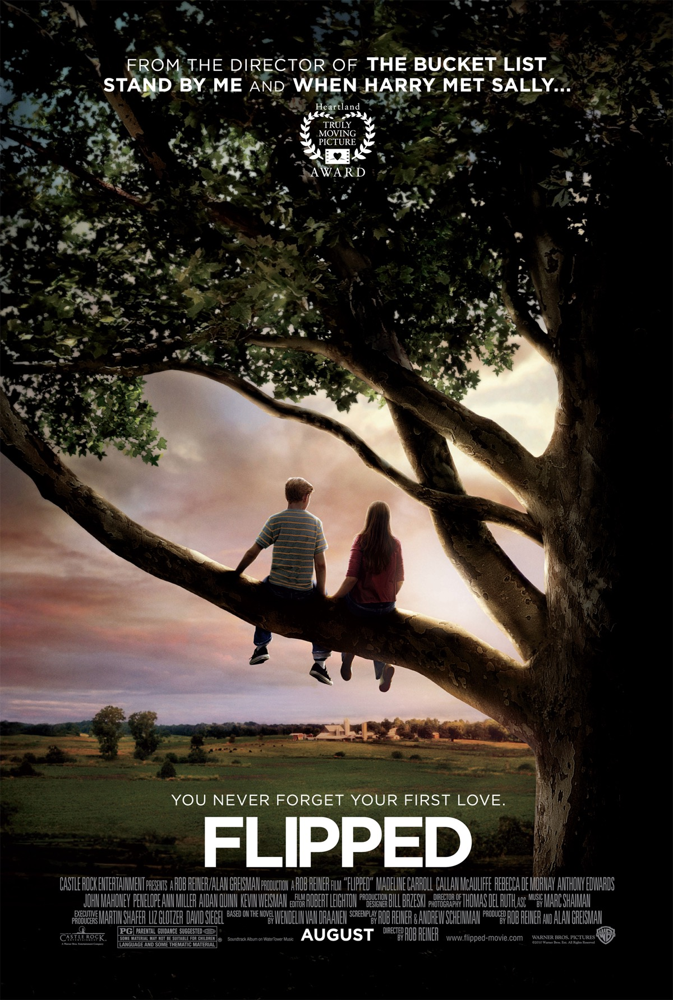

###观后感

一句话总结：

> 这是我看过的最好的爱情片。

我就纳闷为啥外国人花费一点钱就能拍出这么好的电影，而中国动辄几亿的电影却味同嚼蜡，难道是我太弱智，理解不了导演的寓意？？？看了一次太极宗师，差点没把电脑摔了。。。。。。

先上海报：

过年期间看的第一遍，现在已经看过四遍了。我都纳闷为啥这么上瘾。可能就是冲着朱莉贝克去的。就我个人而言，不管你是男生、女生，朱莉贝克绝对能够让你明白一些东西的。

电影的主线是朱莉贝克和布莱斯。主要围绕三件事：梧桐树是圣洁的、她在后院饲养的鸡下的蛋是最卫生的、总有一天她会和布莱斯接吻。

一开始，她只是一个普通的小女孩，折服于邻居布莱斯的“世界上最亮晶晶的眼睛”，憧憬着初吻，甚至在课堂上伸头去问布莱斯头上的“西瓜芬芳”，种种花痴行为可能会让你暗骂脑残：不会又是一部无脑青春校园爱情片吧？？但是如果你接着看，就会发现她的与众不同。身为一个十岁左右的女孩，她已经有意识的开始反省自己，她思考着如果除下布莱斯的眼睛，自己是否还会不会对他那样着迷。虽然她的家庭不富裕，她总是追求不断反省、思考，最终使自己臻于完美。

她会爬上高高的梧桐树眺望远方，试图理解父亲所说的“部分之和大于整体”，然后，她又开始观察布莱斯是否也是这样的。经过一系列的研究自己对布莱斯的感觉，她发现布莱斯除了一双星星般的眼睛，其实就是一个花瓶而已，于是她就放弃了布莱斯。她还决定和父亲去看望智障叔叔，理解爱和家庭的重要。在她那样的年纪，大多数女孩还都做着公主梦呢，而她已经朦胧的感觉到家庭和亲情才是自己真正的依靠，所以，她主动去看望叔叔，要知道，她妈妈可是一次都没有去过。这让父亲非常感动，就像电影里所言：虽然在车上我和爸爸没有说一句话，但无声胜有声。我非常享受那种感觉。而最后，布莱斯在失去了朱莉贝克后，才发现这个女孩是多么的可遇而不可求。可能是受朱莉贝克的影响，他才避免了成为父亲那种外表光鲜，但是内心萎缩的悲剧。他学会了如何自我思考，所以最后才重新赢得了朱莉贝克的认可。

剧中另外一个点睛之笔是布莱斯的祖父，剧中交代，布莱斯的祖父甚至都没有和布莱斯说过几句话，但是却主动和朱莉贝克解决，帮她修缮花园，并和她亲密交谈，这也引起了布莱斯家人的嫉妒。我想布莱斯能明白这些事，也有祖父的功劳，因为他对朱莉贝克的改变是基于祖父说的一段非常有哲理的话：

> Some of us get dipped in flat, some in satin, some in gloss.... But every once in a while you find someone who's iridescent, and when you do, nothing will ever compare.
“有些人浅薄，有些人金玉其外败絮其中。有一天，你会遇到一个彩虹般绚丽的人。当你遇到这个人后，会觉得其他人只是浮云而已。”

另外，韩寒翻译的也相当经典：

> “有人住高楼，有人在深沟，有人光万丈，有人一身锈，世人万千种，浮云莫去求，斯人若彩虹，遇上方知有。”

###经典台词

下面送上几句经典台词作为结尾吧。

* The higher I got, the more amazed I was by the view.
* 我爬得越高，眼前的风景便愈发迷人。
 

* Some days the sunsets would be purple and pink. And some days they were a blazing orange setting fire to the clouds on the horizon. It was during one of those sunsets that my father's idea of the whole being greater than the sum of its parts moved from my head to my heart.
* 有时落日泛起紫红的余晖，有时散发出橘红色的火光燃起天边的晚霞。在这绚烂的日落景象中，我慢慢领悟了父亲所说的整体胜于局部总和的道理。
 

* Sometimes a little discomfort in the beginning can save a whole lot of pain down the road.
* 有时起初的隐忍可以避免一路的疼痛。
 

* The way she talked about what it felt like to be up in that tree to be held above the earth, brushed by the wind. Who in junior high talks like that? This weird feeling started taking over in the pit of my stomach and I didn't like it.
* 她说起那种置身树梢的感觉时说就像被高高举起，微风拂面。哪个初中生会说出这样的话呢？这种怪怪的感觉在我胃里翻腾，我不喜欢这种感觉。
 

* And I realized Garrett was right about one thing: I had flipped. Completely.
* 我意识到加利特一件事是说对了：我心动了。完全心动了。