一直以来都想去云南那边看看，在北京实习的2个多月切身体会了什么叫做“恶劣环境”，所以更激发我去云南的冲动。

因为订了6月2号早上8点多的机票，所以6月1日去新郑同学那住。（PS：郑州大学西亚斯学院真漂亮啊。跟个城堡似的，本土鳖也见识了什么叫做小吃一条街。。）第二天早上痛心花了50大洋到机场。大概11点多到了梦中的云南。

---

#### 第一站——昆明[翠湖、云南大学、陆军讲武堂]

下了飞机，感叹一下昆明长水机场很雄伟的样子。因为在飞机上有介绍云南的书，随便翻了翻，说昆明的翠湖是昆明一大胜地，于是准备下飞机直奔翠湖，问了机场人员后坐了机场大巴到翠湖。早上6点起床后就没吃饭，所以很饿，于是在翠湖边找了个大理小吃，点了传说中的“大理正宗凉粉”：千分希望，万分失望。一直对凉粉无爱，以为云南能给我一个惊喜，结果悲剧收场。之后绕着翠湖瞎转，因为正好小阴天，景色还是不错的。

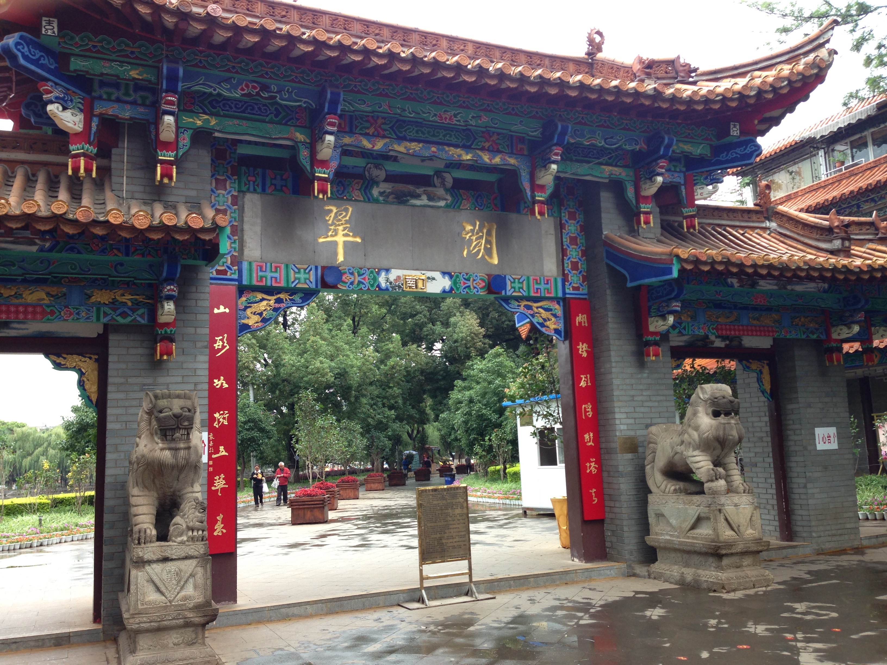

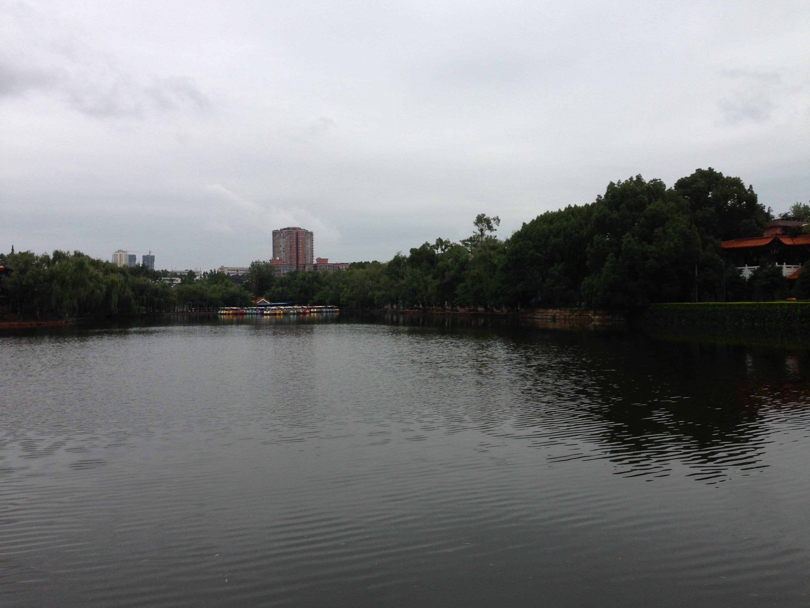

在地图上看离云南大学不远，就直接去了。在门口拍照偶遇一个大叔，于是结伴转云南大学。总体来说，云南大学还是很漂亮的，古韵犹存。我非常喜欢它的花花草草，没有人工修剪的痕迹，透露出一种自然之美。

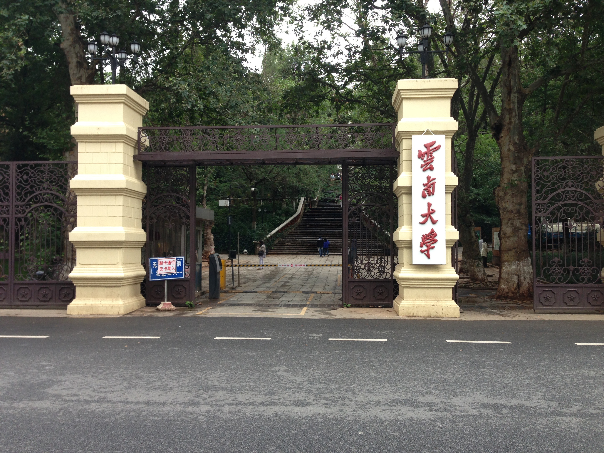

至于陆军讲武堂，我们去的时候好像刚下班？反正就去了里面的操场，那么场馆都没有进去。不过气势还是很刚烈的。我们在里面看了看关于陆军讲武堂的介绍，又围着操场转了几圈，想象着当年在这里发生的事情，小有一点感慨。

到了翠湖的一个小广场，有点累了，就坐那看路人。发现云南人确实生活悠闲的很，走路都不紧不慢，或牵条狗，或遛个鸟什么的。其中一个大概7、8岁的孩子还主动给我表演滑板，竟然让我很不好意思啊- -然后才知道，他竟然是个混血儿，挺意外的际遇。

#### 第二站——丽江[大水车]

早上7点到的丽江，然后和订的俱乐部中的3个长沙mm碰了头。一起打车去丽江古城。由于我们都报了俱乐部，所以就简单去了一下丽江古城的标志性建筑——大水车。

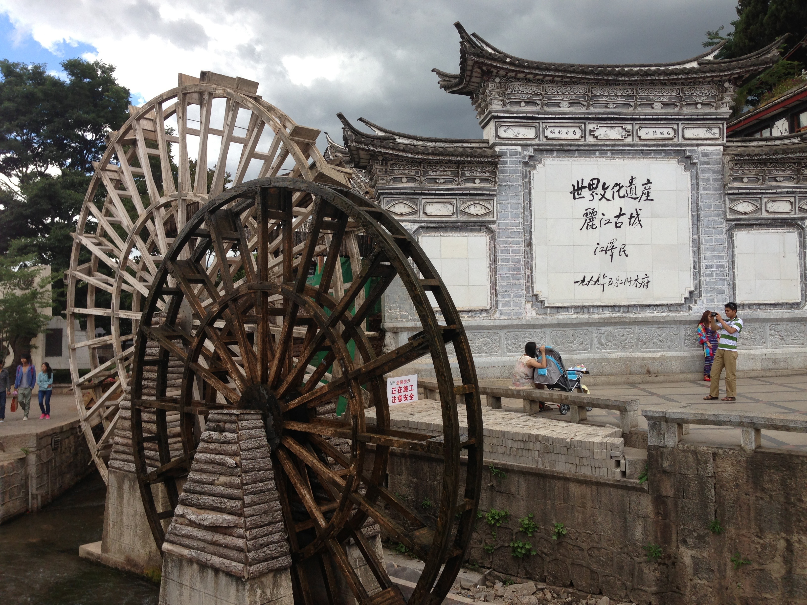

那里人山人海，好不热闹。我们在广场上坐了一会，发现麦当劳的牌子很符合丽江的韵味，于是大家提议一人买一个冰淇淋~本来我不爱吃那玩意的，不忍扫人家的兴，就买了一个。结果，满满的惊喜啊，甜而不腻，非常好吃。这直接导致我后来来丽江古城玩的时候一天买了4个！

丽江一共三座古城：大研古城、束河古城、白沙古城。一般说的丽江古城就是大研古城。大研古城已经商业化了，束河古城就古朴多了，白沙古城没有去，不做评论了。

#### 第三站——德钦【长江第一湾、日照金山、明永冰川、飞来寺】

从早上8点坐车开始，一路上的风光好的不得了。自己都觉得好像做梦，蓝天白云对我来说已经是奢侈的享受了。大概下午1点左右的样子到了”长江第一湾“。

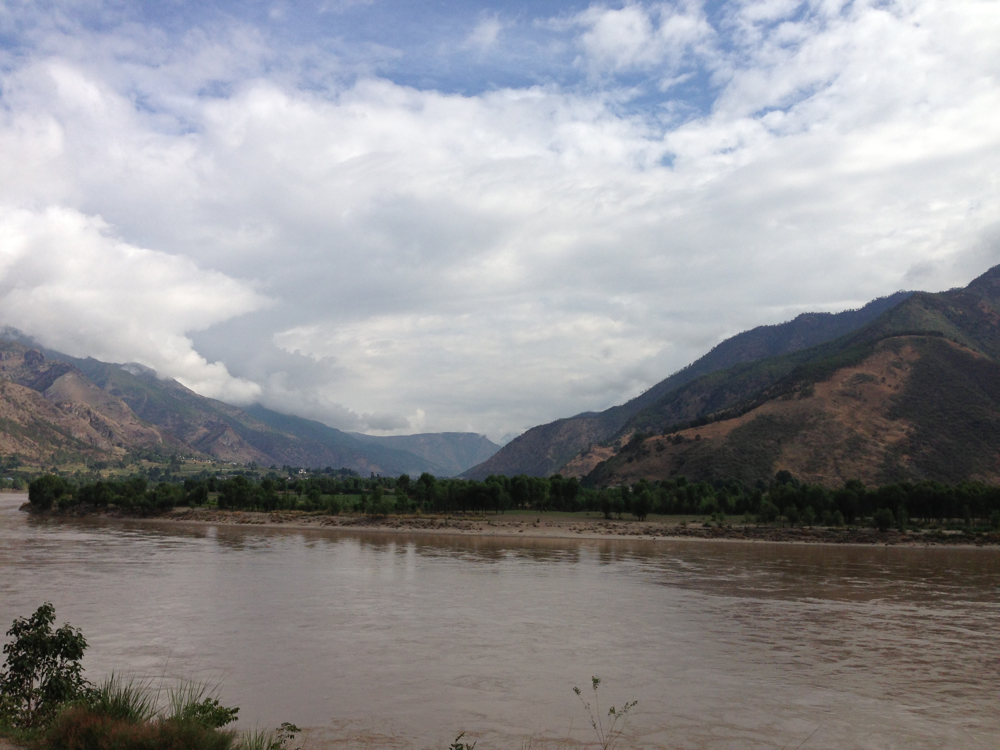

之后住进了飞来寺酒店，晚上吃饭竟然下起了小雨。真是滋润的很啊。然后俱乐部的几个人一起去吃饭，因为我们住的地方是一个很奇特的斜坡街，说实话还是我在城市中第一次见到。因为同行的4个湖南长沙MM，1对广东帅哥美女，1个上海的搞金融的，毕业于四川大学，所以，川菜的赖以高票入围。。。进了一家规模不小的川菜馆，满员！！找到老板后得知还有几桌已经预定了，当时都震惊了啊。我靠，这什么水平？拿出大众点评一搜，评分甩第二的餐馆十八条大马路。只好撤退。进入第二家川菜馆环境还算不错，还有一桌老外呢。结果让老板娘推荐的菜极其不符合偶们的口味，招牌菜酸菜鱼竟然有汽油味，宫保鸡丁我第一次见到了最小块的鸡肉和量最少的回锅肉，大家基本没怎么吃，然后一人40！不能多说，说多了都是泪。

因为晚上不怎么瞌睡，就看了会56的微博江湖，直到12点才睡觉。依稀记得晚上吃完饭不知道谁说了一句明天6点25集合，结果第二天6点就被同房间的那个上海哥们拽起来了，很明显，因为睡眠不足，战斗力全无啊。但是碍于面子我也不好意思说什么，我俩收拾一番就下去了，结果到一楼一看，一个人没有！等了10分钟，还是一个人没有！于是我俩一赌气去吃早饭了。然后看见有一家在卖酥油茶，一问20一壶，不单卖。。只能买了一个小包子，一碗豆浆，一个鸡蛋，必须没吃饱啊。于是我又买了一桶泡面（真有出息！）。然后突然听见有人发出惊叹声，我俩循声一看，日照金山出现了！其实日照金山就是梅里雪山被阳光照到了，这样白色的雪山加上刺目的白光组合一下，对比强烈，非常夺目。我赶忙拿出手机拍了几张照片，但是因为距离太远，所以相片的效果都不太理想。就拍了2、3张照片的功夫，竟然下起了小雨，只能慨叹美好时光总是短暂啊。

因为早上下了点雨，司机竟然说明永冰川没法去了，因为要爬山，路上都是泥，让我们在宾馆打牌。卧槽，我们几千里跑来花钱打牌？？集体抗议后，我们都买了一双迷彩鞋备用。然后就是2个小时的爬山，第一次近距离观察骡子还以为是马呢。后来才知道，分辨骡子和马很容易，马的耳朵一般比较小，而且一般都有齐刘海- -话说路上没有泥，但是骡子屎和尿太尼玛恶心了。全都是啊。。。其中还亲眼目睹一个骡子拉屎和撒尿，气势磅礴，不能多说啊。爬了2个多小时后，终于到达明永冰川了。真不想打击自己，次奥啊，就是一个山尖上有冰而已！我还以为像登喜马拉雅山那样全身装备，中途还要租个羽绒服、氧气瓶什么的= =看来我确实想多了。。。。。不过2个多小时的爬山我还是比较享受的，至少我没有坐骡子！然后在山上的杂货铺看见一只慵懒的猫，我伸手摸它的时候，它盯着我看了几眼，然后就又趴那了，一点不怕人，我一想，这猫的生活确实也太滋润了吧= =

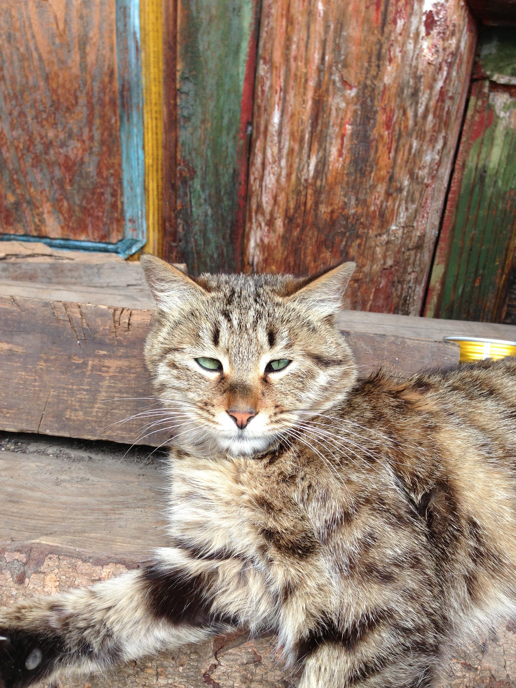

第三天？尼玛，全在车上，去香格里拉。

大概晚上5点多的样子，终于到了香格里拉的独克宗月光古城，先是入住宾馆，之后终于有了个活动，到藏民家家访。一直觉得藏民家肯定特别原始，要体验体验古朴的风情了。结果，毁三观啊！家里建的跟个小别墅似的。进去看了一下照片墙，原来已经商业化很久了，估计和很多旅行团和俱乐部合作过了。之后吃了花卷（原谅我忘了什么名字，但是我肯定那货就是花卷！），还有一些常见的点心。惊喜之处有四：自制酸奶、酥油茶、青稞饼、青稞面、青稞酒。不得不说，酸奶好酸啊~我加了3勺白糖勉强喝下了，但是奶香十足，十分过瘾。之后是酥油茶，味道特别香醇，一连喝了2杯，爽！之后主人端来了青稞面，哎，由于我不喜欢面条，所以没什么兴趣，但是尝过之后发现味道还是不错的，不过可能是因为我饿了，不多做评论。之后根据主人的说法，藏民的习俗就是请客人喝3杯青稞酒，迫于压力，偶强忍着喝了3杯，然后基本就算结束了。说是去藏民家访，其实真的只是单纯的吃个饭而已，其他什么都没有，俱乐部提到的唱歌、跳舞纯属扯淡。回到酒店几分钟偶就不省人事了。

第二天一大早，我们去了传说中的拉帕海骑马。由于个人对这类骗人的活动嗤之以鼻，加上本来就是穷游，最便宜的1个小时380的骑马也坐不起= =，然后就和马场旁边的本地居民侃大山，虽然他的话听不太懂，但是聊了一些当地人的生活和他们的趣事，也算是不枉此行了。 之后骑马的同伴回来后全部抱怨老板的话全是放屁，说什么格桑花开的十分灿烂的都是假话，其实根本就是零零星星的开了几朵花而已，我偷偷的幸灾乐祸了一下，呵呵。

之后我们又坐了1个多小时的车到达了虎跳峡，先简单的吃了饭，印象中有个树皮炒鸡蛋，没什么味道，就是感觉这也能做成菜，太奇葩了。

时至中午，虎跳峡人满为患。但是不得不说，这次虎跳峡确实物超所值。又一次感觉被大自然的力量所震慑。当我在护栏上看着奔涌而至的江水，我第一次感到自己在大自然面前时如此卑微。以前觉得江河湖海没什么可怕的，只要会游泳，一切就是浮云，但眼前之境让我淡定了，只要下水，必死！然后我在回去的路上就有了一丝感悟：人啊，真的不要自不量力~满招损，谦受益。

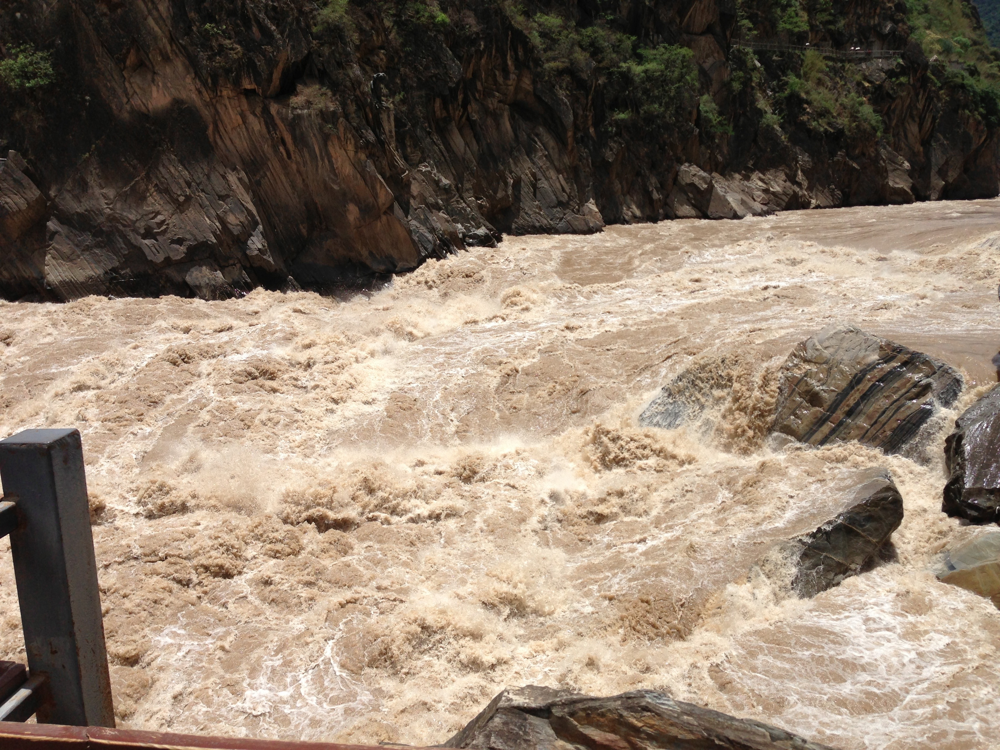

游玩过虎跳峡，我们4天的俱乐部也算是结束了，我们到达丽江古城门口就解散了。结束这还算紧张的旅程后，我决定在丽江好好休养一番，下午先到了先前定好的束河古镇的一个青年旅社。

#### 第四站——丽江[束河古镇、木府、狮子山公园、黑龙潭公园]

说真的，第一次住青年旅社，各种涨姿势啊。首先我非常喜欢青年旅社的氛围，大家都是背包客，来自五湖四海，年龄相仿（30+的人谁会住上下铺？），话题也比较多。我感觉自己非常幸运，第一次住就碰到一个主动搭讪的哥们。名字我还记得住：吴淑代，是一个离职的推销员，喜爱旅行。他给我介绍了一下丽江的基本情况和这里居住的人都有什么爱好，比如丽江这边以胖为美，男女之间以胖金妹、胖金哥尊称……让我瞬间信息量暴增。然后我俩先是去尝了早有耳闻的“水性杨花”和“腊排骨”，水性杨花这么妩媚的名字真是招摇，其实是丽江的一种特色植物，吃起来味道清淡醇香，非常可口。至于腊排骨，我真没觉得和普通排骨有什么大的不同，倒是火锅中的红萝卜和土豆块别有一番风味！

吃过饭之后，我俩又出去走走，看到特色的小店就进去看看，他说要给妹妹买点纪念品，于是我俩挑了几家最终选择了一对孔雀耳坠，真心非常漂亮，而且价格也没公道，比丽江古城便宜了一半~之后又随便逛了几家，比如卖佛器的，卖围巾的，还有卖云南小粒咖啡什么的。不知不觉，竟然转到了篝火晚会现场，本地人和游客一起跳舞，特别欢乐。于是我拉上吴淑代也跳了一会，感觉非常好。

之后我俩又逛了极其出名的酒吧街，哎，真是热闹非凡啊。各种古典的、现代的、摇滚的，一应俱全，因为酒吧街中间正好有一条小河，所以环境非常赞。可惜本人不爱喝酒+囊中羞涩，就只是感受了一下气氛而已。沿途也逛了好几个超搞的小店，比如至今单身，里面的东西都特别好玩，于是偶偷拍了N张留念~走到在青龙桥下，忽然看到网上很多人都说好的丁丁酸奶，于是果断叫上吴淑代去试一下，而且刚好下着小雨，我俩在露天雅座中吃着爽口的酸奶，真是幸福啦。。

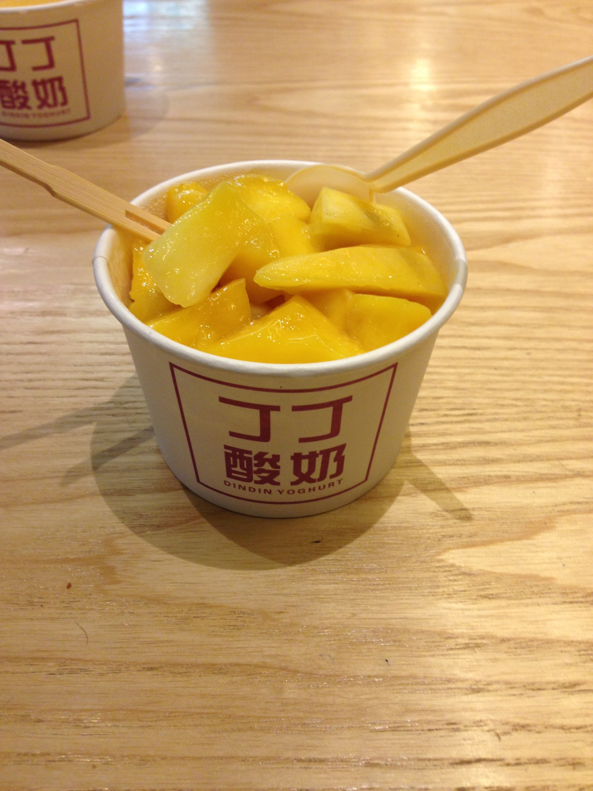

由于都是第一次住在束河古镇，我俩在绕了七七四十九圈之后终于回到了青年旅社。。在楼下的布置的很精致的小院里，坐在秋千上逗逗老板的那只大狗（原谅我不知道是什么品种- -），真是享受啊。PS：丽江好多好多店都养狗，各式各样的，而且都特别漂亮，每过一家我都想进去摸摸它们。。。由于和吴淑代玩的太嗨皮，晚上竟然兴奋的睡不着觉。依稀记得最后一次看表已经2点多了。

早上一睁眼，我考，10点半！赶紧退房去。。。说起这事真是悲催，我确实很喜欢这家店的，但是由于只订了一晚，房间又满了。所以只好byebye，当我回去找吴淑代的时候才发现他已经去丽江古城拍照了，我明明在洗脸时看见他下去了，却没有喊他，真是后悔！于是我去了下家，豆米青年旅社，说实话，对它的评价不好。老板和员工有点小别扭，对客人不理不睬的，同住的一个哥们跟他搭话也是一副不情愿的样子，于是匆匆睡觉作罢，第二天早上一早就起来退房撤了。

出来后，我没有看路标，而是想随性看看这座尚未商业化的小镇。于是我专挑人少的路走，还挺幸运，见到了用棒槌敲打衣服的胖金妹，见到了在给花浇水的小女孩，见到了一边唱歌一边清理水中浮萍的老大爷，见到了穿着特色服装坐在小马扎上纳鞋底的纳西族阿婆……所有的这些，都让我流连忘返，我不由感叹，生活的快乐也许就是这么简单吧。

下午我到达了丽江古城，先是去小吃街上吃了特色的乳扇、黑山羊肉串等，别有一番风味。然后我依次去了木府、狮子山公园、黑龙潭公园，其中值得一说的就是木府了。

木府是吐蕃居住的地方，通俗来说，吐蕃就是一个地方的老大，我估计应该属于省长级别。主要观赏了木府的布局以及它们各自建造的历史。我也由此发现，古代人真的是特别讲究风水的。整个木府的建造就是在“风水大师”的占卜后修建而成的。简单的说，木府主要分为三大部分：接待宾客、吐蕃办公、生活园区。每个部分都建造的很有特色，有图片为证。

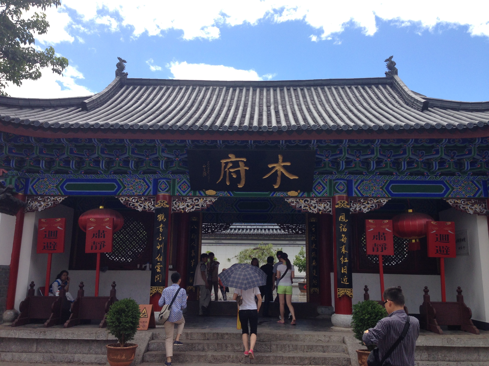

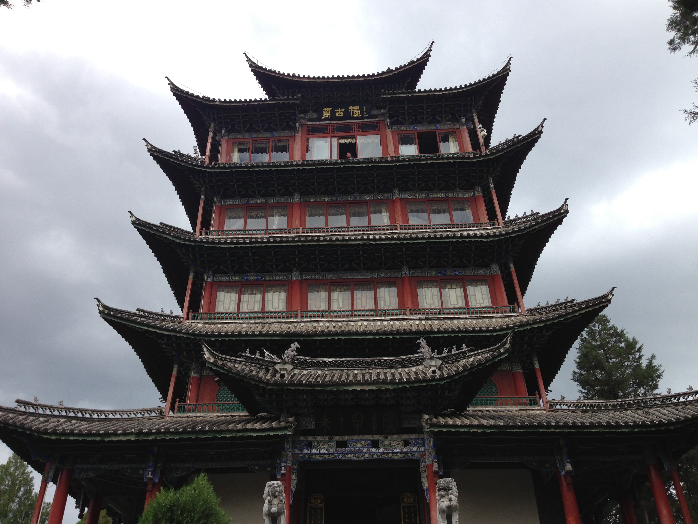

其中有一个小插曲非常搞笑啊。木府每15分钟左右就会有导游召集一群人游览木府，我那拨大概15个左右吧。在山脚下，设有一个免费的茶棚，可以免费喝茶，如果感兴趣的话，可以当场买走茶叶，而且有很大的优惠。但是人家泡了3大户差让我们品尝，然后又吧唧吧唧介绍了10分钟，最后竟然没有一个人买。我起身的时候听到那个泡茶人说，你们这些人真不懂享受啊，没一点情调。我乐了老半天，哈哈。

#### 第五站——大理[三塔、蝴蝶泉、骑行环洱海、双廊]

在丽江玩过之后，坐火车到了大理，大概是晚上8点的样子。然后就坐车去网上定好的客栈，然后我被大理的公交车震慑了。尼玛，开到半路，司机把车开到公司，自己下班了。。让一车人等另外一个司机接班，我当时想，这公交公司太牛逼了，这么干乘客也愿意？然后我们一车人苦逼的等了快10分钟，上来一个人，以为要走了。。结果，她打开钱箱子，把钱收光之后，转身下车了！！我和小伙伴都惊呆了！~这句话太适合这个场景了。然后过了大概5分钟，才来一个大叔开车。总的来算，我们等了15分钟，还算靠谱。另外值得吐槽的是，票价是1.5，对，你没看错。我顿时服气的不行~最后一个吐槽，车上没有报站的，到了哪一站车上也没有个提示，还好旁边坐个大妈，算是问明白还有多少站。。最后，最后，我准确的下车了，万幸~~~~~

到了印象客栈，酒吧风格，环境不错。老板娘是东北的，神侃了一番还请我吃了西瓜，嘿嘿。当时9点多了，也饿了，就出去找吃的。看见了传说中的饵丝米线，结果一问，卖光了。。没办法，继续找，看见路边一个小摊，叫做瑞丽菜馆。我进去一看，真瑞丽啊。统共就2个桌子，老板娘蛮漂亮，老板嘛，目测最少250+的重量级选手，最奇葩的是他在打CF，而且是我最鄙视的挑战模式，顿时来了兴致，站他背后看。老板娘负责切菜，他负责掌勺。巨搞笑的是，他正打呢，老板娘叫他了，他竟然说等会！老板娘一般愤怒，过来啥也不说，直接揪着耳朵拖过去了，我心想，够爷们啊~呵呵。不过说实话，这小哥炒的菜是我来云南吃的最爽的一次了。

吃完饭我就回去了，结果到房间一看，竟然多了个女生。（PS：我专门挑的混合宿舍，我没住过，想尝试一下。）一问，是四川乐山的。来大理一个半月了，晒的好黑- -，在一个幼儿园当老师。本来我打算第二天起来后按照在百度搜的“大理一日游”玩一圈，结果她说，她对大理熟悉的不行，正好她第二天也想出去玩，我俩一拍即合，说第二天租两辆山地车出去骑行， 然后我就去洗洗澡睡觉了。

第二天7点半吧，我俩先去买了包子当早餐，味道还不错。然后我俩去了租车的地方，一问，我去，好便宜啊。旧一点的山地车10元一天！我俩果断一人租了一辆上路。我租的是一辆26的GIANT山地车，骑上去小不舒服，座椅不习惯，但是心情还是不错的。我们决定先去三塔看看，骑了不到20分钟，就到了门前，结果。。。我的车变速器那点的塑料支架断了，于是悲催的搞了半天还是不行，就打电话给老板让过来给换辆车，等了20分钟左右，老板给换了一辆车，于是再次出发。到了三塔感觉一般般吧，就是3个孤零零的塔在那罚站，拍了照片就溜了。（丢人啊，3个塔我都没照全。。。。）

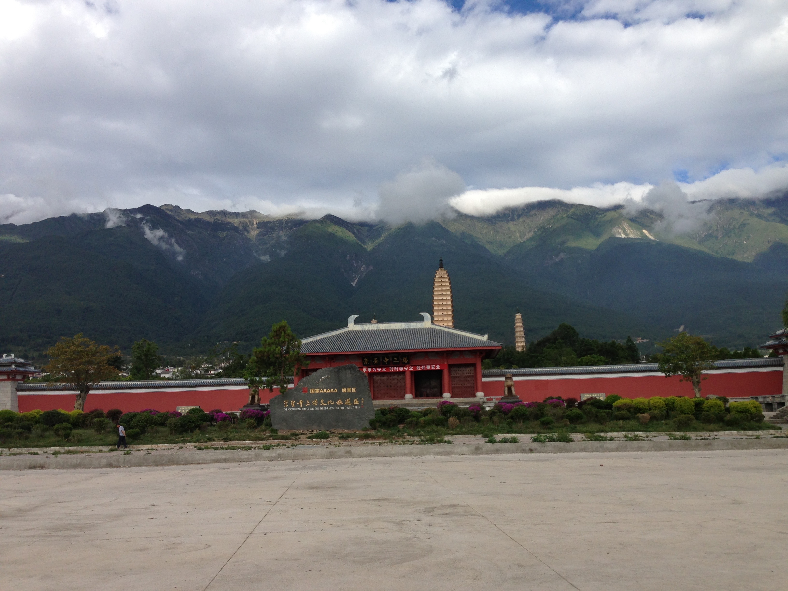

然后又骑了半个小时到了蝴蝶泉，因为四川妹子不想掏钱进去，于是我们就在门口看了一下就继续前进了。话说蝴蝶泉在网上的图片还是很漂亮的，有一个很大的蝴蝶雕刻，等有机会了再去见识见识吧。

不得不说，接下来这一路是相当的爽，因为天气好的不行，既不热，也不阴，路边绿油油的稻田，辽阔的洱海，都让人赏心悦目。不多说，先上一张照片，嘿嘿

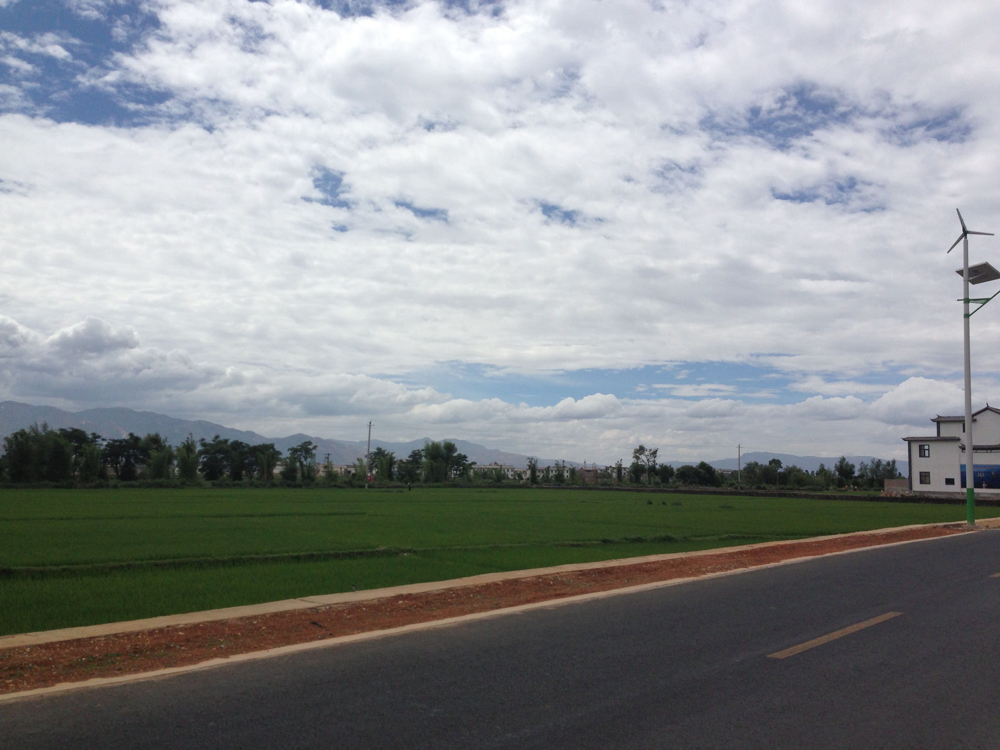

我俩骑了有4个小时，结果还有10多公里。又因为车座不太爽，都觉得屁股疼的很。于是就在路边坐了一会，慢慢的，太阳出来了。于是我俩决定一鼓作气，骑了又大概半个小时的样子，到了洱海最宽的地方，作为一个24K纯土鳖，真没见过一望无际的大海，于是激动的喊住她，下车感受了老半天才依依不舍的上路。等到了传说中美得跟天堂似的双塘镇门口，内心一声高喊：草！我终于来了！！于是俩人使劲蹬车。

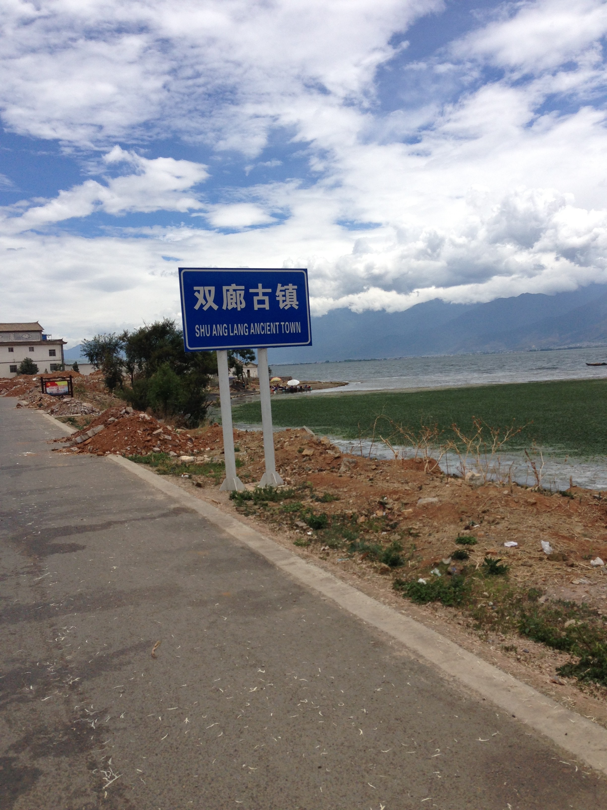

但是越走越觉得不对劲啊，路上全是土，而且街道上冷清的很，没有几个人。由于累得不行，就在一个小超市买了冰淇淋解渴，一问老板，心都碎了。老板说，现在是双廊淡季，基本上都在整修呢。我俩骑着车骑了10分钟，我勒个去啊，路上都是土，80%的店都是关门或者装修的。。。我说那咱们先吃饭吧，于是找了大众点评上推荐榜第一的那家去吃，不多说了，什么玩意嘛，还不如我在学校食堂吃的好呢，真是无语死了。

当时天热的不行，头上的大太阳把我们照的睁不开眼，于是我说还是坐车回去吧，要是骑过去估计屁股就开花了。她估计也受不了了，于是我俩打听到离吃饭不远的地方有公交车，3点发车，好像就一班。于是我俩就赶紧结账撤退了。到了地方，一问一个人25，觉得贵了，这四川妹子性子急，非要跟大叔砍价，结果那大叔竟然生气了，说你们再砍价的话，多少钱都不拉，囧的要死- -最后没办法，只好妥协了，然后大叔才和气的跟我们说，我们这一趟下来也够不容易的，而且我们是成年出车的，不可能宰你们，放心吧。于是我们就耐心的等着车调头。不过不得不再吐槽一下，坐车那也是的，堵的不行，公交车调一个头竟然用了半个小时。。。把我俩快晒成炭了~~~

上车后发现车上的人基本都是当地的，一路上也算欢乐，不过大叔以为四川妹子是我女朋友，一直问我是不是老受她欺负，我解释半天说不是他竟然以为我害羞不敢承认，还一直说，让我很尴尬，四川妹子估计也察觉了，于是就转头看风景+睡觉~然后我就跟大叔有一句每一句的乱侃大山。大概2个小时左右终于到了，天热的不行，买了一个西瓜、梨、荔枝就回客栈休息了。因为四川妹子第二天要上班，我俩就准备还车子之后吃顿饭告别。之后发生了一件非常不愉快的事，就不多说了。

第二天早上起床坐车去昆明，又在昆明小转了一个晚上，第二天就飞回家了。这趟云南之行就这样结束了，很是怀念~以后有机会还会再去的。