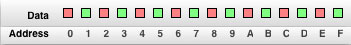
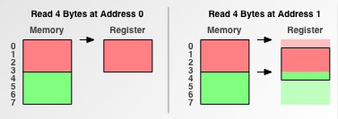
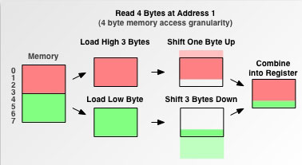

###一、思考代码


#include<iostream>
using namespace std;

struct st1{
    char a;
    int b;
    short c;
};

struct st2{
    short c;
    char a;
    int b;
};

int main(){
    cout<<"sizeof(st1) is:"<<sizeof(st1)<<endl;
    cout<<"sizeof(st2) is:"<<sizeof(st2)<<endl;
    return 0;
}


先自己思考一下，然后再看答案：


sizeof(st1) is:12
sizeof(st2) is:8


问题出来了，这两个一样的结构体，为什么sizeof的时候大小不一样呢？

本文的主要目的就是解释明白这一问题。

###二、内存对齐原理

对于大多数的程序员来说，内存对齐基本上是透明的，这是编译器该干的活，编译器为程序中的每个数据单元安排在合适的位置上，从而导致了相同的变量，不同声明顺序的结构体大小的不同。那么编译器为什么要进行内存对齐呢？程序1中结构体按常理来理解sizeof(st1)和sizeof(st2)结果都应该是7，4(int) + 2(short) + 1(char) = 7 。经过内存对齐后，结构体的空间反而增大了。

首先我们来看一下内存对齐的规则：

* 对于结构的各个成员，第一个成员位于偏移为0的位置，以后每个数据成员的偏移量必须是min(#pragma pack()指定的数，这个数据成员的自身长度) 的倍数。
* `#pragma pack(n)` 表示设置为n字节对齐。（VC默认8字节对齐）
* 在数据成员完成各自对齐之后，结构(或联合)本身也要进行对齐，对齐将按照#pragma pack指定的数值和结构(或联合)最大数据成员长度中，比较小的那个进行。

以程序1为例解释对齐的规则：

* St1 ：char占一个字节，起始偏移为0 ，int 占4个字节，min(#pragma pack()指定的数，这个数据成员的自身长度) = 4（VC6默认8字节对齐），所以int按4字节对齐，起始偏移必须为4的倍数，所以起始偏移为4，在char后编译器会添加3个字节的额外字节，不存放任意数据。short占2个字节，按2字节对齐，起始偏移为8，正好是2的倍数，无须添加额外字节。到此规则1的数据成员对齐结束，此时的内存状态为（x表示额外添加的字节）:

> oxxx|oooo|oo
> 
> 0123 4567 89 （地址）

共占10个字节。还要继续进行结构本身的对齐，对齐将按照#pragma pack指定的数值和结构(或联合)最大数据成员长度中，比较小的那个进行，st1结构中最大数据成员长度为int，占4字节，而默认的#pragma pack 指定的值为8，所以结果本身按照4字节对齐，结构总大小必须为4的倍数，需添加2个额外字节使结构的总大小为12 。此时的内存状态为：

> oxxx|oooo|ooxx
> 
> 0123 4567 89ab （地址）

到此内存对齐结束。St1占用了12个字节而非7个字节。

###三、内存对齐的作用

* 平台原因(移植原因)：不是所有的硬件平台都能访问任意地址上的任意数据的；某些硬件平台只能在某些地址处取某些特定类型的数据，否则抛出硬件异常。
* 性能原因：经过内存对齐后，CPU的内存访问速度大大提升。具体原因稍后解释。

图一：

这是普通程序员心目中的内存印象，由一个个的字节组成，而CPU并不是这么看待的。

图二：

CPU把内存当成是一块一块的，块的大小可以是2，4，8，16字节大小，因此CPU在读取内存时是一块一块进行读取的。块大小成为memory access granularity（粒度） 本人把它翻译为“内存读取粒度” 。

假设CPU要读取一个int型4字节大小的数据到寄存器中，分两种情况讨论：

* 数据从0字节开始
* 数据从1字节开始

图三(再次假设内存读取粒度为4)：

* 当该数据是从0字节开始时，很CPU只需读取内存一次即可把这4字节的数据完全读取到寄存器中。
* 当该数据是从1字节开始时，问题变的有些复杂，此时该int型数据不是位于内存读取边界上，这就是一类内存未对齐的数据。

图四：

此时CPU先访问一次内存，读取0—3字节的数据进寄存器，并再次读取4—5字节的数据进寄存器，接着把0字节和6，7，8字节的数据剔除，最后合并1，2，3，4字节的数据进寄存器。对一个内存未对齐的数据进行了这么多额外的操作，大大降低了CPU性能。

这还属于乐观情况了，上文提到内存对齐的作用之一为平台的移植原因，因为以上操作只有有部分CPU肯干，其他一部分CPU遇到未对齐边界就直接罢工了。