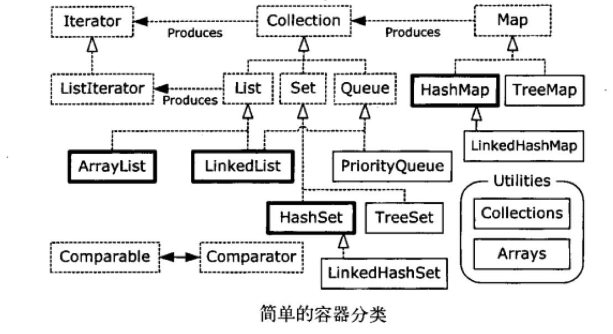

###本章主题

其实从目录结构我们就知道，这一章是讲JAVA的数据结构的。在日常使用中，这些容器类的使用非常频繁，但是能站在一定高度上认知它们的原理，就会理解的更深。回忆了一下，目前使用最频繁的有HashMap、ArrayList、Queue、Set。

首先我们看一下Java容器的整体架构图：



如果要深刻理解Java容器，我认为有几点需要掌握：

1. 哪些是接口，哪些是实现
2. 容器和迭代器的关系（要注意，迭代器是一个不得已的轮子，要理解它的缺点，然后才是优点）
3. 常用容器（ArrayList/HashMap/TreeMap/HashSet/LinkedList）等的底层实现
4. 是否是线程安全
5. 有什么设计不合理的地方（比如List已经被喷无数次了，要总结一下）

从本质来说，Java容器一共分为两大类（因为数组不能调整大小，所以很多情况下不适应；但是数组也广泛存在在已知大小的情境中）：

1. Collection：独立元素的序列，符合一条或者多条规则（比如Queue是FIFO，Stack是FILO等等，Set不能有重复元素）。**所有单元素容器都implements Collection接口**
2. Map：一组成对的“键值对”对象，允许使用键来查找值

###1. 一个tips

在平常代码中，不能因为接口而使用接口。虽然面向接口编程有一定的好处，但是接口无法调用实现类新增的方法。就好像```List<Apple> appleList = new ArrayList<Apple>();```，虽然我们以后重构可以马上改为```List<Apple> appleList = new LinkedList<Apple>();```，但是LinkedList在List基础上添加了方法，而这是List引用无法调用的。所以，不同的场景下有不同的用法。

###2. 关于容器中添加一组元素

在java.util包中的Arrays和Collections类中有很多使用方法，可以在一个Collection中添加一组元素。

* Arrays.asList()方法接受一个数组或是一个用逗号分隔的元素列表（使用可变参数），并将其转换为一个List
* Collections.addAll()方法接受一个Collection对象以及一个数组或是一个用逗号分隔的列表，将元素添加到Collection中
* Collection.addAll()方法只接受Collection对象

这个也算是常见操作，比如我定义一个数组发现不够用了，于是我新建一个大的，把原来的元素添加进去。但添加元素也有一定的讲究，比如Arrays.asList。这个方法的限制在于**它对所产生的List的类型做出了最理想的假设，而并没有注意程序员赋予它什么样的类型**，而这就会出现问题：


package Chapter11;

import java.util.*;

class Snow{}
class Powder extends Snow{}
class Light extends Snow{}
class Heavy extends Snow{}
class Crusty extends Snow{}
class Slush extends Snow{}

public class AsListInference {
	public static void main(String[] args) {
		//在这里，Arrays.asList返回一个List。但是这个List中的元素不是我们想要的Snow，而是
		//最后一个元素的类型。也就是说返回的是一个List<Powder>类型
		List<Snow> snow1 = Arrays.asList(new Crusty(), new Slush(), new Powder());
		
		//不能编译的代码
		List<Snow> snow2 = Arrays.asList(new Light(), new Heavy());
		
		//Collections.addAll()不会报错
		List<Snow> snow3 = new ArrayList<Snow>();
		Collections.addAll(snow3, new Light(), new Heavy());
		
		//如何解决不能编译的问题
		List<Snow> snow4 = Arrays.<Snow>asList(new Light(), new Heavy());
		
	}
}


很囧的是，书上的例子和我的结果不对。。我估计是jdk的版本不一致吧，记得有次switch()参数问题就是因为我使用的是jdk1.7才添加的，而线上环境使用的是jdk1.6。

###3. List

**List承诺可以将元素维护在特定的序列中。**List是一个接口，它implements了Collection接口，并且在它的基础上添加了大量的方法。使得**可以在List的中间插入和移除元素**（看下源码的结构就非常清晰了）。有两种类型的List：

1. ArrayList：长于随机访问元素，劣于在中间插入/删除较慢
2. LinkedList：长于通过较低的代价在List中间插入/删除，并提供了更多的特性集。劣于在随机访问速度较慢

下面是对ArrayList的简单使用：


package Chapter11;

import java.util.*;

public class Exercise05 {
	static Random random = new Random(47);

	public static void main(String[] args) {

		List<Integer> ints = new ArrayList<Integer>(Arrays.asList(1, 2, 3, 4, 5, 6, 7));
		System.out.println("1:" + ints);

		Integer integer = new Integer(10);
		// 自动扩充容量至8
		ints.add(integer);
		System.out.println("2:" + ints);
		System.out.println("3:" + ints.contains(integer));

		ints.remove(integer);
		Integer integer2 = ints.get(2);
		System.out.println("4:" + integer2 + " " + ints.indexOf(integer2));
		
		Integer integer3 = new Integer(20);
		System.out.println("5:" + ints.indexOf(integer3));
		System.out.println("6:" + ints.remove(integer3));
		
		System.out.println("7:" + ints.remove(integer2));
		System.out.println("8:" + ints);
		
		ints.add(3, new Integer(16));
		System.out.println("9:" + ints);
		
		List<Integer> sub = ints.subList(1, 4);
		System.out.println("subList: " + sub);
		System.out.println("10:" + ints.containsAll(sub));
		
		Collections.sort(sub);
		System.out.println("Sorted subList: " + sub);
		
		//跟顺序无关，只要元素全部包括就行
		System.out.println("11:" + ints.containsAll(sub));
		
		Collections.shuffle(sub, random);
		System.out.println("Shuffled subList: " + sub);
		System.out.println("12" + ints.containsAll(sub));
		
		List<Integer> copy = new ArrayList<Integer>(ints);
		System.out.println("copy: " + copy);
		sub = Arrays.asList(ints.get(1), ints.get(4));
		System.out.println("sub: " + sub);
		//retainAll就是把sub中不含有的元素从copy中全部删除
		copy.retainAll(sub);
		System.out.println("13:" + copy);
		
		copy = new ArrayList<Integer>(ints);
		copy.remove(2);
		System.out.println("14:" + copy);
		//removeAll就是把sub中含有的元素从copy中全部删除。和retainAll的作用正好相反
		copy.removeAll(sub);
		System.out.println("15:" + copy);
		
		copy.set(1, new Integer(22));
		System.out.println("16:" + copy);
		
		//从中间插入一个List。这个操作对于ArrayList来说效率很低
		copy.addAll(2, sub);
		System.out.println("17:" + copy);
		
		System.out.println("18:" + ints.isEmpty());
		ints.clear();
		System.out.println("19:" + ints);
		System.out.println("20:" + ints.isEmpty());
		
		ints.addAll(Arrays.asList(33, 44, 55, 66));
		System.out.println("21:" + ints);

		//默认转换为Object数组
		Object[] o = ints.toArray();
		System.out.println("22:" + o[3]);
		
		//转换为指定大小的数据，但如果ints为4个元素，你指定的数组<4，那么toArray会
		//创建一个具有合适尺寸（4）的数组
		Integer[] in = ints.toArray(new Integer[5]);
		System.out.println("23:" + in[3]);
		
	}
}/*output:
1:[1, 2, 3, 4, 5, 6, 7]
2:[1, 2, 3, 4, 5, 6, 7, 10]
3:true
4:3 2
5:-1
6:false
7:true
8:[1, 2, 4, 5, 6, 7]
9:[1, 2, 4, 16, 5, 6, 7]
subList: [2, 4, 16]
10:true
Sorted subList: [2, 4, 16]
11:true
Shuffled subList: [4, 2, 16]
12true
copy: [1, 4, 2, 16, 5, 6, 7]
sub: [4, 5]
13:[4, 5]
14:[1, 4, 16, 5, 6, 7]
15:[1, 16, 6, 7]
16:[1, 22, 6, 7]
17:[1, 22, 4, 5, 6, 7]
18:false
19:[]
20:true
21:[33, 44, 55, 66]
22:66
23:66
*/


###4. 迭代器

这个也算是非常常用的东西。以前在学内部类的时候碰到一个类似的例子。就是迭代器是一个接口，每个容器在自己的内部实现一个private或者匿名的implements 迭代器接口（或者是extends迭代器接口的接口，比如ListIterator接口）内部类。这样客户端程序员就有了统一协议的迭代器去遍历容器。既保证了通用，也保证了安全。所以，**迭代器是一种设计模式**。

记住Java中，Iterator只能单向移动（ListIterator是双向的），而且只能用来：

1. 使用方法iterator()要求容器返回一个Iterator。Iterator将准备返回容器的第一个元素
2. 使用next()获得序列中的下一个元素
3. 使用hasNext()检查序列中是否还有元素
4. 使用remove()将迭代器新近返回的元素删除

一个简单的例子：


package Chapter11;

/**
 *  @author niushuai
 * 
 *   容器的iterator()要求容器返回一个Iterator。Iterator将准备好返回容器的第一个元素
 *   所以在最后一个for循环前要重新定位it的位置，因为第一次while迭代后it已经指向了最后
 *   一个元素了
 */

import java.util.*;

public class SimpleIteration {
	public static void main(String[] args) {
		List<Integer> ints = new ArrayList<Integer>(Arrays.asList(1, 2, 3, 4, 5, 6, 7, 8, 9, 10, 11, 12));
		Iterator<Integer> it = ints.iterator();
		
		while(it.hasNext()) {
			Integer i = it.next();
			System.out.print(i + " ");
		}
		System.out.println();
		
		for(Integer i : ints) {
			System.out.print(i + " ");
		}
		System.out.println();
		
		it = ints.iterator();
		for(int i = 0; i < 6; i++) {
			it.next();
			it.remove();
		}
		System.out.println(ints);
	}
}


如果我们认真思考会发现，```Iterator<Integer> it = ints.iterator();```将准备返回第一个元素。而在while循环中，it.next()获得序列的下一个元素，也就是第二个元素。那第一个元素去哪里了？？？带着这个疑问，google了一下：

> 迭代器只是一个位置，它指向的是元素的首地址。初始化的时候，它指向的是容器第一个元素的起始地址，hasNext先判断这个位置后面是否有元素，有的话，调用next()。而next()方法**用于将游标移至下一个元素的是起始地址，它返回的是所越过的哪个元素的引用**。意思就是它从第一个元素的起始地址移动到第二个元素的起始地址，越过的是第一个元素。所以返回的就是第一个元素的引用。

我是从这篇文章弄懂的：[遍历聚合对象中的元素——迭代器模式（五）](blog.csdn.net/lovelion/article/details/9992799)

###5. Set

Set不保存重复的元素，它的最重要用途是**查询归属性，即某个元素是否存在**。所以，在需要元素唯一性的场合，使用set更佳。

常用的Set有：

1. HashSet：通过散列函数
2. TreeSet：通过红黑树，排序嗖嗖的
3. LinkedHashSet：使用了链表来维护元素的插入顺序

知道这些之后，我们就可以选择使用哪种Set了吧：普通使用HashSet即可；结果排序就用TreeSet；既需要查询、又需要保持插入顺序就用LinkedHashSet。

###6. Map

这玩意在我们项目中用的是最多的了，几乎所有重要的数据都是存在HashMap中了，速度快是第一要求。虽然Map的用法极其简单，但前不久刚因为HashMap的非线程安全被坑了一次，所以还是好好看一下什么地方容易出错。

Map去掉了contains()方法，取而代之的是containsKey()，还有containsValue()。


package Chapter11;

import java.util.*;
import java.util.Map.Entry;

public class Exercise17 {
	public static void main(String[] args) {
		HashMap<String, Gerbil> gerbilMap = new HashMap<String, Gerbil>();
		gerbilMap.put("first", new Gerbil(1));
		gerbilMap.put("second", new Gerbil(2));
		gerbilMap.put("third", new Gerbil(3));
		gerbilMap.put("fourth", new Gerbil(4));
		
		Iterator<Entry<String, Gerbil>> it = gerbilMap.entrySet().iterator();
		while(it.hasNext()) {
			Entry<String, Gerbil> entry = it.next();
			System.out.println(entry.getKey());
			entry.getValue().hop();
		}
	}
}


1. 首先没想到的是import。我上来先```import java.util.*;```我以为util下面所有的包的所有类都已经import了，但是Entry报错！必须再引进```import java.util.Map.Entry;```，我表示很费解。
2. 知道了原来经常使用的Entry和C++的Pair功能类似，都是一个KV对。以前用到时候老忘，现在一下子明白了：
    > Map.keySet()返回它的键的Set，Map.entrySet()返回键值对的Set。而Set是实现了Collection接口，Collection又可以使用foreach语法，所以可以还是用foreach语法遍历Map的key，或者KV对。


###7. Queue

这个以前在写算法题的时候经常用，但都是自己实现的（用一个数组和一个”指针”就可以维护了）。现在想象，Queue在项目中用到最多的地方是**多线程的任务交接**。

package Chapter11;

/**
 * @author niushuai
 * 
 * 这个例子是一个简单C/S通信。C写入命令后送到Queue中，S收到命令后执行
 * 
 * 需要注意的有几点：
 * 1. 使用的Queue必须使用插入有序的容器来初始化，用ArrayList无法保证插入顺序，所以不行；而LinkedList能保持
 * 	  输入有序，所以可以。
 * 2. 使用Queue的话，会消除C/S之间的耦合性。C只管写，不需要等待S的处理。S只管执行，完成后发送给C一个消息即可
 * 3. 使用Queue能保证输入/输出交接的是完整性,而main相当于一个Controller来负责C/S之间的通信
 */

import java.util.*;

class Command {
	private final String str;

	Command(String cmd) {
		str = cmd;
	}
	public void print() {
		System.out.println(str);
	}
}

class TempQueue {
	public static void temp(Queue<Command> queue) {
		queue.offer(new Command("cd /usr/home/niushuai"));
		queue.offer(new Command("ls"));
		queue.offer(new Command("cp *.java /usr/home/other/"));
	}
}

class Server {
	public static void exec(Queue<Command> queue) {
		while(queue.peek() != null) {
			queue.remove().print();
		}
		System.out.println("ok!");
	}
}

public class UsingCommand {
	public static void main(String[] args) {
		Queue<Command> queue = new LinkedList<Command>();
		
		//客户端产生命令
		TempQueue.temp(queue);
		
		//服务器端执行命令
		Server.exec(queue);
	}
}


###8. PriorityQueue

优先队列的话，以前在算法用到的也挺多。比如用优先队列优化的Dijkstra算法。现在Java在5.0之后直接提供了。于是照着例子使用了一下：


package Chapter11;

import java.util.*;

public class PriorityQueueDemo {
	public static void printQueue(Queue queue) {
		while(queue.peek() != null) {
			System.out.print(queue.remove() + " ");
		}
		System.out.println();
	}
	
	public static void main(String[] args) {
		PriorityQueue<Integer> priorityQueue = new PriorityQueue<Integer>();
		Random random = new Random(47);
		for(int i = 0; i < 10; ++i) {
			priorityQueue.offer(random.nextInt(i + 10));
		}
		printQueue(priorityQueue);
		
		List<Integer> ints = Arrays.asList(25, 22, 20, 18, 14, 9, 3, 1, 1, 2, 3, 9, 14, 18, 21, 23, 25);
		priorityQueue = new PriorityQueue<Integer>(ints);
		printQueue(priorityQueue);
		
		priorityQueue = new PriorityQueue<Integer>(ints.size(), Collections.reverseOrder());
		priorityQueue.addAll(ints);
		printQueue(priorityQueue);
		
		//教育可以远离困惑。。。。。。英语烂成渣！
		String fact = "EDUCATION SHOULD ESCHEW OBFUSCATION";
		
		List<String> strings = Arrays.asList(fact.split(" "));
		PriorityQueue<String> stringPQ = new PriorityQueue<String>(strings);
		printQueue(stringPQ);
		
		//按照指定容量添加元素，优先级按照Comparator实现的顺序。如果继续add，还会按照
		//指定的Comparator顺序添加元素
		stringPQ = new PriorityQueue<String>(strings.size(), Collections.reverseOrder());
		stringPQ.addAll(strings);
		printQueue(stringPQ);
		stringPQ.addAll(strings);
		stringPQ.add("NIUSHUAI");
		printQueue(stringPQ);
		
		//空格拥有最高优先级，有木有！
		Set<Character> charSet = new HashSet<Character>();
		for(char c : fact.toCharArray()) {
			charSet.add(c);
		}
		PriorityQueue<Character> characterPQ = new PriorityQueue<Character>(charSet);
		printQueue(characterPQ);
		
	}
}


因为默认的String、Integer、Character都默认实现了Comparator接口。如果你自己也想按照某种排序方法来存放进队列，那么就要自己实现这个接口。也没啥难的。如果你不实现的话，你就只能往优先队列中插入一个元素（因为不需要比较），但是插入第二个的时候肯定就会抛出异常，因为编译器不知道怎么判断元素之间的优先级。

###9. Collection和Iterator

在C++中，容器没有公共的基类；而在Java中，Collection是描述所有序列容器的共性的根接口，因为它要表示其它若干个接口的共性而产生的接口。这样，C++就通过迭代器来表征容器的共性（如果你和我用相同的迭代器，咱俩就是好基友，比如    ```vector<Int>::iterator it```和```vector<bool>::iterator it```就具有共性```vector<T>::iterator```），但是在Java中，因为没有多重继承，所以是通过内部类来完成迭代器的。

考虑一下，如果我们自定义一个序列，其中的元素也是自定义的，比如```List<Apple>```，那么我们怎样遍历它呢？

1. Collection：使用foreach
2. Iterator：实现iterator()，用迭代器

那么，取决于哪种实现就看你的需求，假如你实现一个不是Collection的外部类时，去实现Collection接口就会很冗余，而实现一个Iteator就会很简单高效。总结一下就是：

1. Collection含有13个抽象方法，如果你的类需要使用Collection序列存放，而你implements Collection，那么你必须实现所有的方法（不管你会不会用到）
2. 当然，AbstractCollection是一个实现了Collection的抽象类，它帮你实现了大部分的方法，你只需要重写size()和iterator()就可以了。你可以继承AbstractCollection，但是如果你的类继承了别的类，就无法继承AbstractColletion，这时候就必须implements Collection接口了
3. 还有一个办法是继承原来的类并在内部创建迭代器。大概看了下ArrayList的源代码，发现它是通过一个private的内部类实现了Iterator<E>来完成ArrayList的迭代器遍历。而LinkedList是用private内部类实现的ListIterator<E>接口。

通过实现Collection接口来实现（借助一下AbstractCollection的默认实现）


package Chapter11;

import java.util.*;

public class CollectionSequence extends AbstractCollection<Integer> {
	private Integer[] ints = new Integer[]{1, 2, 3, 4, 5};
	public int size() {
		return ints.length;
	}
	//匿名内部类用法
	public Iterator<Integer> iterator() {
		return new Iterator<Integer>() {
			private int index = 0;
			public boolean hasNext() {
				return index < ints.length;
			}
			public Integer next() {
				return ints[index++];
			}
			public void remove() {
				throw new UnsupportedOperationException();
			}
		};
	}
	
	public static void display(Iterator<Integer> it) {
		while(it.hasNext()) {
			Integer i = it.next();
			System.out.print(i + " ");
		}
		System.out.println();
	}
	
	public static void display(Collection<Integer> c) {
		for(Integer i : c) {
			System.out.print(i + " ");
		}
		System.out.println();
	}
	
	public static void main(String[] args) {
		CollectionSequence c = new CollectionSequence();
		display(c);
		display(c.iterator());
	}
}



然后看看仅仅使用内部类迭代器版本：


package Chapter11;

import java.util.*;

class IntSequence {
	protected Integer[] ints = new Integer[]{1, 2, 3, 4, 5};
}

public class NonCollectionSequence extends IntSequence {
	
	private class MyIterator implements Iterator<Integer> {

		private int index = 0;
		@Override
		public boolean hasNext() {
			return index < ints.length;
		}

		@Override
		public Integer next() {
			return ints[index++];
		}

		@Override
		public void remove() {
			throw new UnsupportedOperationException();
		}
		
	}
	
	public static void display(Iterator<Integer> it) {
		while(it.hasNext()) {
			Integer i = it.next();
			System.out.print(i + " ");
		}
		System.out.println();
	}
	
	public Iterator<Integer> iterator() {
		return new MyIterator();
	}
	
	public static void main(String[] args) {
		NonCollectionSequence nc = new NonCollectionSequence();
		display(nc.iterator());
	}
}


其实上个例子很简单，逻辑性强。但我们也可以使用匿名内部类来搞定，这样更紧凑一些。


package Chapter11;

import java.util.*;

class IntSequence {
	protected Integer[] ints = new Integer[]{1, 2, 3, 4, 5};
}

public class NonCollectionSequence extends IntSequence {
	
	public Iterator<Integer> iterator() {
		return new Iterator<Integer>() {
			private int index = 0;
			public boolean hasNext() {
				return index < ints.length;
			}
			public Integer next() {
				return ints[index++];
			}
			public void remove() {
				throw new UnsupportedOperationException();
			}
		};
	}
	
	public static void display(Iterator<Integer> it) {
		while(it.hasNext()) {
			Integer i = it.next();
			System.out.print(i + " ");
		}
		System.out.println();
	}
	
	public static void main(String[] args) {
		NonCollectionSequence nc = new NonCollectionSequence();
		display(nc.iterator());
	}
}


这样，我们不需要创建一个临时引用，直接返回一个结果的引用。会减轻垃圾回收的负载。同时，目的性更明确。我们仅仅需要返回一个迭代器即可。


###10. Foreach和迭代器

在JAVA SE5提出了foreach()遍历机制，而这里引入了一个值得思考的问题：

> iterable和iterator的区别是神马？

关于这个问题，我在网上搜到的答案全是千篇一律的复制一个答案，大概打开了20多个链接，都是这个。然后google还特么上不去，只好开代理去statckoverflow上找，找到了一个比较好的解释：[iterable和iterator的区别？](http://stackoverflow.com/questions/839178/why-is-javas-iterator-not-an-iterable)

看完之后，我的理解是：

> iterable是一个**产生迭代器**的接口；tierator是一个**使用迭代器**的接口。Collection extends Iterable<E> 接口，使得集合里面可以使用迭代器遍历（其实是foreach使用iterable接口）。而每个容器的遍历方式又不同，比如ArrayList是下标遍历，而LinkedList是链式遍历，所以具体的实现交由类自己来处理。每个类只需要实现一个匿名内部类返回一个迭代器就好了，foreach大概使用方法就是查看这个集合有没有实现iterable接口，然后调用iterator来实现遍历的功能，只不过这是内建的而已。

如果你想让自己的类拥有foreach()方法，就需要实现Iterable<E>接口。我简单写了一个例子：


package Chapter11;

import java.util.*;

class Huhu {
}

class HelloWorld implements Iterable<Huhu> {
	private Huhu[] huhus = {
			new Huhu(),
			new Huhu(),
			new Huhu(),
			new Huhu()
	};
	
	public Iterator<Huhu> iterator() {
		return new Iterator<Huhu>() {
			private int index = 0;

			public boolean hasNext() {
				return index < huhus.length;
			}

			public Huhu next() {
				return huhus[index++];
			}

			public void remove() {
				throw new UnsupportedOperationException();
			}
		};
	}
}

public class TestForeach {
	public static void main(String[] args) {
		for(Huhu s : new HelloWorld()) {
			System.out.print("hi ");
		}
	}
}


Tips：

> foreach语句可以作用于数组或其他任何Iterable，但是这并不意味着**数组肯定是一个Iterable，而任何自动包装也不会自动发生**。例子如下：


import java.util.Arrays;

public class ArrayIsNotIterable {
	static <T> void test(Iterable<T> ib) {
		for(T t : ib){
			System.out.print(t + " ");
		}
		System.out.println();
	}
	
	public static void main(String[] args) {
		test(Arrays.asList(1, 2, 3));
		String[] s = {"A", "B", "C"};
		
		//不能编译
		//test(s);
		
		test(Arrays.asList(s));
	}
}/*output:
1 2 3
A B C
*/


我们可以看到，虽然s是一个数组，但是它没有Iterable的实现，你必须显示将它转换为一个List，而List实现了Iterable接口，所以就可以使用foreach语法了。

然后我们可能在实现自己的容器时需要不同的迭代器，比如正向、反向的，那么只需要使用foreach的时候指定就好了，默认是正向的iterator。假如你实现了一个reverseIterator迭代器，就可以这样使用：`for(T t : it.reverseIterator())`就可以喽。