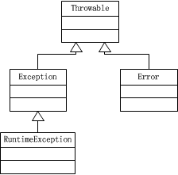

###本章主题

以前在项目的开发中，异常都是 Eclipse 自动添加的，而我却没有问过自己why。所以导致对异常的理解很浅。在我眼里，异常提供2个功能：

* 程序为什么崩溃（异常类型）？
* 在哪里崩溃的（打印的堆栈信息）？

在看完本章后，就要弄清楚异常的工作原理。只有这样，才能在以后自定义异常时更加规范。那么异常是在什么背景下被提出来的呢？

> 在C语言以及其他早期语言中，错误处理模式是通过返回一个特殊值或者标志某个flag来告诉使用者程序的运行状况。**这些返回值不属于语言本身，而是一种约定俗成的习惯。**所以，随着程序语言的发展，逐渐将错误机制给抽象出来，形成了一套完整的理论。从最早的Basic的`on error goto`，到Ada语言，然后C++借鉴了Ada语言的异常处理机制。再往后，Java中的异常处理是建立在C++的异常处理机制之上。

为了把异常讲清楚，文章共分为四个模块：

1. Java异常框架
2. 如何正确使用异常？
3. 如何处理异常？
4. Java 异常实例演示


###一、Java 异常框架

首先我们看一下异常处理的过程：


* 从上图可以看出，必定在运行的 Java 应用程序的一些类或对象中产生异常。出现故障时，“发送者”将产生异常对象。异常可能代表 Java 代码出现的问题，也可能是 JVM 的相应错误，或基础硬件或操作系统的错误。
* 异常本身表示消息，指发送者传给接收者的数据“负荷”。首先，异常基于类的类型来传输有用信息。很多情况下，基于异常的类既能识别故障本因并能更正问题。其次，异常还带有可能有用的数据（如属性）。
* 在处理异常时，消息必须有接收者；否则将无法处理产生异常的底层问题。

因为 Java 中一切都是对象，所以异常也是通过对象实现的。我们先从整体上了解一下 Java 的异常框架，它非常简单，但是却发挥了很大的作用。不禁让我想起了 Apple 的一句广告词：简约而不简单：）



从上图，我们可以将 Java 异常框架分为3个关键点：

1. Throwable：所有异常的根，定义异常的规范
1. Error：系统级严重错误，近似认为用户不会碰到
2. Exception：用户级中低等错误
	1. RuntimeException：运行时异常（unchecked）
	2. OtherException：其他异常（checked）

在Exception的子类中，有一个非常值得关注的异常类型：**RuntimeException（及其子类）**。它们会自动被 JVM 抛出，所以不必在方法声明中指出该函数可能抛出。根据这点，我们可以将Exception再分为两类：

* unchecked Exception：RuntimeException及其子类，不需要在函数中显式声明抛出该异常， JVM 会在运行期间自动抛出
* checked Exception：其他Exception的子类，编译器会强制要求在函数中显式声明函数可能抛出的异常

Tips:

> 如果RuntimeException没有被捕获而直达`main()`，那么在程序退出前将调用异常的`printStackTrace()`方法。所以，只能忽略RuntimeException（及其子类）类型的异常，其他类型异常都必须在函数声明中显式说明。究其原因是因为RuntimeException代表的是**编程错误**：

1. 无法预料的错误：比如在函数外部传进来一个null引用
2. 作为程序员应该在代码中检查的错误（比如ArrayIndexOutOfBoundsException作为一个RuntimeException，代表使用数组时候越界访问了）

下面我们可以写个小程序玩一下：


package Chapter12;

public class NeverCaught {
	static void f() {
		throw new RuntimeException("from f()");
	}
	static void g() {
		f();
	}
	public static void main(String[] args) {
		g();
	}
}
/** output
Exception in thread "main" java.lang.RuntimeException: from f()
	at Chapter12.NeverCaught.f(NeverCaught.java:5)
	at Chapter12.NeverCaught.g(NeverCaught.java:8)
	at Chapter12.NeverCaught.main(NeverCaught.java:11)

*/


我们发现，**它是在main函数中被捕获的（in thread main）**。说明f()扔了没人管，于是到达g()，g()也不管，于是到达main()，main一看，我去，我也不会处理这玩意啊。于是到达Java虚拟机，Java虚拟机一看是 RuntimeException 或者是它的子类，就会果断调用`printStackTrace()`了。

再看这个例子：


package Chapter12;

import java.io.IOException;

public class NeverCaught {
	static void f() {
		try {
			throw new IOException("from f()");
		} catch (IOException e) {
			e.printStackTrace();
		}
	}
	static void g() {
		f();
	}
	public static void main(String[] args) {
		g();
	}
}
/** output:
java.io.IOException: from f()
	at Chapter12.NeverCaught.f(NeverCaught.java:8)
	at Chapter12.NeverCaught.g(NeverCaught.java:14)
	at Chapter12.NeverCaught.main(NeverCaught.java:17)

*/


而这里的异常是**从f()函数抛出**的。因为IOException不是RuntimeException类型。所以在f()中，必须显式的将抛出语句放在try...catch...中或者是在函数声明中显式声明会抛出哪种异常。

总结一下，我们可以将 Java 异常处理进行分类：

* 可检测异常：可检测异常经编译器验证，对于声明抛出异常的任何方法，编译器将强制执行处理或声明规则，例如：sqlExecption 这个异常就是一个检测异常。你连接 JDBC 时，不捕捉这个异常，编译器就通不过，不允许编译。
* 非检测异常：非检测异常不遵循处理或声明规则。在产生此类异常时，不一定非要采取任何适当操作，编译器不会检查是否已解决了这样一个异常。例如：一个数组为 3 个长度，当你使用下标为３时，就会产生数组下标越界异常。这个异常 JVM 不会进行检测，要靠程序员来判断。有两个主要类定义非检测异常：RuntimeException 和 Error。
	* Error 子类属于非检测异常，因为无法预知它们的产生时间。若 Java 应用程序内存不足，则随时可能出现 OutOfMemoryError；起因一般不是应用程序的特殊调用，而是 JVM 自身的问题。另外，Error 一般表示应用程序无法解决的严重问题。
	* RuntimeException 类也属于非检测异常，因为普通 JVM 操作引发的运行时异常随时可能发生，此类异常一般是由特定操作引发。但这些操作在 Java 应用程序中会频繁出现。因此，它们不受编译器检查与处理或声明规则的限制。
* 自定义异常：自定义异常是为了表示应用程序的一些错误类型，为代码可能发生的一个或多个问题提供新含义。可以显示代码多个位置之间的错误的相似性，也可以区分代码运行时可能出现的相似问题的一个或者多个错误，或给出应用程序中一组错误的特定含义。例如，对队列进行操作时，有可能出现两种情况：空队列时试图删除一个元素；满队列时试图添加一个元素。则需要自定义两个异常来处理这两种情况。

###二、如何正确使用异常？

在Java中，使用Exception的方法很简单：


try {
	//业务逻辑
} catch(SmallException e) {
	//异常处理1
} catch(MiddleException e) {
	//异常处理2
} catch(Exception e) {
	//异常处理3
} finally {
	//扫尾工作
}


上面就是平常使用的`try{...}catch{...}finally{...}`模型。看起来没什么大不了的呀，因为我在看《TIJ》之前就是这么用的。但是看完之后发现：

* 原来我根本就没碰异常，我只是调用`e.printStackTrace()`打印了一下堆栈。而且不知道这个版本是讲堆栈重定向到标准错误流。而其他重载版本可以重定向到其他流中
* 没碰异常肯定不会做一些补救措施。比如我的函数不能处理但上层能处理，我catch之后没有抛出给上层。到我这里，异常沉没了
* 压根没思考过如何正确的使用异常。比如用 NIO 打开文件，就可能涉及到很多情况。在文章的最后一部分我们会举例子
* finally只有关闭资源的功能吗？所有的关闭资源都应该在finally完成吗？

那么，既然看完了这一章。就要能说清楚怎样正确使用异常：

1. 抽象问题，定接口。这时候就要思考程序可能抛出哪些异常
2. 思考内部能处理哪些异常，不能处理哪些。对不能处理的异常，捕获后要抛给上层，不然就会沉没
3. 对于不能处理的异常，是抛出原异常，还是其他异常？抛出时的起点在哪里（是我的函数，还是底层实现的那个地方。这与`fillInStackTrace()`有关）？

下面是学习到的几个知识点。

####1. 异常初始化

可以在抛出异常时添加一些异常说明信息。比如```throw new XXException("The parameter must be a int");```。这样，我通过异常的堆栈，马上就知道是参数传递的类型出现了错误。其实我理解这个参数就相当于异常注释。

####2. 打印异常

我们平常在程序中可能只会用到```e.printStackTrace();```，意思是打印异常的堆栈到标准错误流。这个函数有其他的重载版本，如果参数为空，就默认**将打印的错误堆栈信息发送给标准错误流(System.err)而不是标准输出流(System.out)中。**这样定义，可以将正常输出和错误分开处理。比如你想将异常信息输出到标准输出流，就可以使用```e.printStackTrace(System.out);```，还有一种是打印到web应用中```e.printStackTrace(PrintWriter);```。但这是**消极的用法**，因为你catch了异常却只是打印了日志，没做补救措施（当然，很多情况是没法补救的）。

####3. finally的使用

try...catch...机制已经算是比较完整了，但是有时候也会有点麻烦。因为Java没有析构函数，而有的资源必须回收/释放，我们知道Java有GC机制，但是前面也说到，GC机制只作用于**内存**，对于内存以外的资源不会管，比如文件操作、网络IO资源等。在没有finally的情况下也可以解决，就是在try中和catch中实现相同的关闭方法，这样无论是抛出/不抛出异常，都能保证资源的正确释放。但是，另外还有一种情况就不行了：如果有return语句在清理工作的代码前面，try和catch都是无力回天。而这时候，finally就能发挥它的作用。总结一下finally的用法：

1. 对于无论抛出/不抛出异常都要执行的语句，放在finally中
2. 对于try中return后还需要做其它工作的，放在finally中
3. 不是所有的清理工作都必须在finally中完成

看下面的例子：


package Chapter12;

class NSException extends Exception {

}

public class CatchWithoutFinally {

	public static boolean open(String name) throws NSException {
		if (name.equals("C++")) {
			throw new NSException();
		}
		return true;
	}

	public static void gun() {
		String[] strings = { "Java", "C++", "C", "C#" };
		for (int i = 0; i <= 3; ++i) {
			try {
				boolean flag = open(strings[i]);
				if (flag == false) {
					return;
				}
				System.out.println("file :" + strings[i] + " close");
			} catch (NSException e) {
				e.printStackTrace();
			}
		}
	}

	public static void main(String[] args) {
		gun();
	}
}
/** output:
file :Java close
Chapter12.NSException
        at Chapter12.CatchWithoutFinally.open(CatchWithoutFinally.java:11)
	at Chapter12.CatchWithoutFinally.gun(CatchWithoutFinally.java:20)
	at Chapter12.CatchWithoutFinally.main(CatchWithoutFinally.java:32)
file :C close
file :C# close
*/


然后再看下用了finally之后的情况：


package Chapter12;

class NSException extends Exception {

}

public class CatchWithoutFinally {

	public static boolean open(String name) throws NSException {
		if (name.equals("C++")) {
			throw new NSException();
		}
		return true;
	}

	public static void gun() {
		String[] strings = { "Java", "C++", "C", "C#" };
		for (int i = 0; i <= 3; ++i) {
			try {
				boolean flag = open(strings[i]);
				if (flag == false) {
					return;
				}
			} catch (NSException e) {
				e.printStackTrace();
			} finally {
				System.out.println("file :" + strings[i] + " close");
			}
		}
	}

	public static void main(String[] args) {
		gun();
	}
}
/** output:
file :Java close
Chapter12.NSException
	at Chapter12.CatchWithoutFinally.open(CatchWithoutFinally.java:11)
	at Chapter12.CatchWithoutFinally.gun(CatchWithoutFinally.java:20)
	at Chapter12.CatchWithoutFinally.main(CatchWithoutFinally.java:33)
file :C++ close
file :C close
file :C# close
*/


从上面2个例子可以清晰的看到，第一种情况下C++没有被关闭，而第二种情况，无论你在try...catch...中干了什么，我finally都能完成最后的清理工作。

####4. 异常的缺憾：异常丢失

这个缺憾我感觉可以避免呀，因为这里所说的缺憾是指把finally放在catch的前面。这样，当抛出异常之后，我直接执行finally了，而finally是默认作为最后步骤执行的，所以执行完finally之后就不会继续执行下面的东西了。下面是个例子：


package Chapter12;

class VeryImportantException extends Exception {
	public String toString() {
		return "A very import Exception";
	}
}

class HoHumException extends Exception {
	public String toString() {
		return "A trivial exception";
	}
}

public class LostMessage {
	void f() throws VeryImportantException {
		throw new VeryImportantException();
	}

	void dispose() throws HoHumException {
		throw new HoHumException();
	}

	public static void main(String[] args) {
		try {
			LostMessage lostMessage = new LostMessage();
			try {
				lostMessage.f();
			} finally {
				lostMessage.dispose();
			}
		} catch (Exception e) {
			System.out.println(e);
		}
	}
}
/** output:
A trivial exception
*/


这个例子中，我们会发现先抛出了VeryImportantException，然后dispose()又抛出了HoHumException，结果catch的时候只能catch最后那个，原来的给弄丢了。当然，解决方法就是catch的异常一定要从小到大。

> **从根本来说，finally尽量放在异常的最后。**

另外一种是在finally中使用return语句，这样就会进入所谓的silence模式，运行程序的时候，即使抛出了异常，也不会产生任何输出。下面是个例子：


package Chapter12;

public class ExceptionSilencer {
	public static void main(String[] args) {
		try {
			System.out.println("hello");
			throw new RuntimeException();
		} finally {
			return ;
		}
	}
}
/** output: 
hello
*/


我们会发现异常没有输出。。。。

####5. 异常说明

C++从CLU哪里带来了一种思想：异常说明。这样，就可以用编程的方式在方法的特征签名中，声明这个方法将会抛出异常。异常说明可能有两种意思：

1. 我的代码会产生这种异常，这由你来处理
2. 我的代码忽略了这些异常，这由你来处理

###三、如何处理异常？

如果你使用别人写好的库，在读文档时发现A函数会抛出一个异常，那么在我自己的程序中如何处理呢？Java 中我们主要使用一下两种方式：

* 处理异常：try、catch 和 finally
* 声明异常：在方法签名中显示声明会抛出哪种异常

至于在程序中该使用哪种处理方式，这个目前我还没有经验。但是就我感觉，如果在方法中能处理的异常，就使用第一种；如果无法处理，就抛给上层来处理。下面是在网上看到的一篇文章，仅供参考：[Java 异常处理的原则和忌讳](http://www.ibm.com/developerworks/cn/java/j-lo-exception/#major5)

###四、实例演示

额，文章太长了还是咋的？用编辑器一顿一顿的，于是我决定再开篇文章来写这个主题吧：）

> [Java 异常实例演示]()

###五、参考资料

在看《TIJ》的过程中，有时候会陷入对细节的纠结中。这样当以后回忆异常这一主题时，会发现没有一个知识主线，细节非常琐碎就很容易遗忘。所以按照大牛的建议，先从整体上把握，然后再具体填坑。这次我先看了几篇脉络式的文章，然后再深入到细节中：

* [Java 异常处理及其应用](http://www.ibm.com/developerworks/cn/java/j-lo-exception)
* [如何进行Java异常处理设计](http://blog.csdn.net/yanquan345/article/details/19633623)
* [一篇不错的讲解Java异常的文章](http://www.blogjava.net/freeman1984/archive/2013/07/26/148850.html)
* [JAVA异常处理相关面试题](http://blog.csdn.net/zhaoqianjava/article/details/6854732)
