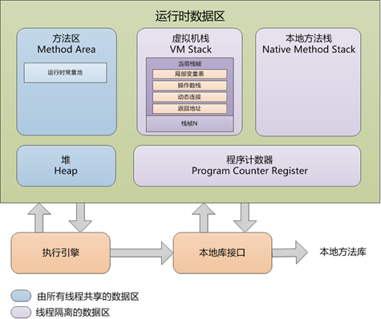
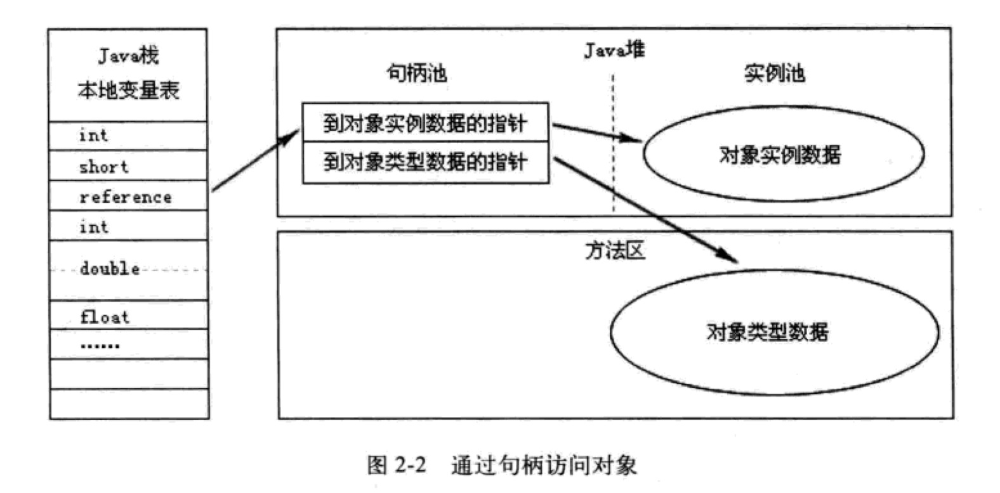
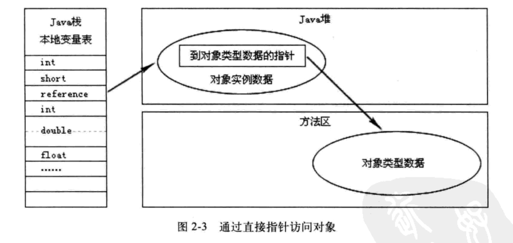

## 前言

本章主要讲述Java内存相关的知识，因为Java与C++之间有一堵由内存动态分配和垃圾收集技术所围成的高墙，墙外面的人想进去，墙里面的人想出来。

* C++的内存管理完全由程序员管理，所以效率比较高，但同时牺牲了安全性（如果程序员稍微不注意，就可能造成内存溢出等问题）
* Java实现了对内存管理的透明，程序员只需要关注业务逻辑，这就保证了开发效率会很高，安全性也有保证。但是很多情况下，程序的性能并没有发挥到极致

这样看来，两者都各有千秋。但是在目前大部分应用中，java的性能已经被优化的很强了。一个问题就是：

> Java到底是通过什么完成对内存的分配和回收呢？

要知其然知其所以然。下面我们就来学习一下Java是如何管理内存的。

## 一、运行时数据区域

Java虚拟机在执行Java程序的过程中，会把内存分为不同的数据区域。如下图所示：

### 1. 程序计数器

它是一块较小的内存空间，作用可以当做是**当前线程所执行的字节码的行号指示器。**在虚拟机的概念模型里，字节码解释器工作时就是通过改变这个计数器的值来选取下一跳需要执行的字节码指令**，分支、循环、跳转、异常处理、线程恢复等基础功能都需要依赖这个计数器**（字节码行号记录器）。

因为java虚拟机的多线程是通过时间片轮转占用cpu，所以一个处理器只会执行一条线程的指令。为了线程切换后能恢复到正确的位置，每个线程都需要一个独立的程序计数器，这样能使各个线程之间的计数器互不影响，独立存储。这类区域就是**线程私有内存**。

* 如果线程正在执行一个 Java 方法，这个计数器记录的是正在执行的虚拟机字节码指令地址
* 如果线程正在执行的是 Native 方法，这个计数器值为空（Undefined）

Tips：

> **此内存区域是唯一一个在 Java 虚拟机规范中没有规定任何 OOM 情况的区域**，所以当出现 OOM 排查问题时，可以直接跳过这个区域。

### 2. Java虚拟机栈

Java虚拟机栈也是**线程私有**的，它的生命周期和线程相同。

上面的程序计数器我们可以理解为字节码解释器用于解释代码如何运行的。而Java虚拟机栈描述的是**Java方法执行的内存模型**：虚拟机栈会在每个方法被执行的时候创建一个栈帧，用于存储局部变量表、操作栈、动态链接、方法出口等信息。每一个方法被调用直至执行完成的过程就对应着一个栈帧在虚拟机中从入栈到出栈的过程。

Tips：

> 在Java虚拟机规范中，对这个区域规定了两种异常情况：
>
>	* 如果线程请求的栈深度太深，超出了虚拟机所允许的深度，就会出现StackOverFlowError（比如无限递归。因为每一层栈帧都占用一定空间，而 Xss 规定了栈的最大空间，超出这个值就会报错）
>	* 虚拟机栈可以动态扩展，如果扩展到无法申请足够的内存空间，会出现OOMError异常。

### 3. 本地方法栈

本地方法栈与虚拟机栈的作用是非常类似的，所以也是**线程私有**的。区别是**虚拟机栈为虚拟机执行Java方法（也就是字节码）服务，而本地方法栈则是为虚拟机使用到的Native方法服务**。因为虚拟机规范没有对这块有太多规定，所以不同的虚拟机可以自由实现它。有的虚拟机（Sun的HotSpot虚拟机）直接就把**本地方法栈和虚拟机栈合二为一**了。

Tips：

> 与虚拟机栈一样，本地方法栈也会抛出StackOverFlowError和OOM。

### 4. Java堆

对于大多数应用来说，Java堆是Java虚拟机所管理的内存中最大的一块，它是**所有线程共享的，在虚拟机启动时候创建**。Java堆唯一的目的就是**存放对象实例（还有数组哦）**，然后GC也是在这个地方干活的。Java堆是所有线程共享的一块内存区域，在虚拟机启动的时候创建（参数为Xmx、Xms）。

Tips：

> 如果堆上没有内存可以完成对象实例的分配，并且堆已经达到了最大容量，无法向OS继续申请的时候，就会抛出OOM异常。

### 5. 方法区

方法区与Java堆一样，是**所有线程共享**的内存区域，它用于存储**已被虚拟机加载的类信息、常量、静态变量、即时编译器编译后的代码**等数据。

对于习惯在 HotSpot虚拟机上开发部署程序的开发者来说，很多人倾向于把方法区成为“永久代（Perm Generation）”，但**本质上两者并不等价，仅仅是因为 HotSpot 团队选择把 GC 分代收集扩展到方法区，或者说使用永久代来实现方法区而已，**，目的是为了让 HotSpot 的垃圾回收器可以像管理 Java 堆一样管理这部分内存，不能再编写这部分内存的内存管理代码。对于其他虚拟机（比如 JRockit、IMB J9）来说，是不存在永久代的概念的。

> 其实 JVM 规范并没有规定如何实现方法区，但是从目前状况来看：**使用永久代来实现方法区不是一个好的做法。因为这样更容易遇到内存溢出问题（永久代有-XX:MaxPermSize 的上限，而 J9和 Jrockit 制药没有触碰到进程可用内存的上限，例如32位的4GB，就不会出现问题）**，同时有极少数方法（比如 String.intern()，这个函数能直接操纵方法区中的常量池）会因为这个原因在不同虚拟机有不同的表现。因此，HotSpot 团队有了*放弃永久代并逐步改为采用 Native Memory 来实现方法区的规划*，在目前已经发布的 JDK1.7 的 HotSpot 中，已经把放在永久代的字符串常量池移出。

Tips：

> 当方法区无法满足分寸分配需求时，就会抛出OOM异常。

#### 1) 运行时常量池

是方法区的一部分。class文件中除了有类的版本、字段、方法、接口等描述信息外，还有一项信息是常量池(class文件中)，用于存放编译期生成的各种字面值和符号引用，这部分内容将在**类加载后存放到方法区的运行时常量池中**。

运行时常量池相对于class文件常量池的另外一个重要特性是具备动态性，Java语言并不要求常量一定是在编译期产生，也就是说，并非是预置入class文件中常量池的内容内能进入方法区的运行时常量池，运行期间也可以将新的常量放入池中，用的比较多是有String.intern()，可以去看下文档。说的很清楚：

> `public String intern()`

> Returns a canonical representation for the string object.    
> A pool of strings, initially empty, is maintained privately by the class String.

> **When the intern method is invoked, if the pool already contains a string equal to this String object as determined by the equals(Object) method, then the string from the pool is returned. Otherwise, this String object is added to the pool and a reference to this String object is returned.**

> It follows that for any two strings s and t, s.intern() == t.intern() is true if and only if s.equals(t) is true.

> All literal strings and string-valued constant expressions are interned. String literals are defined in section 3.10.5 of the The Java™ Language Specification.

> Returns:    
> a string that has the same contents as this string, but is guaranteed to be from a pool of unique strings.

### 6. 直接内存

**直接内存并不是虚拟机运行时数据区的一部分**，也不是Java虚拟机规范中定义的内存区域，但是这部分内存也被频繁地使用，而且也可能导致OutOfMemoryError异常出现，这里大概谈谈。

JDK 1.4中新加入了NIO(NEW Input/Output)类，引入了一种基于通道与缓冲区的I/O方式，可以使用Native函数库直接分配堆外内存，然后通过一个存储在Java堆里面的DirectByteBuffer对象作为这块内存的引用进行操作。这样能在一些场景中显著提高性能，**因为避免了在Java堆和Native堆中来回复制数据**（大概知道 NIO 为什么高效！）。

## 二、HotSpot 虚拟机对象探秘

共分为3个步骤：

1. 对象的创建
2. 对象的内存布局
3. 对象的访问定位

下面我们就来八一八每个步骤的具体过程吧：）

### 1. 对象的创建

在 Java 语言层面上，我们创建一个对象是如此简单：`ClassA intance = new ClassA();`，over。但是在虚拟机内部，其实经历了非常复杂的过程才完成了这一个程序语句。

1. 虚拟机遇到一条 new 指令时，首先将去检查这个指令的参数是否能在常量池中定位到一个类的符号引用，并且检查这个符号引用代表的类是否已经被加载、解析和初始化过。如果没有，就得执行类的加载过程，这个过程在第七章讲了，想了解过程的可以先去后面的博文中瞅瞅。（你瞅啥！！）
2. 类加载检查过之后，虚拟机就为这个新生对象分配内存。目前有两种做法，使用哪种方式是由 GC 回收器是否带有压缩整理功能决定的：
	* 指针碰撞（Bump the Pointer）：没用过的内存和用过的内存用一个指针划分（*所以需要保证 java 堆中的内存是整理过的，一般情况是使用的 GC 回收器有 compact 过程*），假如需要分配8个字节，指针就往后挪8个字节
	* 空闲列表（Free List）：虚拟机维护一个列表，记录哪些内存是可用的，分配的时候从列表中遍历，找到合适的内存分配，然后更新列表

上面解决了分配内存的问题，但是也引入了一个新的问题：并发！！！

就刚才的一个修改指针操作，就会带来隐患：对象 A 正分配内存呢，突然！！对象 B 又同时使用了原来的指针来分配 B 的内存。解决方案也有两种：

* 同步处理——实际上虚拟机采用 CAS 配上失败重试来保证更新操作的原子性
* 把内存分配的动作按照线程划分在不同的空间之中进行，即每个线程在 Java 堆中预先分配一小块内存，成为本地线程分配缓存（Thread Local Allocation Buffer，TLAB）。哪个线程要分配内存，就在哪个线程的 TLAB 上分配，用完并分配新的TLAB时，才需要同步锁定（虚拟机是否使用 TLAB，可以通过`-XX:+/-UseTLAB` 参数来设置）

好了，上面给内存分配了空间，那么内存清零放在什么时候呢？一种情况是给 TLAB 分配的时候，就对这块分配的内存清零，或者可以在使用前清零，这个自己实现。

接下来要对对象进行必要的设置，比如这个对象是哪个类的实例、如何才能找到类的元数据信息、对象的 hashcode 值是多少、对象的 GC 分代年龄等信息，这些信息都放在对象头中。

---

上面的步骤都完成后，从虚拟机角度来看，一个新的对象已经产生了，但是从 Java 程序的视角来看，对象创建才刚刚开始——<init>方法还没有执行，所有的字段都还为零。而这个过程又是一个非常复杂过程，具体可以参考前面的文章，讲解 Java 的对象是如何初始化的。从编译阶段的 constantValue 到准备阶段、初始化阶段、运行时阶段都有涉及，特别酸爽呢！

### 2. 对象的内存布局

首先我们要知道的是：**在 HotSpot 虚拟机中，对象在内存中存储的布局可以分为3块区域：对象头（Header）、实例数据（Instantce Data）、对齐补充（Padding）。**当然，我们不必要知道太深入，大概知道每个部分的作用即可：

1. 对象头（Header）：包含两部分信息。第一部分用于存储对象自身的运行时数据，如 hashcode 值、GC 分代的年龄、锁状态标志、线程持有的锁等，官方称为“Mark Word”。第二部分是类型指针，即对象指向它的类元数据的指针，虚拟机通过这个指针来确定这个对象是哪个类的实例
2. 实例数据（Instance Data）：就是程序代码中所定义的各种类型的字段内容
3. 内存对齐，这个在前面博文中已经说过好多次了，不懂的可以去看看即可

### 3. 对象的访问定位

1. 假如代码出现在方法体中，那么Object obj就会存在在**Java虚拟机栈的本地变量表**中，作为一个引用类型数据。
2. new Object()则存在在**Java堆**上。另外，在Java堆上还必须包含能查找到该对象类型数据（如对象类型、父类、实现的接口、方法等）的地址信息，这些类型数据则存储在**方法区**中。
3. 由于引用类型在Java虚拟机规范里面只规定了一个指向对象的引用，并没有定义这个引用应该通过哪种方式去定位，以及访问到Java堆中的对象的具体位置，因此不同虚拟机实现的对象访问方式可能不同，主流的有：
	1. 使用句柄：Java堆中划分一块区域作为句柄池，引用存储的是对象的句柄地址，而句柄中含有对象实例数据和类型数据各自的数据信息
	2. 直接指针：引用中直接存储的就是对象的地址，同时还必须包括方法区类型信息的指针

下面是对应的图片：

对于引用类型的实现，不同的实现方法有不同的特点：

1. 使用句柄：Java堆会划出一块区域作为句柄池，引用中存储的是稳定的句柄地址，而句柄中包含了**对象实例数据（也在Java堆）和类型数据（方法区中）**各自的地址信息。在对象被移动（垃圾回收时移动对象是非常普遍的行为）时只需要改变句柄中的实例数据指针，而引用本身核方法区的类型数据指针都不需要修改
2. 直接指针：速度更快，因为不需要间接寻址。对于效率而言是更好的，Sun HotSpot就是使用这种方式实现对象访问的。但在其他虚拟机中，使用句柄方式也非常常见。

## 三、实战演练

下面我们会演示几个小程序，目的有两个：

1. 通过代码验证Java虚拟机规范中描述的各个运行时区域存储的内容
2. 希望以后遇到类似问题时，能根据异常的信息快速判断是哪个区域的内存溢出，知道怎样的代码可能会导致这些区域的内存溢出，以及出现这些异常后改如何处理

### 1. Java堆溢出

这个顾名思义，是最常见的。因为Java堆上存储的是对象实例，所以只要保证GC roots到该对象有路径可达，就会在不断创建对象的过程中达到Java堆的最大容量而导致溢出。下面是实例代码：


package Chapter_02;

import java.util.ArrayList;
import java.util.List;

/**
 * 
 * @author niushuai
 * 
 * 虚拟机参数：
 * -verbose:gc -Xmx20M -Xms20M -Xmn10M -XX:+PrintGCDetails -XX:SurvivorRatio=8
 * 
 */
public class HeapOOM {
	static class OOMObject {
		
	}
	
	public static void main(String[] args) {
		List<OOMObject> list = new ArrayList<OOMObject>();
		while(true) {
			list.add(new OOMObject());
		}
	}
}/*output:
[GC [PSYoungGen: 7363K->1001K(9216K)] 7363K->5017K(19456K), 0.0097670 secs] [Times: user=0.03 sys=0.01, real=0.01 secs] 
[GC [PSYoungGen: 9193K->1024K(9216K)] 13209K->10550K(19456K), 0.0113040 secs] [Times: user=0.04 sys=0.00, real=0.02 secs] 
[Full GC [PSYoungGen: 1024K->511K(9216K)] [ParOldGen: 9526K->9982K(10240K)] 10550K->10494K(19456K) [PSPermGen: 2564K->2563K(21504K)], 0.3076080 secs] [Times: user=0.65 sys=0.01, real=0.30 secs] 
[Full GC [PSYoungGen: 8335K->8240K(9216K)] [ParOldGen: 9982K->7866K(10240K)] 18317K->16106K(19456K) [PSPermGen: 2563K->2563K(21504K)], 0.1443110 secs] [Times: user=0.32 sys=0.00, real=0.14 secs] 
[Full GC [PSYoungGen: 8240K->8240K(9216K)] [ParOldGen: 7866K->7855K(10240K)] 16106K->16095K(19456K) [PSPermGen: 2563K->2563K(21504K)], 0.0994290 secs] [Times: user=0.31 sys=0.01, real=0.10 secs] 
Exception in thread "main" java.lang.OutOfMemoryError: Java heap space
	at java.util.Arrays.copyOf(Arrays.java:2245)
	at java.util.Arrays.copyOf(Arrays.java:2219)
	at java.util.ArrayList.grow(ArrayList.java:242)
	at java.util.ArrayList.ensureExplicitCapacity(ArrayList.java:216)
	at java.util.ArrayList.ensureCapacityInternal(ArrayList.java:208)
	at java.util.ArrayList.add(ArrayList.java:440)
	at Chapter_02.HeapOOM.main(HeapOOM.java:20)
Heap
 PSYoungGen      total 9216K, used 8597K [0x00000007ff600000, 0x0000000800000000, 0x0000000800000000)
  eden space 8192K, 98% used [0x00000007ff600000,0x00000007ffde5818,0x00000007ffe00000)
  from space 1024K, 49% used [0x00000007fff00000,0x00000007fff7ff00,0x0000000800000000)
  to   space 1024K, 0% used [0x00000007ffe00000,0x00000007ffe00000,0x00000007fff00000)
 ParOldGen       total 10240K, used 7855K [0x00000007fec00000, 0x00000007ff600000, 0x00000007ff600000)
  object space 10240K, 76% used [0x00000007fec00000,0x00000007ff3abe10,0x00000007ff600000)
 PSPermGen       total 21504K, used 2595K [0x00000007f9a00000, 0x00000007faf00000, 0x00000007fec00000)
  object space 21504K, 12% used [0x00000007f9a00000,0x00000007f9c88cd8,0x00000007faf00000)

*/


从上面的结果可以看到，发生了OOM异常。要解决这个异常，一般是把内存快照dump下来用工具分析，确认**内存中的对象是否是必要的**，也就是要先分清到底是出现了内存泄露（Memory Leak）还是内存溢出（Memory overflow）。

* 如果是内存泄露：使用工具查看泄露对象到GC Roots的引用链。于是就可以顺藤摸瓜找到泄漏对象是通过怎样的路径关联GC Roots的，从而准确定位泄露代码的位置
* 如果是内存溢出：就应当检查虚拟机的堆参数（-Xmx和-Xms），与机器物理内存对比看是否可以调大，从代码上检查是否存在某些对象生命周期过长、持有状态时间过长等情况，尝试减少程序运行期间的内存消耗

还有其他类似的小实验，都是根据每个区域的特点进行专门的攻击，目的是让我们知道异常发生地方where，原因why，然后才能迅速修复。
