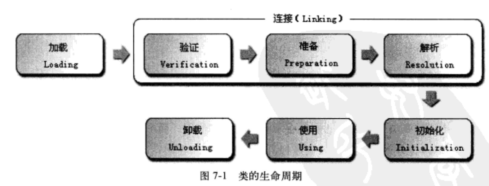

###前言

这一章是讲类加载的，前阵子刚刚研究了类加载器的代码实现。但那时候是以代码为主，对JVM内部的工作原理不太清楚，正好趁这个机会巩(xue)固(xi)一下整个JVM的类加载机制。**类加载器只是类加载机制7个步骤中的第一步而已，我刚看的时候就搞混了**。那么，什么是JVM的类加载机制呢?

> 虚拟机把描述类的数据从class文件加载到内存中，并对数据进行检验、转换解析和初始化，最终形成可以被虚拟机直接使用的Java类型，这就是虚拟机的类加载机制。

上一章没有细看，知道大体上是讲class文件中每个字节的作用。而.class文件是源代码经过编译后得到的字节码，如果学过编译原理会知道，这个仅仅完成了一半的工作（完成了词法分析、语法分析、语义分析、中间代码生成），接下来就是实际的 运行了。而Java选择的是动态链接的方式，即使用到某个类再加载进内存，而不是像C++那样使用静态链接：将所有类加载，不论是否使用到。当然了，孰优孰劣不好判断。静态链接优点在速度，动态链接优点在灵活。

与那些在编译时进行链接的语言不同，Java类型的加载和链接过程都是在运行的时候进行的，这样虽然在类加载的时候稍微增加一些性能开销，但是却能为Java应用程序提供高度的灵活性，**Java中天生可以动态扩展的语言特性就是依赖动态加载和动态链接这个特点实现的**。

不管怎么说，.class文件要想被执行，需要被JVM加载。而.class文件是如何被JVM处理的呢？这就是本章的重点。

类从加载到虚拟机内存开始，到卸载出内存，一共经历了7个步骤（其中验证、准备、解析三个部分统称为连接（linking））：

1. 加载
2. 验证
3. 准备
4. 解析
5. 初始化
6. 使用
7. 卸载

下图是类的生命周期：

Tips（因为没仔细看下面这段话，让我看后面验证的时候百思不得其解。。真是因小失大）:

> 上图中，加载、验证、准备、初始化和卸载这个阶段的顺序是确定的，类的加载过程必须按照这种顺序按部就班地开始，而解析阶段则不一定：它在某些情况下可以在初始化阶段之后再开始，这是为了支持Java语言的运行时绑定。这里写的是按部就班地开始，而不是进行或完成。因为这些阶段通常都是交叉混合进行的，通常会在一个阶段执行的过程中调用或激活另外一个阶段。

其中，对于如何加载，Java虚拟机规范并没有说明。但是对于初始化，Java虚拟机规范做了严格的限制，**有且只有**四种情况必须立即对类进行"初始化"（而加载、验证、准备当然在初始化的前面了）：

1. 遇到new、getstatic、putstatic、invokestatic这四条指令码时，如果类没有进行初始化，必须触发初始化。new肯定是新建对象，而get/putstatic是读取或者设置一个类的静态字段（static final修饰的是编译期放入常量池了，所以不算），invokestatic是调用一个类的静态方法
2. 使用java.lang.reflect包的方法对类进行反射调用的时候，如果类没有进行初始化，必须触发初始化
3. 当初始化一个类时，如果其父类还没有初始化，则触发初始化
4. 当虚拟机启动时，用户需要指定一个要执行的主类（包含`main()`方法的类），虚拟机会先初始化这个主类

这四种场景中的行为被称为主动引用，除此之外所有引用类的方式都不会触发初始化，称为被动引用。下面有3个例子供大家欣赏= =

例子一：通过子类引用父类的静态属性，不会触发子类的初始化


class A {
	
	public static int count = 10;
	
	static {
		System.out.println("super class");
	}
}

class B extends A {
	static {
		System.out.println("sub class");
	}
}

public class Example_One {
	public static void main(String[] args) {
		System.out.println(B.count);
	}
}/*output:
super class
10
*/


我们会发现，纳尼！！竟然没有输出`sub class`，很奇怪是吧。原因如下：

> 对于静态字段，只有直接定义这个字段的类才会初始化，因此通过子类来调用父类的静态字段，只会触发父类的初始化而不会触发子类的初始化。(对父类而言，调用了getstatic，所以触发初始化；对子类而言，new没有吧，get/putstatic没有吧，invokestatic也没有。只是调用了父类的getstatic)而这点会不会触发其他过程（比如加载、验证），Java虚拟机规范并没有说明，取决于具体的虚拟机实现。对于Sun HotSpot来说，可通过-XX:+TraceClassLoading参数看到此操作会导致子类的加载。

例子二：通过数组定义来引用类，不会触发此类的初始化


class A {
	
	public static int count = 10;
	
	static {
		System.out.println("super class");
	}
}

class B extends A {
	static {
		System.out.println("sub class");
	}
}

public class Example_One {
	public static void main(String[] args) {
		B[] bs = new B[10];
	}
}


这段代码执行的时候，没有任何输出，也就是说没有触发初始化。这个其实很简单，bs是神马？bs只是一个数组引用，引用是存在于虚拟机栈的局部变量表中的。因为无法指向数组中元素的地址，所以数组中的元素和引用没有半毛钱关系。当然不会触发初始化了。

但是通过这个例子，有个知识点终于知道原因了：**为什么Java语言对数组的访问比C++安全**？

> 如上图所示，创建一个10个B元素的数组，并没有触发B的初始化。但是触发了`[LB`的类的初始化，对于用户代码来说，这并不是一个合法的类。它是虚拟机自动生成的，继承于java.lang.Object类，创建动作由字节码指令newarray触发。**这个类代表了一个元素类型为B的一维数组（其实就是一个对象），数组中应有的属性和方法（用户可直接使用的只有修饰为public的length属性和clone()方法）都实现在这个类中。**Java语言访问数组比C++安全是因为这个类包装了数组元素的访问方法（**本质上来说，数组越界并不是封装在数组元素访问的类中，而是封装在数组访问的xaload/xastore字节码指令中**），而C++直接翻译成对数组指针的移动。

例子三：常量在编译阶段会被存入本类的常量池，本质上没有引用定义该常量的类，因此不会触发定义该常量的类的初始化


class C {
	static {
		System.out.println("const field");
	}
	
	public static final int MAX_INT = 65535;
}

public class Example_Two {
	public static void main(String[] args) {
		System.out.println(C.MAX_INT);
	}
}/*output:
65535
*/


这个代码想说明的是：常量在编译时期就被放入了调用类的常量池，本质上没有引用到定义常量的类，因此不会触发定义常量的类的初始化。

那么，这是为什么呢？原来Java会在编译的时候将C的MAX_INT的值存储在Example_Two类的常量池中，对A中MAX_INT的引用都被转化为对Example_Two自身常量池的引用。所以，Example_Two中的class文件中并没有C的符号引用的入口，这两个类在编译之后就谁也不认识谁了呢。

###一、类加载的过程

这个是本章的重头戏，主要分为：加载、验证、准备、解析、初始化这几个步骤。下面我们逐个击破。

####1. 加载

在加载阶段，虚拟机需要完成3件事情：

1. 通过一个类的全限定名来获取定义此类的二进制字节流
2. 将这个字节流所代表的静态存储结构转化为方法区的运行时数据结构
3. 在Java堆中生成一个代表这个类的java.lang.Class对象，作为方法区这些数据的访问入口

这里第一点很有意思。结合这一章后面的类加载机制和前面学到的东西，我觉得可以写出来一篇文章了，敬请期待。而第二点和第三点很好理解，最终.class文件还是要被处理为虚拟机规定的格式的。所以第二点的方法区只是类的静态属性等，前一章讲过了；而Class对象结合上一章，其实就是对象如何引用方法区的类信息，有句柄和直接指针两种实现。Sun的HotSpot是使用的直接指针。

Tips：

> 加载阶段与连接阶段的部分内容（如一部分字节码格式验证）是交叉进行的，加载阶段尚未完成，连接阶段可能已经开始，但这些夹在加载阶段之中进行的动作，仍然属于连接阶段的内容，这两个阶段的开始时间仍然保持着固定的先后顺序。

####2. 验证

前面的加载是要把.class文件中的字节码转换为虚拟机中对应的数据，而由于Java的开放，字节流有五花八门的来源，如果有人写了恶意的代码，那么在执行的时候就会让程序或者JVM崩溃。为了防止这种危险的发生，JVM会在加载的过程中交叉进行验证工作。而验证工作Java虚拟机规范也没有具体的说明（只说不符合.class文件的格式时，抛出java.lang.VerifyError），业界比较统一的做法是这样的：

1. 文件格式验证：字节流是否符合.class文件格式规范，能否被当前版本虚拟机处理（比如开头是CAFEBABE）。**该阶段的主要目的是保证输入的字节流能正确地解析并保存于方法区之内，格式上符合描述一个Java类型信息的要求。经过这个阶段的验证之后，字节流才会进入内存的方法区进行存储，后面三个验证阶段都是基于方法区的存储结构进行验证的**
2. 元数据验证：对字节码描述的信息进行**语义分析**，说白了就是语法检查。比如我implements某个接口，是不是把所有函数都实现了、是否继承了final类呀。
3. 字节码验证：最复杂的验证过程，进行数据流和控制流分析。元数据验证是对类的方法体进行语义检查，而字节码验证是**保证被校验类的方法在运行时不会危害虚拟机**。比如跳转指令不会跳转到方法体外的字节码指令上；类型转换是正确的；**如果一个类方法体的字节码没有通过字节码验证肯定是有问题的，但是通过了也不能说明类方法体没有问题。这个是NP问题**
4. 符号引用验证：将符号引用转化为直接引用，将在连接阶段的第三个过程——解析阶段进行。符号引用验证可以看做是对类本身以外（常量池中的各种符号引用）的信息进行匹配性的验证。**符号引用的目的就是确保解析动作能正常执行**，所以这个阶段验证比如：验证符号引用中通过字符串全限定名能否找到对应的类。

####3. 准备

准备阶段是在**方法区**为类的静态属性分配内存，并设置初始值。**这时候进行内存分配的只有类变量而不包括类的实例变量，因为实例变量将在对象实例化的时候随着对象一起分配到Java堆上。**仔细想想道理很简单啊，因为方法的东西是该类所有对象共享的，所以只保存一份即可。而对象的实例肯定是各自持有，所以在堆上分配对象的时候再把实例变量分配一下。

这里的初始值通常情况是数据的零值。比如：

> `public static int value = 123;`

那么value在准备阶段的初始值为0，而不是123。因为这时候尚未开始执行任何Java方法，而把value赋值为123的putstatic指令是程序被编译后，存放于类构造器`<clinit>()`方法中，所以把value赋值123的动作将在**初始化阶段**才会执行。上面说的通常情况，也有一些特殊情况：如果某些static字段是final修饰的，那么value会在编译时被javac生成ConstantValue属性，那么在准备阶段就会初始化为123。（所以static final不是编译期被赋值的，而是仅仅标记为ConstantValue属性，准备阶段才初始化对应的值）

> `public static final int value = 123;`

这时候，在准备阶段value的值就是123了（归功于编译时候的ConstantValue属性哦）

####4. 解析

解析阶段是虚拟机**将常量池内的符号引用替换为直接引用的过程**。这两个概念要分清：

* 符号引用：以一组符号来描述所引用的目标，符号引用可以是任意值，只要能定位目标。符号引用与虚拟机的内存布局无关，而且目标不一定加载到内存中
* 直接引用：直接指向目标的指针、相对偏移量或者是一个能间接定位到目标的句柄。直接引用是与虚拟机的内存布局有关的。所以同一个符号引用在不同的虚拟机中直接引用一般是不同的（因为可以有各自的内存布局）。如果有了直接引用，那么目标一定在内存中

理解符号引用比较关键，首先符号引用是编译原理的概念，包括了下面3种常量：

* 类和接口的全限定名
* 字段的名称和描述符
* 方法的名称和描述符

不难看出，符号引用其实就是用来定向外部数据的，因为在.class文件中不会保存各个方法和字段的最终内存布局信息，因此这些字段和方法的符号引用不经过转换的话是无法被虚拟机使用的。正确的流程应该是**当虚拟机运行时，需要从常量池获得对应的符号引用，再在类创建或运行时解析并翻译到具体的内存地址中**。

所以，符号引用相当于在类内部使用的，虚拟机相当于外部环境。举个例子，你爸叫“赵百万”，在家里你可以直接叫爸，但是出门跟别人介绍就需要告诉别人“赵百万”了，你要是告诉这是你爸，估计就要挨揍了：）而这个“赵百万”就可以理解为直接引用。

####5. 初始化

是类加载阶段的最后一步，前面的类加载过程中，除了在加载阶段用户应用程序可以定义自己的类加载器参与，后面的验证、准备、解析都是虚拟机主导的，用户无法干预。到了初始化阶段，才真正执行类中定义的Java程序代码（本质上来说就是解释器执行字节码了）。

在准备阶段会对方法区内的属性进行一次“初始化”，而对于final修饰的则是在编译的时候加入ConstatnValue属性。而初始化阶段是**根据程序员为程序制定的主观计划去初始化类变量和其他资源，或者可以说：执行类构造器`<clinit>()`方法的过程**。

* `<clinit>()`方法是由编译器自动收集类中的所有类变量的赋值动作和静态语句块(static{})中的语句合并产生的，而顺序是按照在类中定义的顺序
* `<clinit>()`方法与类的构造函数不同，它不需要显式调用父类构造器，虚拟机会保证在子类的`<clinit>()`执行前，父类的`<clinit>()`会执行完。因此，虚拟机第一个被运行的`<clinit>()`一定是java.lang.Object的
* 由于父类的`<clinit>()`方法先执行，就意味着父类的静态语句块要优于子类的变量赋值操作，下面有个例子哦
* 接口不一定有`<clinit>()`方法，因为按接口的由来原理（通用协议），接口是没有属性的，在枚举以前可以用接口来完成常量的定义，但是有了枚举，还是使用枚举比较好
* 若接口有变量初始化的赋值操作，这时候的`<clinit>()`不需要先执行父类的`<clinit>()`方法。只有用到父接口定义的变量时才会触发父类的`<clinit>()`方法。同理，接口的实现类在执行`<clinit>()`方法前也不需要执行接口的`<clinit>()`方法
* **虚拟机会保证一个类的`<clinit>()`方法在多线程环境中被正确的加锁和同步**。如果多个线程同时初始化一个类，那么只会有一个线程执行类的`<clinit>()`方法，其他线程会被阻塞等待，直到`<clinit>()`完成。

###二、类加载器

这个决定单独写篇文章，总结一下近来学习的关于类加载器相关的东西。

