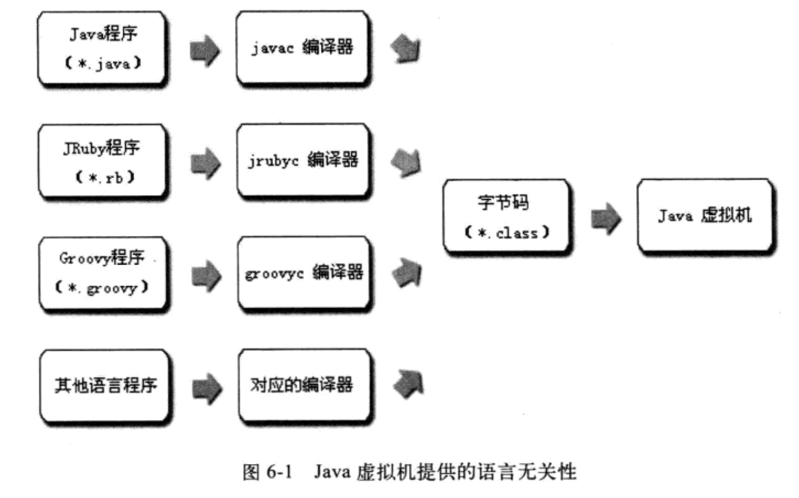

###前言

最近一段时间在学习JVM，类加载器算是比较关键的一个知识点。于是决定把最近学习的东西总结梳理一下。

本文主要讨论以下四个方面：

1. 类加载器由来：介绍类加载器产生的历史背景
2. 类加载器基本概念：重点剖析java.lang.ClassLoader的loadClass()方法
3. Tomcat类加载器：tomcat如何组织下游应用程序和上层JVM（tomcat也是一个java应用程序）
4. 开发自己的类加载器：做一个demo

嗯，参考资料放在这里备忘吧：）

* 深入理解Java虚拟机
* [深入理解Java虚拟机——第七章](http://github.thinkingbar.com/jvm-vii/)
* [深入探讨Java类加载器](http://www.ibm.com/developerworks/cn/java/j-lo-classloader/index.html)
* [Java类加载原理解析](http://www.blogjava.net/zhuxing/archive/2008/08/08/220841.html)

接下来，我们就开始谈一谈Java的类加载器。

---

###一、类加载器由来

类加载器从 JDK 1.0 就出现了，最初是为了满足 Java Applet 的需要而开发出来的。很奇葩的是现在 Java Applet 被淘汰了，但类加载器却在类层次划分、OSGi、热部署、代码加密等领域大放异彩，成为了Java的一大王牌，可谓失之东隅，收之桑榆。

因为Java的广告就是一次编写到处运行，所以Sun将Java语言和JVM当成两个产品来开发。而JVM对应的《Java虚拟机规范》就是为了实现**多输入，统一处理**的目的：

> Java虚拟机规范把类加载机制中的“通过一个类的全限定名来获取描述此类的二进制字节流”这个动作放在JVM的外部，只要外部应用程序处理后的输入符合JVM的规定（比如Java自家的.class文件字节流），那么就可以被JVM处理成平台相关的机器码，从而实现应用程序级别的跨平台。而这个模块就被称为类加载器。

用一幅图来说明：

###二、类加载器基本概念

首先必须重点强调的是：

> 对于Java中的任意一个类，都需要由**加载它的类加载器和这个类本身一同确立其在JVM中的唯一性**。所以，看两个类是否相等（Class对象的equals()方法等），前提就是由一个类加载器加载的。如果不是一个类加载器加载的，即使是同一个.class文件也肯定是不相等的。理解这点是开发自己的类加载器的大前提。

####1. 类加载器是怎样工作的？

顾名思义，类加载器就是就是用来把Java文件加载到JVM中运行的。Java程序运行的大概过程是：

1. 编写Java源代码程序
2. Java编译器编译成.class文件
3. 类加载器将.class文件加载进JVM，转换成java.lang.Class的一个实例，每个这样的实例代表一个Java类。通过这个实例的newInstance()方法可以创建出该类的一个对象

基本上所有的类加载器都是java.lang.ClassLoader的实例，所以我们需要重点学习这个类。当然，学习方法很简单，直接去看源码。逻辑清晰，很容易的。最重要的是loadClass()方法，我把这个函数的代码粘出来：


protected Class<?> loadClass(String name, boolean resolve)
        throws ClassNotFoundException
    {
        synchronized (getClassLoadingLock(name)) {
            // First, check if the class has already been loaded
            Class c = findLoadedClass(name);
            if (c == null) {
                long t0 = System.nanoTime();
                try {
                    if (parent != null) {
                        c = parent.loadClass(name, false);
                    } else {
                        c = findBootstrapClassOrNull(name);
                    }
                } catch (ClassNotFoundException e) {
                    // ClassNotFoundException thrown if class not found
                    // from the non-null parent class loader
                }

                if (c == null) {
                    // If still not found, then invoke findClass in order
                    // to find the class.
                    long t1 = System.nanoTime();
                    c = findClass(name);

                    // this is the defining class loader; record the stats
                    sun.misc.PerfCounter.getParentDelegationTime().addTime(t1 - t0);
                    sun.misc.PerfCounter.getFindClassTime().addElapsedTimeFrom(t1);
                    sun.misc.PerfCounter.getFindClasses().increment();
                }
            }
            if (resolve) {
                resolveClass(c);
            }
            return c;
        }
    }


上面代码注释已经非常清楚，关于类加载器的工作，大体上有3步：

1. 检查这个类是否已经被加载过
2. 如果没有被加载过，调用父类加载器去加载
3. 如果父类加载器加载失败，就调用当前类加载器去加载

这里面有个地方值得我们思考：为什么要调用父类加载器先加载呢？如果已经被加载过，我直接使用缓存就好了，如果没有，我自己去加载就可以了嘛。这多出来的一步是干嘛的？下面就来说一说Java的双亲委派模型

####2. 双亲委派模型

Java 中的类加载器大致可以分成两类，一类是系统提供的引导类加载器，它是用C++语言实现的，是JVM自身的一部分；另外一类则是其他所有的类加载器，这些类加载器都是用Java语言实现的，独立于虚拟机的外部，并且全部继承自java.lang.ClassLoader：

* 引导类加载器（bootstrap class loader）：它用来加载 Java 的核心库，是用C++实现的，负责将${JAVA_HOME}/lib目录下的，或者-Xbootclasspath参数所指定的路径中的，并且是Java虚拟机识别的（仅按照文件名识别，如rt.jar,不符合的类库即使放在lib下也不会被加载）类库加载到JVM内存中，引导类加载器无法被Java程序直接引用
* 扩展类加载器（extensions class loader）：它用来加载 Java 的扩展库，${JAVA_HOME}/ext下面的，或者被java.ext.dirs系统变量所指定的路径中的所有类库，开发者可用
* 系统类加载器（system class loader）：它根据 Java 应用的类路径（CLASSPATH）来加载 Java 类。一般来说，Java 应用的类都是由它来完成加载的。可以通过 ClassLoader.getSystemClassLoader()来获取它。

除了系统提供的类加载器以外，开发人员可以通过继承 java.lang.ClassLoader类的方式实现自己的类加载器，以满足一些特殊的需求。

除了引导类加载器之外，所有的类加载器都有一个父类加载器。通过`ClassLoader.getParent()`方法可以得到。对于系统提供的类加载器来说，系统类加载器的父类加载器是扩展类加载器，而扩展类加载器的父类加载器是引导类加载器；对于开发人员编写的类加载器来说，其父类加载器是加载此类加载器 Java 类的类加载器。因为类加载器 Java 类如同其它的 Java 类一样，也是要由类加载器来加载的。一般来说，**开发人员编写的类加载器的父类加载器是系统类加载器**。类加载器通过这种方式组织起来，形成树状结构。树的根节点就是引导类加载器。下面给出类加载器树状组织结构示意图，其中的箭头指向的是父类加载器。

Tips:

> 如图所示，类加载器之间的关系**不是继承，而是使用组合来复用父加载器的代码**

双亲委派模型的工作过程是：如果一个类加载器收到了类加载的请求，那么它首先会把这个请求委派给父加载器完成，以此类推。因此所有的类加载请求最终都应该传送到顶层的引导类加载器中，只有当父加载器无法完成这个加载请求，子加载器才会尝试自己去加载。那么，回到上面的问题。为什么要使用这种代理机制呢？

> 这样做Java类和它的类加载器就一起具备了带有优先级的层次关系。例如类java.lang.Object,它存放在rt.jar中，无论哪一个类加载这个类，最终都会被委派到引导类加载器去完成它的加载，因此Object类在程序中的各种类加载器环境中都是一个类。这样做也保证安全性，因为如果有人想恶意置入代码，类加载器的代码就避免了这种情况的发生。

####3. 破坏双亲委派模型

上文提到的双亲委派模型并不是一个强制性的约束模型，而是推荐使用。但在某些特殊情况下，双亲委派也被破坏过：

1. JDK 1.2发布之前：压根就没双亲委派模型，但是classloader在JDK 1.0就存在了。所以引入双亲委派模型也做一点妥协，具体的不用关心。反正现在出现的概率为0了
2. 自身缺陷：用户调用基础类的时候，就会被上层类加载器加载。但如果基础类要调用用户代码呢？比如JNDI（Java Naming Directory Interface）,为此虚拟机团队设计了一个无奈之举：线程上下文类加载器。具体的可以自己google。包括最常用的JDBC也是使用线程上下文类加载器。
3. 动态替换：也就是所谓的热部署，典型就是OSGi了。

其实第二点的JNDI和第三点的OSGi都是比较常用的功能，如果想把类加载器学好，一定要去看看OSGi哦。

###三、Tomcat的类加载器

这个也算一个实例了，具体在《深入理解Java虚拟机》中已经讲过了，可参考：

* [Tomcat和OSGi类加载器架构](http://github.thinkingbar.com/jvm-ix)

###四、开发自己的类加载器

接下来我们就自己动手写一个简单的类加载器。


 public class FileSystemClassLoader extends ClassLoader { 

    private String rootDir; 

    public FileSystemClassLoader(String rootDir) { 
        this.rootDir = rootDir; 
    } 

    /**
    * 对用户类加载器而言，一般重写findClass方法即可。loadClass不要重写，因为可能会破坏双亲
    * 委派模型，造成系统核心类库加载错误
    */
    protected Class<?> findClass(String name) throws ClassNotFoundException { 
        byte[] classData = getClassData(name); 
        if (classData == null) { 
            throw new ClassNotFoundException(); 
        } 
        else { 
            return defineClass(name, classData, 0, classData.length); 
        } 
    } 

    //这里用户可以自定义.class文件的来源（比如从网络下载后需要解密才能被JVM加载）
    private byte[] getClassData(String className) { 
        String path = classNameToPath(className); 
        try { 
            InputStream ins = new FileInputStream(path); 
            ByteArrayOutputStream baos = new ByteArrayOutputStream(); 
            int bufferSize = 4096; 
            byte[] buffer = new byte[bufferSize]; 
            int bytesNumRead = 0; 
            while ((bytesNumRead = ins.read(buffer)) != -1) { 
                baos.write(buffer, 0, bytesNumRead); 
            } 
            return baos.toByteArray(); 
        } catch (IOException e) { 
            e.printStackTrace(); 
        } 
        return null; 
    } 

    private String classNameToPath(String className) { 
        return rootDir + File.separatorChar 
                + className.replace('.', File.separatorChar) + ".class"; 
    } 
 }


上面只是一个简单的例子，但是核心已经说明白了：

> 重写findClass()方法，只要保证JVM要加载的.class文件符合Java虚拟机规范的规定，那么无论.class文件是怎样的来的，对JVM全都是透明的。而这就为用户提供了极大的灵活性。
