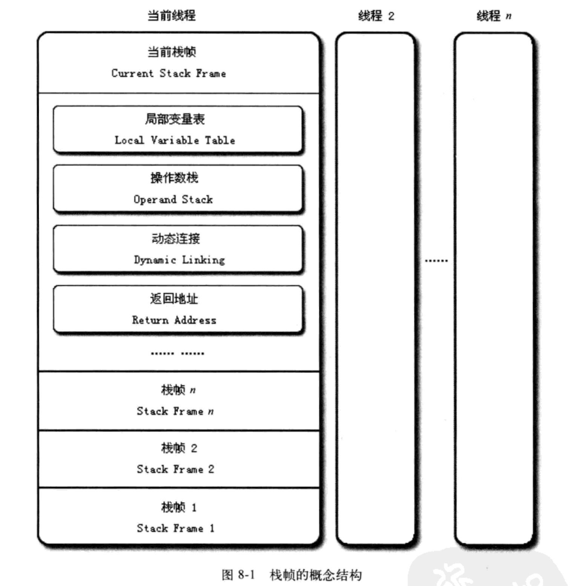

###前言

执行引擎是Java虚拟机最核心的组成部分之一。执行引擎在执行Java代码的时候可能有解释执行（通过解释器执行）和编译执行（通过即时编译器产生的本地代码执行）两种选择，也可能两者兼备，甚至还可能包含几个不同级别的编译器执行引擎。但从Java虚拟机规范中描述的执行引擎概念模型来说，所有的Java虚拟机的执行引擎都是一样的：它的输入是字节码文件，处理过程是字节码解析的等效过程，输出的是执行结果。

本章重点有下面几个小节：

* 运行时栈帧结构
* 方法调用
* 基于栈的字节码解释执行引擎

###一、运行时栈帧结构

首先，栈帧是用于支持虚拟机进行方法调用和方法执行的**数据结构**（还记得不？栈帧是运行时数据区虚拟机栈的栈元素）。也就是说它就是一个类似结构体的东东，用于存放一些诸如

* 局部变量表
* 操作数栈
* 动态连接
* 方法返回地址

还有一些其他的附属信息。**每一个方法从调用开始到执行完毕，就对应着一个栈帧在虚拟机栈里面从入栈到出栈的过程**。

看图说话：



接下来就具体分析一下栈帧中的元素：

####1. 局部变量表

稍微一想，局部变量表当然存储的是方法参数+方法内的变量。而这些数据被存在变量槽（Variable Slot，下称slot）的最小单位中，slot中能存放的类型为：

1. 8种基类类型（bool/byte/char/short/int/long/float/double)
2. reference
3. returnAddress：指向字节码指令的地址

我们看到，Java虚拟机规范并没有规定每个slot的大小。所以不同的虚拟机或者操作系统可以有各自的实现。当然，一个slot可以存放一个32位以内的数据类型，包含了上面3类中除long和double的其他所有类型。而64的long和double则分配两个连续是slot。这里我们可能会想到多线程访问的问题，但是请记得大前提：**Java虚拟机栈是线程私有的，对线程来说是原子性的**。所以这里连续不连续都不会引起安全问题。 

上面说完了局部变量表的东西，那么JVM如何使用它们呢？答案是索引定位。

在方法执行时，虚拟机是通过局部变量表来完成参数值到参数变量列表的传递过程的，如果是非static方法，**局部变量表的第0号索引的slot默认是当前对象实例的引用，也就是this指向的对象。而且slot可以复用，比如函数内变量作用域只在一个循环内，那么后面的变量可以占用这个slot。

关于局部变量还想再说一点，在J《ava编程思想》的笔记里，曾经分三章提到了类的初始化，那么说局部变量是没有初始化的。在局部变量表中找到了答案：）

> 类变量有两次赋初始值的过程，一个是准备阶段，赋予系统初始值（有final的话在编译时会加上ConstantValue属性，那么在准备时就是常量值了）。另外一次是初始化阶段，是程序员指定的值。因此，如果程序员在初始化不指定值的话，准备阶段也会有默认值。但是局部变量就不同了，因为准备阶段是处于方法区，而局部变量表是处于Java虚拟机栈。所以，一个局部变量定义了但是没有初始值是不能使用的。尽管这点由编译器帮你判断，但是知道原理，即使没有编译器，你也能马上定位错误。

####2. 操作数栈

这个和局部变量表类似，操作数栈的每一个元素可以是Java的任意类型，long和double是2个栈容量，其他1个栈容量。

至于操作数栈的工作原理，去看下表达式如何工作的（逆波兰式）。

####3. 动态连接

每个栈帧都包含一个指向运行时常量池中该栈帧所属方法的引用，**持有这个引用是为了支持方法调用过程中的动态连接**。在前面知道，class文件中的常量池有大量的符号引用，字节码中的方法调用指令就以常量池中指向方法的符号引用为参数。这些符号引用一部分会在类加载阶段或者第一次使用的时候转换成直接引用，这种转化称为**静态解析**。另外一部分将在每一次的运行期间转换为直接引用，这部分称为**动态连接**。

####4. 方法返回地址

一个方法执行结束有两种情况

1. 正常结束：
2. 异常结束：异常结束指的是在方法内部无法处理异常（没有匹配的异常处理器），那么方法就会异常退出。一个方法只要是异常退出，是不会给调用者任何返回值的。

无论何种方式的方法退出，都需要返回到方法被调用的位置，用于恢复上下文供程序继续处理。一般来说，方法正常退出时，调用者的PC计数器的值可以作为返回地址，栈帧很可能会保存这个计数器值。而方法异常退出时，返回地址是要通过异常处理器表来确定的，栈帧中一般不会保存这个信息。

方法退出相当于出栈，可能执行的操作有：

* 恢复上层调用方法的局部变量表和操作数栈
* 把返回值（如果有的话）压入调用者栈帧的操作数栈中
* 调整PC计数器指向下一条指令

####5. 附加信息

这部分Java虚拟机规范没有明确规定，具体实现是虚拟机自己的事情。在实际开发中，一般会把动态连接、方法返回地址和其他附加信息全部归为一类，称为栈帧信息。

###二、方法调用

方法调用阶段的唯一目的是：

> **确定被调用方法的版本（即调用哪一个版本）**，暂时还不涉及方法内部的具体运行过程。意思很明显，将在所有的重载、覆盖函数中确定应该调用哪个版本。

Tips：

**这里需要说明一点，Class文件的编译过程不包含传统编译中的连接步骤，一切方法调用在Class文件中都只是符号引用，而不是方法在实际运行时内存布局的入口地址（直接引用），这个特性给Java带来了更强大的动态扩展能力，但也使得Java方法的调用过程变得复杂，需要在类加载期间甚至到运行时才能确定目标方法的直接引用。**

####1. 解析

Java虚拟机一共提供了四条方法调用字节码指令，分别是：

* invokestatic：调用静态方法
* invokespecial：调用实例构造器<init>方法、私有方法和父类方法
* invokevirtual：调用所有的虚方法
* invokeinterface：调用接口方法，会在运行时确定一个实现该接口的对象

**只有被invokestatic和invokespecial调用的方法，才可以在解析阶段确定唯一的调用版本，符合这个条件的有静态方法、私有方法、实例构造器和父类方法，它们在类加载的时候就会把符号引用解析成直接引用。**这些方法可以称为非虚方法，与之相反的invokevirtual和invokeinterface就是虚方法了，这些就需要在运行时确定实现该接口的对象。

在第七章没有说明解析过程，这里可以搞定了。首先，解析阶段的目的是讲符号引用转为直接引用。但是这种解析有个前提条件：**方法在程序真正运行前就有一个可确定的调用版本，并且这个方法的调用版本在运行期是不可改变的。**而符合这个条件的方法有两种：

* 静态方法
* final方法

**解析调用一定是一个静态的过程，在编译期间就能完全确定，在类装载的解析阶段就会把涉及的符号引用全部转变为可确定的直接引用，不会延迟到运行期再完成。而分派调用则可能是静态的或者动态的。**

####2. 分派

分派调用过程将会揭示Java多态特性是如何实现的，比如重载和重写，这里的实现当然不是语法那么low，我们关心的是JVM如何确定正确的目标方法。而分派共分为四种：

* 静态单分派
* 静态多分派
* 动态单分派
* 动态多分派

结论我们先记住：

* 重载：参数静态类型
* 重写：参数动态类型

首先我们说明静态分派。首先是一段在面试中经常出现的代码：


public class StaticDispatch {
	static abstract class Human {
		
	}
	
	static class Man extends Human {
		
	}
	
	static class Woman extends Human {
		
	}
	
	public void sayHello(Human guy) {
		System.out.println("hello, Human");
	}
	
	public void sayHello(Man guy) {
		System.out.println("hello, Man");
	}
	
	public void sayHello(Woman guy) {
		System.out.println("hello, Woman");
	}
	
	public static void main(String []args) {
		Human man = new Man();
		Human woman = new Woman();
		
		StaticDispatch staticDispatch = new StaticDispatch();
		staticDispatch.sayHello(man);
		staticDispatch.sayHello(woman);
	}
}


请思考一下答案应该是神马呢？

正确答案是：


hello, Human
hello, Human


如何感觉到惊诧就对了，下面我们解释。对于那些完全无压力而且能说出原因的人，请你们洗洗睡吧。咳咳，进入正题。

这里我们需要定义两个重要概念：

`Human man = new Man();`

我们把上面的Human称为变量man的静态类型，后面的Man称为man的实际类型。它们的区别在于：

> 变量本身的静态类型不会改变，而且在编译期就可以知道；而实际类型变化的结果到运行时才能确定，编译时无法知道。下面是例子


//实际类型变化
Human man = new Man();
man = new Woman();

//静态类型变化
sayHello((Man)man);
sayHello((Woman)man);


知道了这个回到刚才那个例子就很清楚了，在main中man和woman的静态类型都是Human，但编译器在重载时是通过参数的静态类型而不是实际类型作为判断依据的。因为静态类型是编译期已知的，所以javac会在编译时确定该调用哪个版本，在本例子中就是sayHello(Human guy)了。

**所有依赖静态类型的分派都称为静态分派，而静态分派最典型的应用就是重载。**静态分派发生在编译时期，因此确定静态分派的动作实际上跟JVM无关。但是也有例子，即使编译器能精确的判断上个例子，但是对于一些无法知道静态类型的变量（比如字面值），编译器只好靠猜了，它会尽量选择最符合语境的方法。下面是一个例子：


import java.io.Serializable;

public class Overload {
	public static void sayHello(Object org) {
		System.out.println("hello Object");
	}

	public static void sayHello(int org) {
		System.out.println("hello int");
	}

	public static void sayHello(long org) {
		System.out.println("hello long");
	}

	public static void sayHello(Character org) {
		System.out.println("hello Character");
	}
	
	public static void sayHello(char org) {
		System.out.println("hello char");
	}
	
	public static void sayHello(char... org) {
		System.out.println("hello char...");
	}

	public static void sayHello(Serializable org) {
		System.out.println("hello Serializable");
	}

	public static void main(String[] args) {
		sayHello('a');
	}
}/*output:
hello char
*/


很明显的结果。请依次注释掉char/int/long/Character/Serializable/Object，这时候应该只剩下char ...了。输出结果其实很容易知道。

需要说明的是，可变形参的重载优先级是最低的，上面8种版本只有当其他7种都注释的情况才会出现`hello char...`。这个代码演示了编译期选择静态分派目标的过程，这个过程是Java实现方法重载的本质。

下面说说动态分派。它和多态性的另外一个重要体现——重写（Override）有很大的关联。废话少说，上代码


public class DynamicDispatch {
	static abstract class Human {
		protected abstract void sayHello();
	}
	
	static class Man extends Human {

		@Override
		protected void sayHello() {
			System.out.println("hello, Man");
		}
	}
	
	static class Woman extends Human {

		@Override
		protected void sayHello() {
			System.out.println("hello, Woman");
		}
		
	}
	
	public static void main(String[] args) {
		Human man = new Man();
		Human woman = new Woman();
		
		man.sayHello();
		woman.sayHello();
		
		man = new Woman();
		man.sayHello();
	}
}/*output:
hello, Man
hello, Woman
hello, Woman
*/


这次代码运行的结果对于面向对象思维的程序员来说是很容易接受的。现在的问题还是一样：JVM是如何调用正确的方法呢？

> 关键在于invokevirtual指令。invokevirtual指令的查找过程是这样的：
>
>	1. 找到操作数顶的第一个元素所指向的对象的实际类型，记作C
>	2. 如果在类型C中找到与常量中的描述符和简单名称都相符的方法，进行访问权限验证，通过则返回这个方法的直接引用，查找过程结束；否则返回java.lang.IllegalAccessError
>	3. 按照继承关系从下到上试探步骤2
>	4. 抛出java.lang.AbstractMethodError

> **由于invokevirtual指令执行的第一步就是在运行时确定接收者的实际类型，所以两次调用中的invokevirtual指令把常量池中的类方法符号引用解析到了不同的直接引用，这个过程就是Java重写的本质。我们把这种在运行时确定方法执行版本的过程成为动态分派。**

经过上面静态分派、动态分派的讲解，我们还得思考一个问题：**为什么重载是静态分派，而重写是动态分派呢？**

> 重载的时候是根据本类进行方法选择，重写是根据子类进行方法选择。因为本类可以在编译期间确定参数的静态类型；而子类是在运行期间加载进来的，编译期是无法知道究竟是哪个子类作为参数，所以运行时确定参数对象，进而确定方法。

嗯，最后说一下。因为运行时的动态分派非常频繁，为了性能考虑。Java会为类在方法区中建立一个虚方法表（和C++一样的啦），如果是接口，那么就是一个虚接口表，然后在这个表中进行查找。而不是大海捞针式。而这个方法区的方法表一般在类加载的连接阶段进行初始化，准备了类的变量初始值后，虚拟机会把该类的方发表也初始完成。

###三、基于栈的字节码解释执行引擎

前面说过，字节码的执行分为解释执行和编译执行，下面就来讲一下。

####1. 解释执行

这个看了之后就是编译原理的流程，javac完成的工作有：

> 程序源代码 -> 词法分析 -> 语法分析到抽象语法树 -> 字节码

剩下的解释运行被实现在JVM中。怎么实现呢？Java编译器生成的字节码应该属于一种基于栈的指令集架构。而物理机多采用的是x86架构（也就是寄存器架构，二地址指令集）。大体上可以用一个例子来说明：比如计算`1+1`：

基于栈的指令集：

```
iconst_1
iconst_1
iadd
istore_0
```

两条iconst_1指令连续把2个常量1压入栈中，iadd把2个1弹出，结算结果为2后放入栈顶。然后istore_0把2放到局部变量表的0号slot中。

基于寄存器的指令集：

```
mov eax, 1
add eax, 1
```

mov把EAX寄存器的值设为1，然后add指令再把这个值+1,结果还是保存在EAX寄存器中。

那么这两种哪个更好呢？其实，两者各有优劣，要不然就不会出现两雄争霸的局面了。

* 基于栈的指令集最主要优点是跟机器无关，具有移植性；缺点就是执行速度较慢，所有主流物理机的指令集都是寄存器架构从侧面说明了这一点。
* 寄存器和硬件息息相关，程序依赖寄存器就会失去移植性。但是寄存器最主要的优点是速度快，因为频繁的入栈出栈会产生相当多的指令，而且栈是实现在内存中，而对于处理器来说，内存始终是执行速度的瓶颈。

下面用一个简单的例子来说明基于栈的解释器执行过程，首先是例子：


public int calculate() {
	int a = 100;
	int b = 200;
	int c = 300;
	return (a + b) * c;
}


编译后通过`javap -c A`得到字节码：


public int calculate();
    Code:
       0: bipush        100
       2: istore_1
       3: sipush        200
       6: istore_2
       7: sipush        300
      10: istore_3
      11: iload_1
      12: iload_2
      13: iadd
      14: iload_3
      15: imul
      16: ireturn


我们把每条指令解释一下：

1. `bipush 100`，把100推入操作数栈顶
2. `istore_1`，把栈顶元素出栈并存放到局部变量表的1号slot（因为calculate不是static的，0号slot是指向本对象的this）
3. `sipush 200`一直到`istore_3`都是重复1-2步骤
4. `iload_1`，将1号slot的值复制到栈顶
5. `iload_2`，将2号slot的值复制到栈顶
6. `iadd`，出栈两个元素，将相加结果300压入栈顶
7. `iload_3`，将3号slot的值复制到栈顶
8. `imul`，出栈两个元素，将相乘结果90000压入栈顶
9. `ireturn`，将栈顶元素返回给调用者

上面只是一个简单的例子，在实际应用中，复杂的代码JVM会做很多优化，这里仅仅为了说明问题，所以比较简单。


