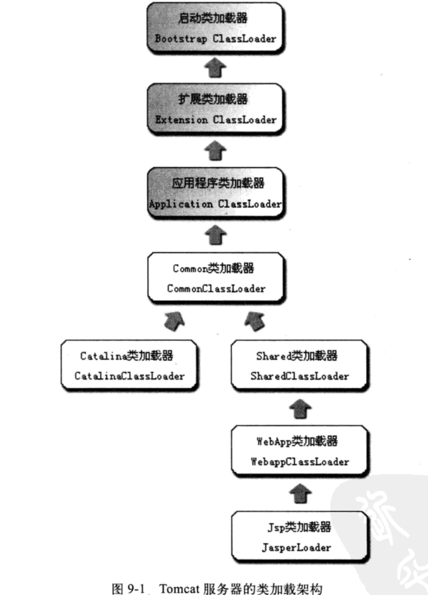
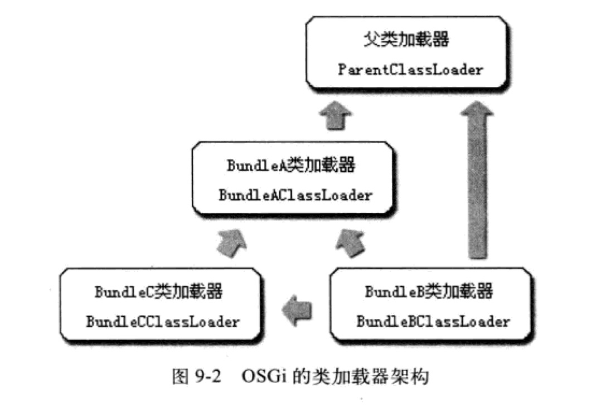

###前言

这一章是给出了几个例子说明前面几章讲过的内容。我觉得关于tomcat那个例子对我来说太有用了。正好被这个问题困扰，然后今天看完瞬间感觉豁然开朗。而这一章关注点有：

* 类加载器
* 字节码生成

因为平时跟字节码打交道的场景不多，而最近研究类加载器算是比较多。所以，这章我主要关注的就是类加载器相关的东西。

###一、类加载器实例之——Tomcat

主流的Java Web服务器，如Tomcat、Jetty、WebLogic、WebSphere，都实现了自己定义的类加载器（一般都不止一个）。因为一个功能健全的Web服务器，要解决如下问题：

* **部署在同一个服务器上的两个Web应用程序所使用的Java类库可以使用相互隔离。**这是最基本的要求，因为不同应用可能依赖同一个类库的不同版本，不能要求每个类库在一个服务器只有一个版本，应当保证两个应用程序的类库可以互相独立使用
* **部署在同一个服务器上的两个Web应用程序所使用的Java类库可以互相共享。**这个也很正常，比如我有10个应用程序，都用到Spring，那么我不可能放10份Spring相关的类库吧。
* 服务器需要尽可能地保证自身的安全不受部署的Web应用程序影响。目前很多Java Web服务器也是Java实现的，因此肯定有库依赖问题。一般来说，基于安全考虑，服务器所使用的类库应该和应用程序的类库相互独立
* 支持Jsp应用的Web服务器，十有八九都需要支持HotSwap功能。因为Jsp本质上还是需要被编译成.class文件才能被JVM执行，但Jsp在运行时被修改的概率比较大。因此主流Web服务器都会支持Jsp生成类的热替换

由于以上几个要求，如果只有一个CLASSPATH就很难实现了。**所以各种Web服务器都会提供好几个CLASSPATH路径供用户存放第三方类库，这些路径一般都以lib或者classes命名。被放置在不同目录的类库，具备不同的访问范围和服务对象。通常而言，每一个目录都会有一个对应的自定义类加载器去加载设置在里面的Java类库。**那么我们就以Tomcat为例来看一下。

####1. Tomcat目录结构

在Tomcat目录结构中，有三组目录可以存放Java类库，另外加上应用程序自身的目录，一共四组：

1. 放置在/common目录中：类库可被Tomcat和所有Web应用程序共同使用
2. 放置在/server目录中：类库只能被Tomcat使用
3. 放置在/shared目录中：类库可以Web应用程序共同使用，但是Tomcat不能使用
4. 放置在/webapp/WEB-INF目录中：仅仅可以被这个Web应用程序使用，Tomcat和其它Web应用程序不能使用

为了支持这套目录，并对目录内的类库进行加载和隔离，Tomcat自定义了几个类加载器，这些类加载器按照经典的双亲委派模型来实现，如下图所示：

* 其中最上层的3个是JVM的类加载器（因为Tomcat也相当于一个Java程序，它只是将程序员写的Java程序做了一个封装）
* CommonClassLoader：对应/common目录
* CatalinaClassLoader：对应/server目录
* SharedClassLoader：对应/shared目录
* WebAppClassLoader：对应/webapp/WEB-INF目录

其中WebAppClassLoader和JsperClassLoader会存在多个实例，每一个WebApp对应一个WebApp类加载器，每一个Jsp文件对应一个Jsp类加载器。

上面的图我们也能看出它们之间的隔离性：

* Common类加载器加载的类可以被Catalina类加载器和Shared类加载器使用
* Catalina类加载器和Shared类加载器相互隔离
* WebApp类加载器可以使用Shared类加载器加载的类
* 各个WebApp类加载器之间加载的类相互隔离
* 各个Jsp类加载器加载的仅仅是这个Jsp文件编译出来的那个.class文件，它出现的目的就是被丢弃，如果修改，就会新建一个Jsp类加载器替换原来的那个，实现HotSwap

####2. Tomcat版本升级

对于Tomcat的6.x版本，只有指定了conf/catalina.properties配置文件中的server.loader和share.loader才会真正建立CatalinaClassLoader和SharedClassLoader的实例，否则会以CommonClassLoader代替。而默认的配置里面是没有设置这两个loader的，所以Tomcat 6.x顺理成章的把/commmon、/server、/shared这三个目录合并为一个/lib目录。这是Tomcat团队为了简化大多数部署场景所做的一项改进，如果默认设置不能满足需求，再通过修改配置完成3种类加载器的协同分工。

###二、OSGi：灵活的类加载器结构

传说Java社区流传这样一句话：学习JEE规范，去看JBoss源码；学习类加载器，去看OSGi源码。可见，OSGi的类加载器机制确实值得学习。

OSGi（Open Service Gateway Initiative）是OSGi联盟制定的一个基于Java语言的动态模块化规范，最初是Sun、IBM、爱立信等公司联合发起，目的是**使服务提供商通过住宅网关为各种家用智能设备提供各种服务**，后来这个规范在Java其他技术领域都有不错的发展，现在已经成为Java世界中“事实上”的模块化标准。OSGi在程序员中最著名的应用案例Eclipse。你对Eclipse进行设置后，不需要重启就可以完成某个功能的开启或关闭，这就是OSGi的功劳。

看了之后，给我的感觉就是这东西非常灵活。OSGi的基本单位是Bundle，每个Bundle都可以有自己的类加载器和父加载器。而Bundle和类也差不多，内部也是package和class组成。但是一个Bundle可以声明它依赖的Java Packeage（通过Import-Package描述），也可以声明它允许导出发布的Java Package（通过Export-Package描述）。**在OSGi中，Bundle之间的依赖关系从传统的上层模块依赖叠层模块转变为平级模块之间的依赖，而且类库的可见性得到了非常精确的控制，一个模块里只有被Export过的Package才能被外界访问，其他的Package和class会被隐藏。**所以，OSGi才能支持热插拔技术。

而OSGi拥有这么诱人特性的原因就是它的类加载器架构。举一个简单的例子：

* Bundle A：声明发布了packageA，依赖了java.*的包
* Bundle B：声明依赖了packageA和packageC，同时也依赖了java.*的包
* Bundle C：声明发布了packageC，依赖了packageA

那么，三者之间的关系可以用下图表示：

从上图可以看出来，OSGi里面的加载器不再是双亲委派模型的树形结构，而是进一步发展成了一种运行时才能确定的网状结构。更灵活的同时肯定带来了更复杂的使用方法，这点在实际应用中确实值得权衡。

一般来说，在OSGi中，加载一个类可能发生的查找行为和委派关系会比上图复杂的多，大体规则可以总结为：

1. 以java.*开头的类，委派给父类加载器加载
2. 委派列表名单内的类，委派给父类加载器加载
3. Import列表中的类，委派给Export这个类的Bundle的类加载器加载
4. 查找当前Bundle的CLASSPATH,使用自己的类加载器加载
5. 否则，查找是否在自己的Fragment Bundle中，如果是则委派给Fragment Bundle的类加载器加载
6. 否则，查找Dynamic Import列表的Bundle，委派给对应Bundle的类加载器加载
7. 否则，类查找失败

