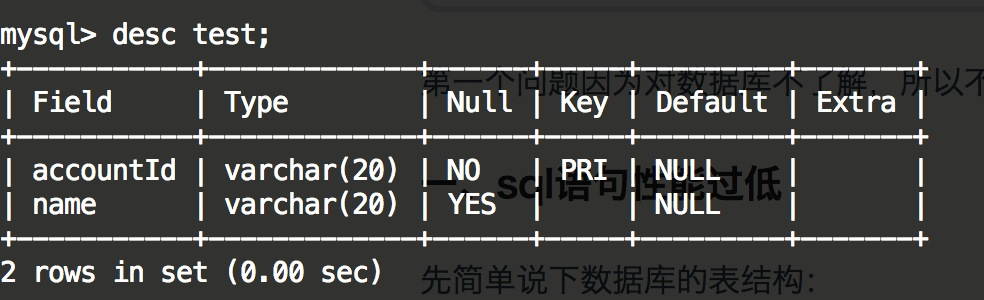
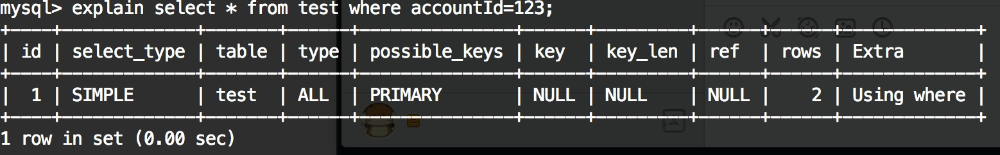
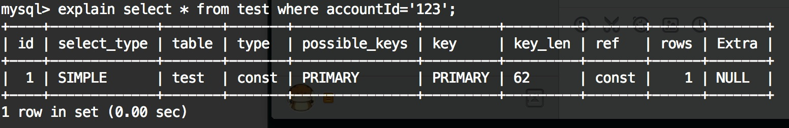

最近数据库的性能出现了一些问题，于是就查了一下原因。下面就来说说。

---

数据库的表结构可以简化如下：

存储引擎是Innodb, 版本是MySQL 5.6。其中accountId是主键, 表数据量在500W左右。测试发现查询起来很慢，于是很奇怪，这点数据量对于mysql竟然还有压力？？？不会啊，于是就看了看结构什么的，偶然发现accountId定义的是varchar字段类型，但在使用过程中只是用了数字类型，所以没有加单引号。对于varchar字段，如果只放数字类型的字符串，可以不加单引号执行SQL语句，不报错（但是如果有除数字以外的字符就会出错）。在实际的运行过程中也没有出现过任何问题，只是随着时间推移和数据规模的不断增大，问题终于暴漏了出来。

在生产环境中，类似下面这样的语句出现了很多次：

* `select * from test where accountId=123;` 

注意accountId是varchar类型的。问题就出在123上，如果是accountId被定义为字符串类型，那么正确的sql语句应该是这样：

* `select * from test where accountId='123';`

那么，为什么就差一点点性能就下降这么多呢？

我们可以用explain命令来看看：

未加单引号时：

加单引号时：

如果仔细观察，我们会发现`123`和`'123'`的执行过程是不同的，关键就在于type上：

* 使用字符串类型查找的type是const，走的是**索引**
* 使用数字查找的type是ALL，也就是**全表扫描**

什么意思呢？就是使用`123`的时候，没有用到索引，而使用`'123'`的时候，就用上了索引。这样结果就一目了然了，使用索引和不适用索引是有天差地别的嘛。具体想了解索引是如何工作以及效率的差别，可以自行google mysql索引的实现——B+树。

针对单引号问题去看了下mysql的官方文档，有下面这段说明：

> You are comparing indexed columns with constant values and MySQL has calculated (based on the index tree) that the constants cover too large a part of the table and that a table scan would be faster. See Section 7.3.1.2, “WHERE Clause Optimization”.

**mysql不是把你的数字转成了字符串，而是把每个查询到的结果转成了数字去比较。**因为索引是按照varchar类型建立的，而你查找的key不是varchar，自然无法使用索引来查询。由于数据类型不一致，没办法比较，右值数据类型是int, 而左值存储的字段类型是varchar, mysql没有严格的检查数据类型，估计是采用尝试的策略来转换数据类型，发现字段值可以转换成int，于是转换了该列所有的数据，由于记录规模比较大，所以性能肯定急剧下降。

所以平时使用sql语句一定要规范，要弄清楚数据库基本概念，比如加不加单引号有什么区别、单引号和双引号有什么区别等。

