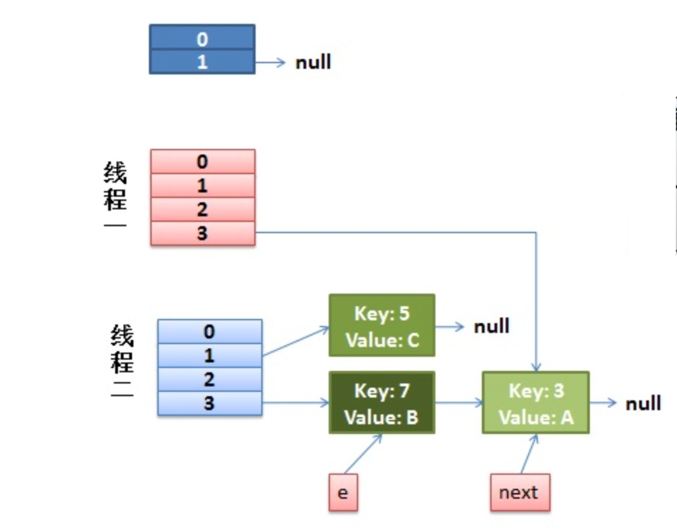
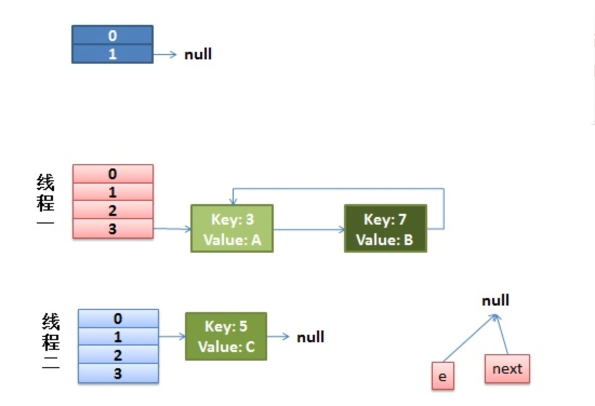

### 前言

几个月前，上线了一个版本。但是上线了几个小时之后 CPU 突然暴增至99%，在网上搜了一下，多半是因为出现死循环问题了。就用 jstack dump 了当时的线程快照，发现这次死循环问题的起源是 HashMap 的 `get()`方法。之后先是重启了服务止损，然后修复了这个 bug并提交到 SVN。

这次事故的原因是因为开发时没有注意到 HashMap 是非线程安全的，而使用 HashMap 的那个地方又是 PV 级别的代码，多线程并发非常容易出现问题。但因为这块代码不是我开发的，我也不清楚具体的细节，就没有过多关注。最近正好在看 HashMap 的源码，突然想起来这事，就正好看看究竟是神马原因造成了 HashMap 的死锁问题。

### 一、HashMap 的底层实现

这个可以参考上一篇文章：[HashMap 源码剖析](http://github.thinkingbar.com/hashmap-analysis/)，具体介绍了 HashMap 的底层实现：

* 数组：充当索引
* 链表：处理碰撞

简单地说一下：

HashMap通常会用一个指针数组（假设为 table[]）来做分散所有的 key，当一个 key 被加入时，会通过 Hash 算法通过 key 算出这个数组的下标 i，然后就把这个`<key, value>`插到 table[i]中，如果有两个不同的 key 被算在了同一个 i，那么就叫冲突，又叫碰撞，这样会在 table[i]上形成一个链表。

我们知道，如果 table[]的尺寸很小，比如只有2个，如果要放进10个 keys 的话，那么碰撞非常频繁，于是一个 O(1)的查找算法，就变成了链表遍历，性能变成了 O(n)，这是 Hash 表的缺陷。

所以，Hash 表的尺寸和容量非常的重要。一般来说，Hash 表这个容器当有数据要插入时，都会检查容量有没有超过设定的 thredshold，如果超过，需要增大 Hash 表的尺寸，但是这样一来，整个 Hash 表里的元素都需要被重算一遍（重新计算hash值）。这叫 rehash，成本相当大。

### 二、源码剖析

首先来猜下，神马情况会造成死锁呢？

我们知道，如果要造成死循环，肯定和链表有关，因为只有链表才有指针。但是在源码剖析中我们知道，每次添加元素都是在链表头部添加元素，怎么会造成死锁呢？

> 其实，关键就在于**rehash**过程。在前面我们说了是 HashMap 的`get()`方法造成的死锁。既然是 `get()`造成的死锁，一定是跟`put()`进去元素的位置有关，所以我们从 `put()`方法开始看起。


    public V put(K key, V value) {
        if (table == EMPTY_TABLE) {
            inflateTable(threshold);
        }
        if (key == null)
            return putForNullKey(value);
        int hash = hash(key);
        int i = indexFor(hash, table.length);
        //如果该 key 存在，就替换旧值
        for (Entry<K,V> e = table[i]; e != null; e = e.next) {
            Object k;
            if (e.hash == hash && ((k = e.key) == key || key.equals(k))) {
                V oldValue = e.value;
                e.value = value;
                e.recordAccess(this);
                return oldValue;
            }
        }

        modCount++;
        //如果没有这个 key，就插入一个新元素！跟进去看看
        addEntry(hash, key, value, i);
        return null;
    }

    void addEntry(int hash, K key, V value, int bucketIndex) {
    	//查看当前的size是否超过了我们设定的阈值threshold，如果超过，需要resize
        if ((size >= threshold) && (null != table[bucketIndex])) {
            resize(2 * table.length);
            hash = (null != key) ? hash(key) : 0;
            bucketIndex = indexFor(hash, table.length);
        }

        createEntry(hash, key, value, bucketIndex);
    }

    //新建一个更大尺寸的hash表，把数据从老的Hash表中迁移到新的Hash表中。
    void resize(int newCapacity) {
        Entry[] oldTable = table;
        int oldCapacity = oldTable.length;
        if (oldCapacity == MAXIMUM_CAPACITY) {
            threshold = Integer.MAX_VALUE;
            return;
        }

        //创建一个新的 Hash 表
        Entry[] newTable = new Entry[newCapacity];
        //转移！！！！跟进去
        transfer(newTable, initHashSeedAsNeeded(newCapacity));
        table = newTable;
        threshold = (int)Math.min(newCapacity * loadFactor, MAXIMUM_CAPACITY + 1);
    }

    //高能预警！！！！重点全在这个函数中
    void transfer(Entry[] newTable, boolean rehash) {
        int newCapacity = newTable.length;
        for (Entry<K,V> e : table) {
            while(null != e) {
                Entry<K,V> next = e.next;
                if (rehash) {
                    e.hash = null == e.key ? 0 : hash(e.key);
                }
                int i = indexFor(e.hash, newCapacity);
                e.next = newTable[i];
                newTable[i] = e;
                e = next;
            }
        }
    }


看到最后这个函数`transfer()`，就算到达了问题的关键。我们先大概看下它的意思：

1. 对索引数组中的元素遍历
2. 对链表上的每一个节点遍历：用 next 取得要转移那个元素的下一个，将 e 转移到新 Hash 表的头部，因为可能有元素，所以先将 e.next 指向新 Hash 表的第一个元素（如果是第一次就是 null)，这时候新 Hash 的第一个元素是 e，但是 Hash 指向的却是 e 没转移时候的第一个，所以需要将 Hash 表的第一个元素指向 e
3. 循环2，直到链表节点全部转移
4. 循环1，直到所有索引数组全部转移

经过这几步，我们会发现转移的时候是逆序的。假如转移前链表顺序是1->2->3，那么转移后就会变成3->2->1。这时候就有点头绪了，死锁问题不就是因为1->2的同时2->1造成的吗？所以，HashMap 的死锁问题就出在这个`transfer()`函数上。

### 三、单线程 rehash 详细演示

单线程情况下，rehash 不会出现任何问题：

* 假设hash算法就是最简单的 key mod table.length（也就是数组的长度）。
* 最上面的是old hash 表，其中的Hash表的 size = 2, 所以 key = 3, 7, 5，在 mod 2以后碰撞发生在 table[1]
* 接下来的三个步骤是 Hash表 resize 到4，并将所有的 `<key,value>` 重新rehash到新 Hash 表的过程

如图所示：

### 四、多线程 rehash 详细演示

首先我们把关键代码贴出来，如果在演示过程中忘了该执行哪一步，就退回来看看：


while(null != e) {
    Entry<K,V> next = e.next;
    if (rehash) {
        e.hash = null == e.key ? 0 : hash(e.key);
    }
    int i = indexFor(e.hash, newCapacity);
    e.next = newTable[i];
    newTable[i] = e;
    e = next;
}


上面代码就是重中之重，不过我们可以再简化一下，因为中间的 i 就是判断新表的位置，我们可以跳过。简化后代码：


while(null != e) {
    Entry<K,V> next = e.next;
    e.next = newTable[i];
    newTable[i] = e;
    e = next;
}


去掉了一些与本过程冗余的代码，意思就非常清晰了：

1. `Entry<K,V> next = e.next;`——因为是单链表，如果要转移头指针，一定要保存下一个结点，不然转移后链表就丢了
2. `e.next = newTable[i];`——e 要插入到链表的头部，所以要先用 e.next 指向新的 Hash 表第一个元素（为什么不加到新链表最后？因为复杂度是 O（N））
3. `newTable[i] = e;`——现在新 Hash 表的头指针仍然指向 e 没转移前的第一个元素，所以需要将新 Hash 表的头指针指向 e
4. `e = next`——转移 e 的下一个结点

好了，代码层面已经全部 ok，下面开始演示：

* 假设这里有两个线程同时执行了`put()`操作，并进入了`transfer()`环节
* 粉红色代表线程1，浅蓝色代码线程2

---

#### 1. 初始状态

现在假设线程1的工作情况如下代码所示，而线程2完成了整个`transfer()`过程，所以就完成了 rehash。


while(null != e) {
    Entry<K,V> next = e.next; //线程1执行到这里被调度挂起了
    e.next = newTable[i];
    newTable[i] = e;
    e = next;
}


那么现在的状态为：

从上面的图我们可以看到，因为线程1的 e 指向了 key(3)，而 next 指向了 key(7)，在线程2 rehash 后，就指向了线程2 rehash 后的链表。

#### 2. 第一步

然后线程1被唤醒了：

1. 执行`e.next = newTable[i]`，于是 key(3)的 next 指向了线程1的新 Hash 表，因为新 Hash 表为空，所以 `e.next = null`，
2. 执行`newTable[i] = e`，所以线程1的新 Hash 表第一个元素指向了线程2新 Hash 表的 key(3)。好了，e 处理完毕。
3. 执行`e = next`，将 e 指向 next，所以新的 e 是 key(7)

状态图为：

#### 3. 第二步

然后该执行 key(3)的 next 节点 key(7)了:

1. 现在的 e 节点是 key(7)，首先执行`Entry<K,V> next = e.next`,那么 next 就是 key(3)了
2. 执行`e.next = newTable[i]`，于是key(7) 的 next 就成了 key(3)
3. 执行`newTable[i] = e`，那么线程1的新 Hash 表第一个元素变成了 key(7)
4. 执行`e = next`，将 e 指向 next，所以新的 e 是 key(3)

这时候的状态图为：

#### 4. 第三步

然后又该执行 key(7)的 next 节点 key(3)了：

1. 现在的 e 节点是 key(3)，首先执行`Entry<K,V> next = e.next`,那么 next 就是 null
2. 执行`e.next = newTable[i]`，于是key(3) 的 next 就成了 key(7)
3. 执行`newTable[i] = e`，那么线程1的新 Hash 表第一个元素变成了 key(3)
4. 执行`e = next`，将 e 指向 next，所以新的 e 是 key(7)

这时候的状态如图所示：

很明显，环形链表出现了！！当然，现在还没有事情，因为下一个节点是 null，所以`transfer()`就完成了，等`put()`的其余过程搞定后，HashMap 的底层实现就是线程1的新 Hash 表了。

没错，`put()`过程虽然造成了环形链表，但是它没有发生错误。它静静的等待着`get()`这个冤大头的到来。

#### 5. 死锁吧，骚年！！！

现在程序被执行了一个`hashMap.get(11)`，这时候会调用`getEntry()`，这个函数就是去找对应索引的链表中有没有这个 key。然后。。。。悲剧了。。。Infinite Loop~~

### 五、启示

通过上面的讲解，我们就弄明白了 HashMap 死锁的原因，其实在很久以前这个 Bug 就被提交给了 Sun，但是 Sun 认为这不是一个 Bug，因为文档中明确说了 HashMap 不是线程安全的。要并发就使用 ConcurrentHashMap。

因为 HashMap 为了性能考虑，没有使用锁机制。所以就是非线程安全的，而 ConcurrentHashMap 使用了锁机制，所以是线程安全的。当然，要知其然知其所以然。最好是去看一下 ConcurrentHashMap 是如何实现锁机制的（其实是分段锁，不然所有的 key 在锁的时候都无法访问）。就像侯捷在《STL 源码剖析》中说的：

> 源码面前，了无秘密。

对我们的启示在前面的文章[踩坑记](http://github.thinkingbar.com/fix-bug/)中就提到过：

> 使用新类、新函数时，一定一定要过一遍文档

不要望文生义或者凭直觉“猜”，不然坑的不仅仅是自己。

