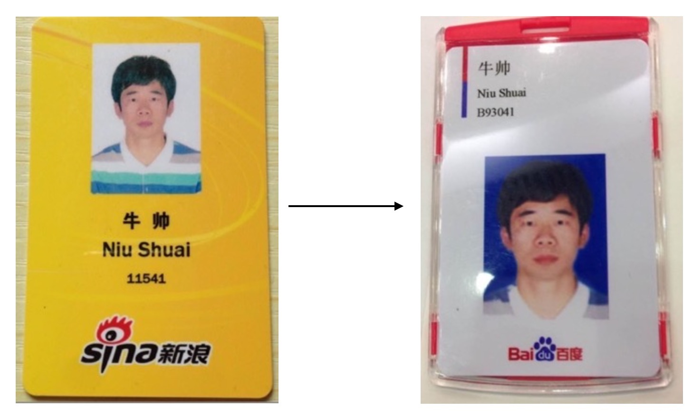

时间真的好快，转眼间马上就要2015了。以前没做过年度总结，所以回忆起来总是一片模糊。今年也算经历了一些事情，就趁着周末颓在家里总结一下吧。

* 工作
* 学习
* 生活

####1. 工作

今年最大的事情当然是换了工作：

具体不想说了，我希望知道的人我都告诉了，也都聊过。

那么，入职百度也将近2个月了。最大的感受只有一个字：忙。很有意思的是，我从一个极端走到了另一个极端：在新浪，大家基本不加班，6点多就走了，我7点吃完饭回来这一层基本就空了；而在百度（仅限我们组，其它组不清楚），10点也大有人在。这里我不想讨论加班的好与坏，因为我觉得无论加班与否，自己心里都清楚的很，是磨洋工还是主动提升业务能力、技术能力，只要稍微静下来想想就能知道。引用我在微博上看到的一句非常深刻的话：

> 这些年我一直提醒自己一件事情，千万不要自己感动自己。大部分人看似的努力，不过是愚蠢导致的。什么熬夜看书到天亮，连续几天只睡几小时，多久没放假了，如果这些东西也值得夸耀，那么富士康流水线上任何一个人都比你努力多了。人难免天生有自怜的情绪，唯有时刻保持清醒，才能看清真正的价值在哪里。

这段话给了我很大的触动。直接导致我一直在思考这个问题：

> **如何在各种因素的影响下更快的提升自己呢？**

在百度，除了少数 Top 级别的大牛，剩下99%的工程师都只是这个庞然大物的一颗螺丝钉。而这些人中又有做的好的、做的不好的。区别在于优秀的人适应环境，平庸的人抱怨环境。这样看来，答案显而易见：**态度决定高度**。通过这一阵子的反思，我发现自己就存在这样的问题：主动性不强。说的直白点：看似忙碌的背后，本质却是一种偷懒，一种自我安慰。就像上面那段话一样，自己被自己虚假的“勤奋”感动，其实是自欺欺人。

举个例子：

> 老大现在分给你一个活，你按时完成了，上线之后跟进几天也没有发现问题，那么这件事就算搞定了，对吧。但是，你有发挥自己的主观能动性吗？你有没有去问问 PM，为什么要有这个需求？这个需求合理吗？有数据支撑还是拍脑袋拍出来的？在实现代码的时候，能思考它的价值或者看到它的不足吗？在写（说不定是堆积？）代码的时候，是用自己最熟悉也最省事的方式去完成还是尝试去使用不同的解决方案？功能完成后有没有考虑性能？上线之后是不是主动跟进看看它的效果并思考如何做的更好？

是的，如果你有主动性，每个步骤都有学习的空间。而所谓的大牛，其实时间和你一样，但是差别就在这一点。而关于这一点，我是现在才渐渐察觉到的。当然了，我自己说的都是隔靴搔痒，而有大牛早就一针见血的指出了这个问题的要害：非常推荐刘未鹏的书——《暗时间》，这里会有你想要的答案：）

####2. 学习

2014年没看几本书，原因无非也是看书过程中太在意今天要完成 xx 页的任务，而不是彻底搞懂这块知识。如果满分是100分的话，我羞愧不已的给自己打个60分吧。

真真正正好好做的事情屈指可数：

* redis 的设计与实现，仔细看了大概3遍
* redis 源码看了数据结构和基本的事件模型(select/kqueue/epoll)
* 深入理解 Java 虚拟机
* Java 编程思想基础部分又啃了一遍，高级主题有点囫囵吐枣，所以还得再看一遍
* 抽了1个半月的地铁时间重新背了下四级单词，然后现在又忘光了
* 看了马士兵的 Spring 教程，重点部分看了2遍-3遍，时间长也有点忘了

知乎刷了挺多，基本忘了；微博刷了挺多，基本忘了；博客之类看了挺多，基本忘了。之所以啥都记不住，还是因为单个的点过于分散，没有和其它知识联系起来形成知识网络。**专业技能必须系统学习，互为网络，不然仅仅是过眼云烟。**

####3. 生活

这个怎么说呢，工作以后生活水平必然有所提高。毕竟自己赚的钱，花的时候没有多大的心理负担。但总体上来说，今年在生活方面最大的改观是逐渐养成了一个习惯：

> 用金钱换时间

其实说养成习惯总感觉有点别扭。

一本书，可以在网上找到盗版电子书，也可以去亚马逊买 kindle 正版电子书。区别是盗版质量参差不齐，需要自己花费时间、精力去甄别质量高的，如果找到的都是差不多，里面再有一堆水印啥的，看的时候就像碗里有几只苍蝇似的；而 kindle 正版仅仅是几块钱或者十几块钱，对于我现在的消费水平来讲，确实是可以接受的。这种情况下，用金钱换时间还能说得过去。而且很重要的一点，免费的东西好像大家都不珍惜，我见过很多人从皮皮书屋下载了一堆电子书，然后……就没有然后了。

但是在知乎上看到有些人对这个观点有些矫枉过正，这也让我反思了一下。在知乎印象特别深刻的是一个人在反驳别人时咄咄逼人地说：“你知道时间有多重要吗？时间才是最宝贵的东西。比如现在去参加个聚会，打的半个小时，坐地铁一个小时，我是绝对不会选择坐地铁浪费那半个小时的宝贵时间的”。对于这种言论，看起来很有道理，但仔细想想，我只想问 ta 一句：“你丫真的有那么忙？忙到连半小时都挤不出来？”，明明是自己懒/拖延，导致出门比较晚，非要给自己一个冠冕堂皇的理由，而且自己还被自己的“大彻大悟”感动了。这和上面那段话想说明的问题一样，只不过这里用反了。

所以，对于学习上的事情。我倾向于用金钱换时间，而对于其他事情，其实只要提前规划好，大可不会出现“浪费时间”的现象。在这里，我必须再推荐一下**《奇特的一生》**，讲的就是苏联科学家柳比歇夫是如何运用时间的。人家每天睡眠10个小时左右，但是他“从来没有抱怨过时间不够用”。强烈推荐。

####4. 2015希望

* 多读书
* 多创造机会接触牛人T_T
* 锻炼身体
* 扩充生活技能

多的也不敢列了，免得吓到自己。。。。总之，要比2014积极就好了。。。。。