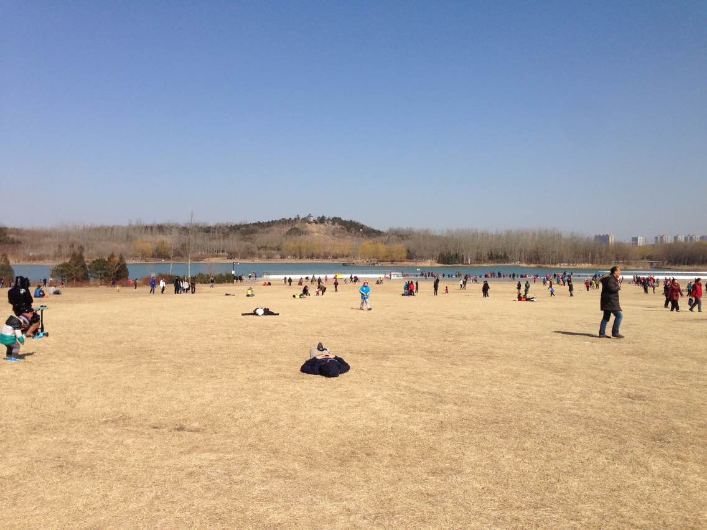

今天是周日，来上班后的第一个周末。周四和周五北京天气晴朗，加上膝盖都特么恢复一年多了，各种蠢蠢欲动，想去奥森刷圈。结果周六一起床就发现下大雪了。。。WTF!!!跟同事吃饭抱怨了好久，晚上也赖到12点才睡觉。。。万万没想到，第二天6点多竟然被阳光照！醒！了！！往窗外一看，雪完全化了。于是果断起床、洗漱冲向奥森。

一进奥森吓一大跳，门口人超多，而且都是光穿一个短裤，身上、脸上画的五花八门，一堆长短炮在拍照。。。不是太喜欢热闹的地方，就开始简单热身，慢跑了1公里感觉身子热的差不多了。就慢慢加速，可能是将近1年都没跑步吧，到4.5公里处就感觉心跳很快了，看来身体素质确实下降了不少，有点自我感觉良好了。。。。选择了一块草坪休息了大约10分钟，重新再开始就调整了跑步的速度，估计是6-8km/h的样子吧，跑的很舒服。

跑到8km 的时候，膝盖完全没一点不适的感觉，很出乎我的意料，不过悲剧的是右胯很酸痛，直接导致跑的时候略疼，很难受。就走完了剩下的2.5km。之后在南门入口的大草坪上躺了一个多小时。虽然上面挺多杂草，但是跑完步酣畅淋漓就关不了那么多了。。。

放一张照片吧：）

虽然这次直接上10公里有点累（中午心情好，吃了一顿大餐，，，，，，然后从3点睡到6点），但是跑步那种酣畅淋漓的感觉又回来了。希望今年能重新开始跑步，初步计划是每周去奥森刷一次。而且加入了百度跑协，说不定还能叫上几个人一起跑，那估计更爽吧。哈哈哈哈哈哈哈哈哈哈哈哈哈哈。如果可能，我还想参加今年的北马！！Enjoy running...