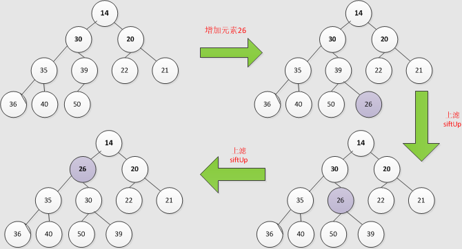
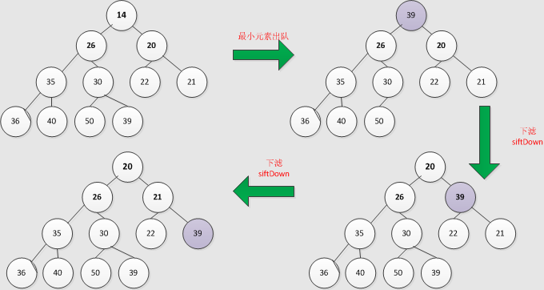

###一、前言

昨天看《Java 编程思想》21.7小节的 DelayQueue 的时候，写了一个小例子。但是程序的输出和我的预期输出不符，debug 了一下是 add 出了问题，但是因为已经23：30了就直接睡了，今天把这个坑填了。

从文档我们知道，DelayQueue 是一个使用 PriorityQueue 的 BlockingQueue，其中优先级是由 Delayed 接口的 getDelay()方法返回的延迟到期时间决定的。问题就出在 DelayQueue.add()方法中。其实跟一下代码很好理解，我只是备忘一下。。。。。

###二、问题引入

首先描述一下我写的程序的需求：

> 现在正在进行一场考试，有2个规则：1. 开始考试30分钟后才能交卷子；2. 考试时间为120分钟。

需求超级简单吧？但是实现起来还是有点难度。说一下我的思路：

1. 首先要有老师和学生
2. 如何确定考试结束的状态？肯定是所有学生都交卷了才算考试结束，所以学生肯定都要起单独的线程，正好 CountDownLatch 满足需求（CyclicBarrier 多了个复用）
3. 如果有学生不能在120分钟完成考试，应该强制收卷。这块比较难搞，怎么设计更合理？我想了2种方法：
	1. 抽出老师、学生的共性：参加考试接口，这个参加考试接口实现 Delayed 接口，然后 DelayQueue 加入老师和所有学生，老师作为120分钟的哨兵。等 queue 的头是老师，后面的学生直接交卷子
	2. 找一个其他班的不考试的学生作为助手，在120分钟时把未完成考试的学生卷子强行收上来
4. 上面两种设计都有缺点：
	1. 老师和学生虽然都参加考试，但是他们最好是不耦合的，老师只负责维护纪律，学生负责答题
	2. 虽然解耦了，但是引入了第三方，没有形成一个闭环（如果第三方服务挂了怎么办？）

嗯，Done is better than perfect.先把这个需求实现了，再慢慢改进。实际上我的代码是第二种思路实现的，贴一下：


package concurrency;

import java.util.Iterator;
import java.util.Random;
import java.util.concurrent.CountDownLatch;
import java.util.concurrent.DelayQueue;
import java.util.concurrent.Delayed;
import java.util.concurrent.TimeUnit;

class Teacher implements Runnable {

    private DelayQueue<Student> students = null;

    public Teacher(DelayQueue<Student> students) {
        this.students = students;
    }

    @Override
    public void run() {
        try {
            // 老师只负责看场子，考试结束后也是 Assistant 继续做事
            while (!Thread.interrupted()) {
                students.take().run();
            }
        } catch (InterruptedException e) {
            e.printStackTrace();
        }
    }

}

class Student implements Runnable, Delayed {

    private String name;
    private int workTime;
    private int submitTime;
    private boolean timeOut = false;
    private CountDownLatch countDownLatch;

    public Student(String name, int workTime, CountDownLatch countDownLatch) {
        this.name = name;
        this.workTime = workTime;
        this.submitTime = (int) TimeUnit.NANOSECONDS.convert(System.nanoTime() + workTime, TimeUnit.NANOSECONDS);
        this.countDownLatch = countDownLatch;
    }

    @Override
    public void run() {
        if (timeOut == false) {
            System.out.println(name + " 完成考试...期望用时：" + workTime + ", 实际用时：" + workTime);
        } else {
            System.out.println(name + " 未完成考试...期望用时：" + workTime + ", 实际用时：120");
        }
        countDownLatch.countDown();
    }

    @Override
    public int compareTo(Delayed o) {
        Student that = (Student) o;
        return this.workTime - that.workTime;
    }

    @Override
    public long getDelay(TimeUnit unit) {
        return unit.convert(submitTime - System.nanoTime(), TimeUnit.NANOSECONDS);
    }

    public void setTimeOut(boolean timeOut) {
        this.timeOut = timeOut;
    }

    @Override
    public String toString() {
        return name + " 期望用时： " + workTime + "\n";
    }
}

// 助手，其实是考试结束的哨兵
class Assistant extends Student {

    private CountDownLatch countDownLatch = null;
    private Thread teacherThread = null;
    private DelayQueue<Student> students = null;

    public Assistant(String name, int workTime, CountDownLatch countDownLatch, Thread teacherThread,
            DelayQueue<Student> students) {
        super(name, workTime, countDownLatch);
        this.countDownLatch = countDownLatch;
        this.teacherThread = teacherThread;
        this.students = students;
    }

    @Override
    public void run() {
        System.out.println("\n考试时间到！！！！请大家放下纸笔，立即交卷！！！这不是在演习，这不是在演习！！！\n");
        // 告诉老师，时间到了，是我的 show time
        teacherThread.interrupt();
        /**
         * 将120分钟还没有完成的同学的试卷强制收上来. 
         * 
         * 问：但是这里为什么用的是 students.iterator()？这样不是重头遍历了吗？ 
         * 答：DelayQueue<Student>前面的元素已经获取并且删除了，去看文档：  
         * 1. peek()不会删除头元素，如果队为空，返回 nulll 
         * 2. poll()会删除头元素，但是如果获取不到到期的元素，就会立马返回一个 null 
         * 3. take()会删除头元素，如果获取不到到期的元素，就会阻塞 
         */
        Student tempStudent = null;
        for (Iterator<Student> iterator = students.iterator(); iterator.hasNext();) {
            tempStudent = iterator.next();
            tempStudent.setTimeOut(true);
            tempStudent.run();
        }

        // 表示收卷子完成
        countDownLatch.countDown();

    }
}

public class MyExam {
    private static final int MIN_EXAM_TIME = 30;
    private static final int STUDENT_NUM = 20;
    private static Random random = new Random(47);

    public static void main(String[] args) throws InterruptedException {
        DelayQueue<Student> students = new DelayQueue<Student>();
        CountDownLatch countDownLatch = new CountDownLatch(STUDENT_NUM + 1);
        for (int i = 0; i < STUDENT_NUM; i++) {
            students.add(new Student("student " + (i + 1), MIN_EXAM_TIME + random.nextInt(120), countDownLatch));
        }

        // DEBUG
        // System.out.println(Arrays.asList(students));

        // 老师线程作用就是收取学生的试卷，本来需要同步锁机制。但是因为 DelayQueue 是一个使用
        // PriorityQueue 实现的 BlockingQueue，且使用 Delayed 接口的 getDelay()的时间作为比较的优先级
        // 所以，BlockingQueue 就隐藏了锁操作。
        Thread teacherThread = new Thread(new Teacher(students));

        students.add(new Assistant("强制收卷子...", 120, countDownLatch, teacherThread, students));

        teacherThread.start();
        countDownLatch.await();
        // 卷子全部收齐，考试结束
        System.out.println("考试结束！！！！！");
    }
}/*output:
student 5 完成考试...期望用时：31, 实际用时：31
student 10 完成考试...期望用时：37, 实际用时：37
student 3 完成考试...期望用时：43, 实际用时：43
student 7 完成考试...期望用时：58, 实际用时：58
student 6 完成考试...期望用时：59, 实际用时：59
student 2 完成考试...期望用时：65, 实际用时：65
student 9 完成考试...期望用时：72, 实际用时：72
student 11 完成考试...期望用时：78, 实际用时：78
student 12 完成考试...期望用时：78, 实际用时：78
student 20 完成考试...期望用时：88, 实际用时：88
student 18 完成考试...期望用时：91, 实际用时：91
student 8 完成考试...期望用时：110, 实际用时：110
student 19 完成考试...期望用时：110, 实际用时：110
student 15 完成考试...期望用时：119, 实际用时：119

考试时间到！！！！请大家放下纸笔，立即交卷！！！这不是在演习，这不是在演习！！！

student 1 未完成考试...期望用时：128, 实际用时：120
student 4 未完成考试...期望用时：131, 实际用时：120
student 14 未完成考试...期望用时：139, 实际用时：120
student 17 未完成考试...期望用时：148, 实际用时：120
student 13 未完成考试...期望用时：141, 实际用时：120
student 16 未完成考试...期望用时：148, 实际用时：120
考试结束！！！！！
*/


上面的程序能完成我的需求，但是考试结束后的学生竟然不是按照期望用时排序的，让我很诧异。因为加入队列的 compareTo() 我已经重写了啊，是按照期望用时(workTime)从小到大排序的，怎么输出就不对了呢？那个141是什么鬼！！！！刚开始以为是 compareTo 有 bug？但是compareTo()已经写过 N 次，就是简单的 ASCII 码比较，没出 bug 的可能啊，然后怀疑是程序逻辑有问题，就打印了 DelayQueue，结果果然不是按照期望用时排序的，于是 debug 了一下 add() 方法才算恍然大悟。。。。额，也就是本文的目的了：PriorityQueue 源码剖析。
###三、PriorityQueue 源码剖析

先上干货：

> PriorityQueue 文档上来就说了使用堆实现！！！！！没错，所以数组其实不是排序结果，而是维护了一个小顶堆。OK，核心已经说明。

如果数据结构没白学，这个类的核心已经算掌握80%了，剩下的就是一些小细节了。额，我就简单八一八。。

####0. 类属性 & 类方法


//默认初始化大小，11是什么鬼！！！
private static final int DEFAULT_INITIAL_CAPACITY = 11;  
//堆  
private transient Object[] queue;  
//当前大小  
private int size = 0;  
//比较器  
private final Comparator<? super E> comparator;  
//修改次数（增、删、改、查）  
private transient int modCount = 0;  

//增加  
public boolean add(E e)   
//出队（不删除）  
public E peek()  
//出队（删除）  
public E poll()  
//删除  
public boolean remove(Object o)  
//是否包含某元素  
public boolean contains(Object o)  
//清空  
public void clear()  
//扩容  
private void grow(int minCapacity)  
//查找  
private int indexOf(Object o)  


####1. add()方法

堆在增加元素后，需要进行调整才能维护其最大堆或者最小堆的性质，下面以最小堆为例：

增加元素26，默认是从队尾增加，即直接添加到数组最后。下一步需要执行上滤。从上图可以看出，26比其父节点39小，因此两者交换位置；再次比较此时的26和其父节点30，30>26,调整位置，依次进行直到找到比26小的父节点，结束。

贴下源码：


//可以看出，add方法实际上是全部委托给offer(E)
public boolean add(E e) {  
        return offer(e);  
    }

public boolean offer(E e) { 
	// 第1步：判空 
    if (e == null)  
        throw new NullPointerException();  
    // 第2步:改变大小和扩容
    modCount++;  
    int i = size;  
    //检查容量（扩容）  
    if (i >= queue.length)  
        grow(i + 1);  
    //改变size  
    size = i + 1;  
    // 第3步：添加元素并上滤
    if (i == 0)  
        queue[0] = e;//无父节点 ，直接赋值  
    else  
        siftUp(i, e);//有父节点，需要上滤  
    return true;  
}  

  
从上面的3步中可以看出，实际上关键的步骤是：grow() 和 siftUp()，下面贴下代码：


/**
* 1：扩容方式是：当前队列大小queue.length<64，则增加一倍容量；反之则增加一半容量。
* 2：调用Arrays的copyOf函数 ，实际上调用了该函数
*/
private void grow(int minCapacity) {  
    if (minCapacity < 0) // overflow  
        throw new OutOfMemoryError();  
    int oldCapacity = queue.length;  
    // Double size if small; else grow by 50%  
    int newCapacity = ((oldCapacity < 64) ? ((oldCapacity + 1) * 2)  
            : ((oldCapacity / 2) * 3));  
    if (newCapacity < 0) // overflow  
        newCapacity = Integer.MAX_VALUE;  
    if (newCapacity < minCapacity)  
        newCapacity = minCapacity;  
    queue = Arrays.copyOf(queue, newCapacity);  
}  

// siftUp()：

//根据不同的比较方式，采取不同比较策略。下面以使用默认comparable的方式分析
private void siftUp(int k, E x) {  
    if (comparator != null)  
        siftUpUsingComparator(k, x);  
    else  
        siftUpComparable(k, x);  
}  

// 经典的堆 shiftUp 操作
private void siftUpComparable(int k, E x) {  
    Comparable<? super E> key = (Comparable<? super E>) x;  
    // 迭代到堆顶  
    while (k > 0) {  
        // 父节点
        int parent = (k - 1) >>> 1;  
        Object e = queue[parent];  
        // 满足小顶堆属性，退出  
        if (key.compareTo((E) e) >= 0)  
            break;  
        // 父节点元素下移  
        queue[k] = e;  
        // 新迭代 
        k = parent;  
    }  
    // 交换  
    queue[k] = key;  
}  


####2. peek() 出队（不删除元素)


// 这个很简单，只是取出了其中的首位元素，但是并没有删除，不需要调整堆。
public E peek() {  
    if (size == 0)  
        return null;  
    return (E) queue[0];  
}  


####3. poll() 出队（删除最小元素）

出队过程:

当最小元素14出队，从数组尾处取39赋值给队首。之后，进行和增加元素后相反的动作即下滤。首先选出根节点（父节点）39的两个孩子结点中较小者，和39交换位置；当39找到新位置后，执行同种方法，如果孩子结点为null或者都比39大，则结束。

贴下源码：


public E poll() {  
    // 优先队列为空，返回null  
    if (size == 0)  
        return null;  
    int s = --size;  
    modCount++;  
    // 取出队首  
    E result = (E) queue[0];  
    E x = (E) queue[s];  
    // 队尾赋值为null  
    queue[s] = null;  
    // 判断是否执行下滤  
    if (s != 0)  
        siftDown(0, x); //核心方法，这里把最后一个元素传进去了，而且添加位置是0
    return result;  
}

private void siftDown(int k, E x) {  
    if (comparator != null)  
    siftDownUsingComparator(k, x);  
    else  
    siftDownComparable(k, x);  
}  

/**
* k = 0，所以相当于堆顶空降一个元素，然后执行经典的 ShiftDown
*/
private void siftDownComparable(int k, E x) {
        Comparable<? super E> key = (Comparable<? super E>)x;
        int half = size >>> 1;        // loop while a non-leaf
        while (k < half) {
            int child = (k << 1) + 1; // assume left child is least
            Object c = queue[child];
            int right = child + 1;
            if (right < size &&
                ((Comparable<? super E>) c).compareTo((E) queue[right]) > 0)
                c = queue[child = right];
            if (key.compareTo((E) c) <= 0)
                break;
            queue[k] = c;
            k = child;
        }
        queue[k] = key;
    } 


####4. removeAt() 删除(这个有点意思，是删除堆中的某一个节点)


private E removeAt(int i) {  
    assert i >= 0 && i < size;  
    modCount++;  
    int s = --size;  
    // 如果删除的是最后一个元素，则将最后一个元素设为null
    if (s == i)  
        queue[i] = null;  
    else {  
        // 如果删除的不是最后一个元素，取出最后一个元素，并将最后一个元素设为null。执行 ShiftUp
        E moved = (E) queue[s];  
        queue[s] = null;  
        // 执行 ShiftDown 
        siftDown(i, moved);  
        // 如果下滤后元素位置没变，说明moved是该子树最小元素；之后需要执行上滤  
        // ShiftUp 和 ShiftDown 实际只会执行其中一个  
        if (queue[i] == moved) {  
            siftUp(i, moved);  
            if (queue[i] != moved)// iterator中会用到此处  
                return moved;  
        }  
    }  
    return null;  
}
  

####5. clear() 清除


// 这个很简单，只是遍历数组，删除（设为null）
public void clear() {  
    modCount++;  
    for (int i = 0; i < size; i++)  
        queue[i] = null;  
    size = 0;  
} 


####6. contains() 是否包含


// 这个过程实际上就是查找过程
public boolean contains(Object o) {  
	return indexOf(o) != -1;  
}  


####7. idnexOf() 查找


private int indexOf(Object o) {  
(o != null) {  
        //遍历数组查询  
        for (int i = 0; i < size; i++)  
            //如果是自定义的元素，重写equals方法是很有必要的  
            if (o.equals(queue[i]))  
                return i;  
    }  
    return -1;  
} 

