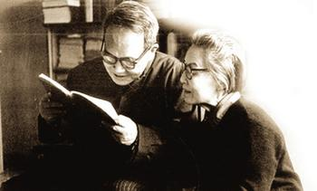

一直以来，都觉得杨绛是一位值得尊敬的女性。今天看到她的103岁访谈，如沐春风。看完以后觉得有必要放在博客里，与君分享：）

---

###序

2014年7月17日，杨绛迎来103岁生日，一百年的岁月风尘却难掩她的风华，就像多年前，钱钟书便给了她一个最高的评价：“最贤的妻，最才的女”。

儿时进的是启明、振华，长大后上的是清华、牛津，从小到大上名校，“好的教育”几乎伴随一生;作为在开明家庭和教育中长大的“新女性”，却嫁入需对公婆行叩拜礼的“传统”家庭，但依然和丈夫相亲相爱了一生;是名副其实的自由思想者，却要做别家媳妇诸事含忍，国难中的百忍生活之苦，以及在名利面前深自敛抑、“穿隐身衣”，“甘当一个零”，最终诠释何谓“忍生活之苦，保其天真”……可以说，‍杨绛先生的一生是传奇的，不论命运多艰，身上永远充溢着一种无怨无悔的向上之气，到了老年，脸上的淡定从容更是散发一种别样气质。

那么，在先生眼中，什么样的教育才算“好的教育”?什么样的婚姻才是理想婚姻?又有哪些忠告良言要献给年轻人呢?

###谈教育：“好的教育”首先是启发学习兴趣

　　问：您从小进的启明、振华，长大后上的清华、牛津，都是好学校，也听说您父母家训就是：如果有钱，应该让孩子受好的教育。杨先生，您认为怎样的教育才算“好的教育”?
　　
>　　教育是管教，受教育是被动的，孩子在父母身边最开心，爱怎么淘气就怎么淘气，一般总是父母的主张，说“这孩子该上学了”。孩子第一天上学，穿了新衣新鞋，拿了新书包，欣欣喜喜地“上学了!”但是上学回来，多半就不想再去受管教，除非老师哄得好。
>
>　　我体会，“好的教育”首先是启发人的学习兴趣，学习的自觉性，培养人的上进心，引导人们好学，和不断完善自己。要让学生在不知不觉中受教育，让他们潜移默化。这方面榜样的作用很重要，言传不如身教。
>
>　　我自己就是受父母师长的影响，由淘气转向好学的。爸爸说话入情入理，出口成章，《申报》评论一篇接一篇，浩气冲天，掷地有声。我佩服又好奇，请教秘诀，爸爸说：“哪有什么秘诀?多读书，读好书罢了。”妈妈操劳一家大小衣食住用，得空总要翻翻古典文学，现代小说，读得津津有味。我学他们的样，找父亲藏书来读，果然有趣，从此好读书，读好书入迷。
>
>　　我在启明还是小孩，虽未受洗入教，受到天主教姆姆的爱心感染，小小年纪便懂得“爱自己，也要爱别人”，就像一首颂歌中唱的“我要爱人，莫负人家信任深;我要爱人，因为有人关心。”
>
>　　我进振华，已渐长大。振华女校创始人状元夫人王谢长达太老师毁家办学，王季玉校长继承母志，为办好学校“嫁给振华”贡献一生的事迹，使我深受感动。她们都是我心中的楷模。
>
>　　爸爸从不训示我们如何做，我是通过他的行动，体会到“富贵不能淫，贫贱不能移，威武不能屈”古训的真正意义的。他在京师高等检察厅厅长任上，因为坚持审理交通部总长许世英受贿案，宁可被官官相护的北洋政府罢官。他当江苏省高等审判厅厅长时，有位军阀到上海，当地士绅联名登报欢迎，爸爸的名字也被他的属下列入欢迎者的名单，爸爸不肯欢迎那位军阀，说“名与器不可假人”，立即在报上登启事声明自己没有欢迎。上海沦陷时期，爸爸路遇当了汉奸的熟人，视而不见，于是有人谣传杨某瞎了眼了。
>
>　　我们对女儿钱瑗，也从不训示。她见我和钟书嗜读，也猴儿学人，照模照样拿本书来读，居然渐渐入道。她学外文，有个很难的单词，翻了三部词典也未查着，跑来问爸爸，钟书不告诉，让她自己继续查，查到第五部辞典果然找着。
>
>　　我对现代教育知道的不多。从报上读到过美术家韩美林作了一幅画，送给两三岁的小朋友，小孩子高高兴兴地回去了，又很快把画拿来要韩美林签名，问他签名干什么，小孩说：“您签了名，这画才值钱!”可惜呀，这么小的孩子已受到社会不良风气的影响，价值观的教育难道不应引起注意吗?

### 谈婚姻：男女结合最最重要的是感情

　　问：您是在开明家庭和教育中长大的“新女性”，和钱钟书先生结婚后，进门却需对公婆行叩拜礼，学习做“媳妇”，连老圃先生都心疼自己花这么多心血培养的宝贝女儿，在钱家做“不花钱的老妈子”。杨先生，这个转换的动力来自哪里?您可有什么良言贡献给备受困扰的现代婚姻?
　　
>　　我由宽裕的娘家嫁到寒素的钱家做“媳妇”，从旧俗，行旧礼，一点没有“下嫁”的感觉。叩拜不过跪一下，礼节而已，和鞠躬没多大分别。如果男女双方计较这类细节，那么，趁早打听清楚彼此的家庭状况，不合适不要结婚。
>
>　　抗战时期在上海，生活艰难，从大小姐到老妈子，对我来说，角色变化而已，很自然，并不感觉委屈。为什么，因为爱，出于对丈夫的爱。我爱丈夫，胜过自己。我了解钱钟书的价值，我愿为他研究著述志业的成功，为充分发挥他的潜力、创造力而牺牲自己。这种爱不是盲目的，是理解，理解愈深，感情愈好。相互理解，才有自觉的相互支持。
>
>　　我与钱钟书是志同道合的夫妻。我们当初正是因为两人都酷爱文学，痴迷读书而互相吸引走到一起的。钟书说他“没有大的志气，只想贡献一生，做做学问。”这点和我志趣相同。
>
>　　我成名比钱钟书早，我写的几个剧本被搬上舞台后，他在文化圈里被人介绍为“杨绛的丈夫”。但我把钱钟书看得比自己重要，比自己有价值。我赖以成名的几出喜剧，能够和《围城》比吗?所以，他说想写一部长篇小说，我不仅赞成，还很高兴。我要他减少教课钟点，致力写作，为节省开销，我辞掉女佣，做“灶下婢”是心甘情愿的。握笔的手初干粗活免不了伤痕累累，一会儿劈柴木刺扎进了皮肉，一会儿又烫起了泡。不过吃苦中倒也学会了不少本领，使我很自豪。
>
>　　钱钟书知我爱面子，大家闺秀第一次挎个菜篮子出门有点难为情，特陪我同去小菜场。两人有说有笑买了菜，也见识到社会一角的众生百相。他怕我太劳累，自己关上卫生间的门悄悄洗衣服，当然洗得一塌糊涂，统统得重洗，他的体己让我感动。
>
>　　诗人辛笛说钱钟书有“誉妻癖”，钟书的确欣赏我，不论是生活操劳或是翻译写作，对我的鼓励很大，也是爱情的基础。同样，我对钱钟书的作品也很关心、熟悉，1989年黄蜀芹要把他的《围城》搬上银幕，来我家讨论如何突出主题，我觉得应表达《围城》的主要内涵，立即写了两句话给她，那就是：
>
>　　围在城里的人想逃出来， 
>　　城外的人想冲进去。 
>　　对婚姻也罢，职业也罢。 
>　　人生的愿望大都如此。 
>
>　　意思是“围城”的含义，不仅指方鸿渐的婚姻，更泛指人性中某些可悲的因素，就是对自己处境的不满。钱钟书很赞同我的概括和解析，觉得这个关键词“实获我心”。
>
>　　我是一位老人，净说些老话。对于时代，我是落伍者，没有什么良言贡献给现代婚姻。只是在物质至上的时代潮流下，想提醒年轻的朋友，男女结合最最重要的是感情，双方互相理解的程度，理解深才能互相欣赏吸引、支持和鼓励，两情相悦。我以为，夫妻间最重要的是朋友关系，即使不能做知心的朋友，也该是能做得伴侣的朋友或互相尊重的伴侣。门当户对及其他，并不重要。

###谈修养：肯吃苦是最值得骄傲的品质

　　问：杨先生，您觉得什么是您在艰难忧患中，最能依恃的品质，最值得骄傲的品质，能让人不被摧毁、反而越来越好的品质?您觉得您身上的那种无怨无悔、向上之气来自哪里?
　　
>　　我觉得在艰难忧患中最能依恃的品质，是肯吃苦。因为艰苦孕育智慧;没有经过艰难困苦，不知道人生的道路多么坎坷。有了亲身经验，才能变得聪明能干。
>
>　　我的“向上之气”来自信仰，对文化的信仰，对人性的信赖。总之，有信念，就像老百姓说的：有念想。
>
>　　抗战时期国难当头，生活困苦，我觉得是暂时的，坚信抗战必胜，中华民族不会灭亡，上海终将回到中国人手中。我写喜剧，以笑声来作倔强的抗议。
>
>　　我们身陷上海孤岛，心向抗战前线、大后方。当时凡是爱国的知识分子，都抱成团。如我们夫妇，陈西禾，傅雷，宋淇等，经常在生活书店或傅雷家相会，谈论国际国内战争形势和前景。我们同自愿参加“大东亚共荣圈”的作家、文化人泾渭分明，不相往来。
>
>　　有一天，我和钱钟书得到通知，去开一个不记得的什么会。到会后，邻座不远的陈西禾非常紧张地跑来说：“到会的都得签名。”钟书说：“不签，就是不签!”我说：“签名得我们一笔一划写，我们不签，看他们怎么办。”我们三人约齐了一同出门，把手插在大衣口袋里扬长而去，谁也没把我们怎么样。
>
>　　到“文化大革命”，支撑我驱散恐惧，度过忧患痛苦的，仍是对文化的信仰，使我得以面对焚书坑儒悲剧的不时发生，忍受抄家、批斗、羞辱、剃阴阳头……种种对精神和身体的折磨。我绝对不相信，我们传承几千年的宝贵文化会被暴力全部摧毁于一旦，我们这个曾创造如此灿烂文化的优秀民族，会泯灭人性，就此沉沦。
>
>　　我从自己卑微屈辱的“牛鬼”境遇出发，对外小心观察，细细体味，一句小声的问候，一个善意的“鬼脸”，同情的眼神，宽松的管教，委婉的措辞，含蓄的批语，都是信号。我惊喜地发现：人性并未泯灭，乌云镶着金边。许多革命群众，甚至管教人员，虽然随着指挥棒也对我们这些“牛鬼蛇神”挥拳怒吼，实际不过是一群披着狼皮的羊。我于是更加确信，灾难性的“文革”时间再长，也必以失败告终，这个被颠倒了的世界定会重新颠倒过来。

###谈“自由”：忍耐是为了保持内心的自由

　　问：杨先生，您一生是一个自由思想者。可是，在您生命中如此被看重的“自由”，与“忍生活之苦，保其天真”却始终是一物两面，从做钱家媳妇的诸事含忍，到国难中的忍生活之苦，以及在名利面前深自敛抑、“穿隐身衣”，“甘当一个零”。这与一个世纪以来更广为人知、影响深广的“追求自由，张扬个性”的“自由”相比，好像是两个气质完全不同的东西。这是怎么回事?
　　
>　　这个问题，很耐人寻思。细细想来，我这也忍，那也忍，无非为了保持内心的自由，内心的平静。你骂我，我一笑置之。你打我，我决不还手。若你拿了刀子要杀我，我会说：“你我有什么深仇大恨，要为我当杀人犯呢?我哪里碍了你的道儿呢?”所以含忍是保自己的盔甲，抵御侵犯的盾牌。我穿了“隐身衣”，别人看不见我，我却看得见别人，我甘心当个“零”，人家不把我当个东西，我正好可以把看不起我的人看个透。这样，我就可以追求自由，张扬个性。所以我说，含忍和自由是辨证的统一。含忍是为了自由，要求自由得要学会含忍。

　　问：孔子“十五志于学，三十而立，四十而不惑”那一段话，已进入中国人的日常生活，成为一个生命的参照坐标，不过也只说到“七十从心所欲不逾矩”。期颐之境，几人能登临?如今您有登泰山而小天下的感觉吗?能谈谈您如今身在境界第几重吗?

>　　我也不知道自己如今身在境界第几重。年轻时曾和费孝通讨论爱因斯坦的相对论，不懂，有一天忽然明白了，时间跑，地球在转，即使同样的地点也没有一天是完全相同的。现在我也这样，感觉每一天都是新的，每天看叶子的变化，听鸟的啼鸣，都不一样，new experince and new feeling in everyday。
>
>　　树上的叶子，叶叶不同。花开花落，草木枯荣，日日不同。我坐下细细寻思，我每天的生活，也没有一天完全相同，总有出人意外的事发生。我每天从床上起来，就想“今天不知又会发生什么意外的事?”即使没有大的意外，我也能从日常的生活中得到新体会。八段锦早课，感受舒筋活络的愉悦;翻阅报刊看电视，得到新见闻;体会练字抄诗的些微进步，旧书重读的心得，特别是对思想的修炼。要求自己待人更宽容些，对人更了解些，相处更和洽些，这方面总有新体会。因此，我的每一天都是特殊的，都有新鲜感受和感觉。
>
>    我今年一百岁，已经走到了人生的边缘边缘，我无法确知自己还能往前走多远，寿命是不由自主的，但我很清楚我快“回家”了。我得洗净这一百年沾染的污秽回家。我没有“登泰山而小天下”之感，只在自己的小天地里过平静的生活。
>
>　　细想至此，我心静如水，我该平和地迎接每一天，过好每一天，准备回家。
