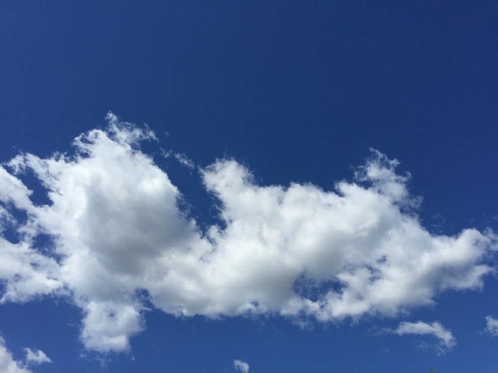
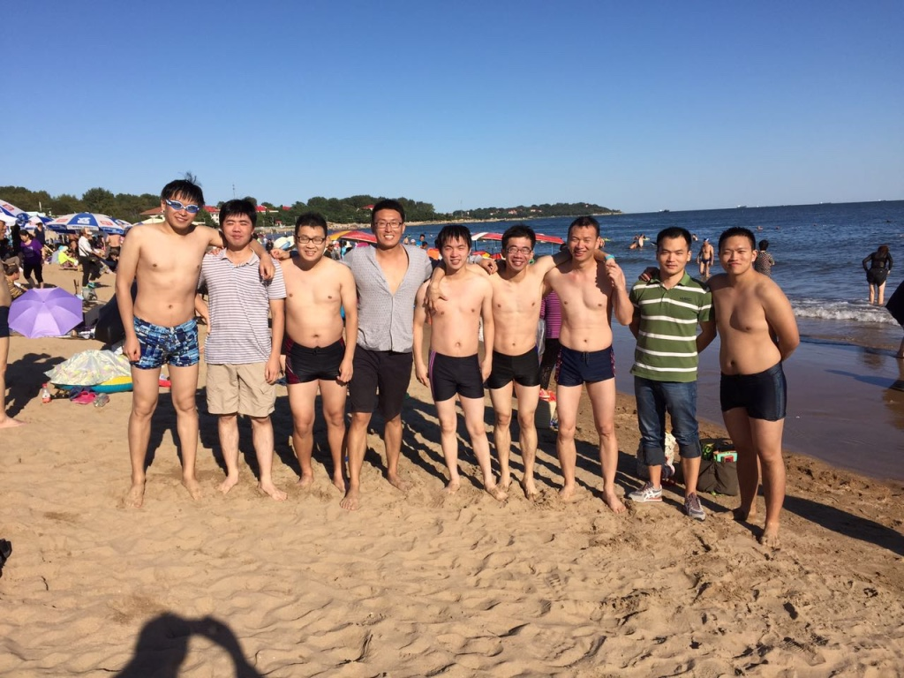
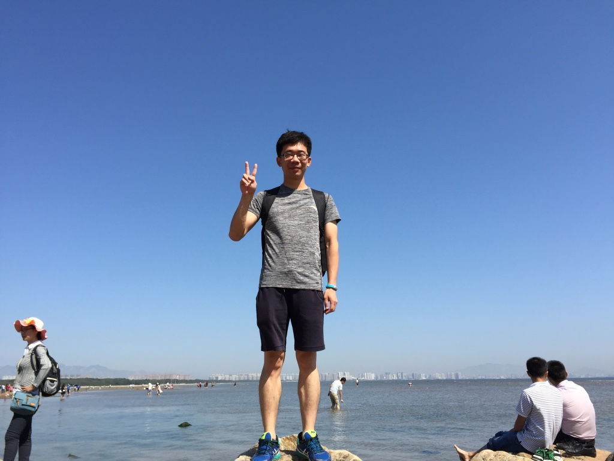
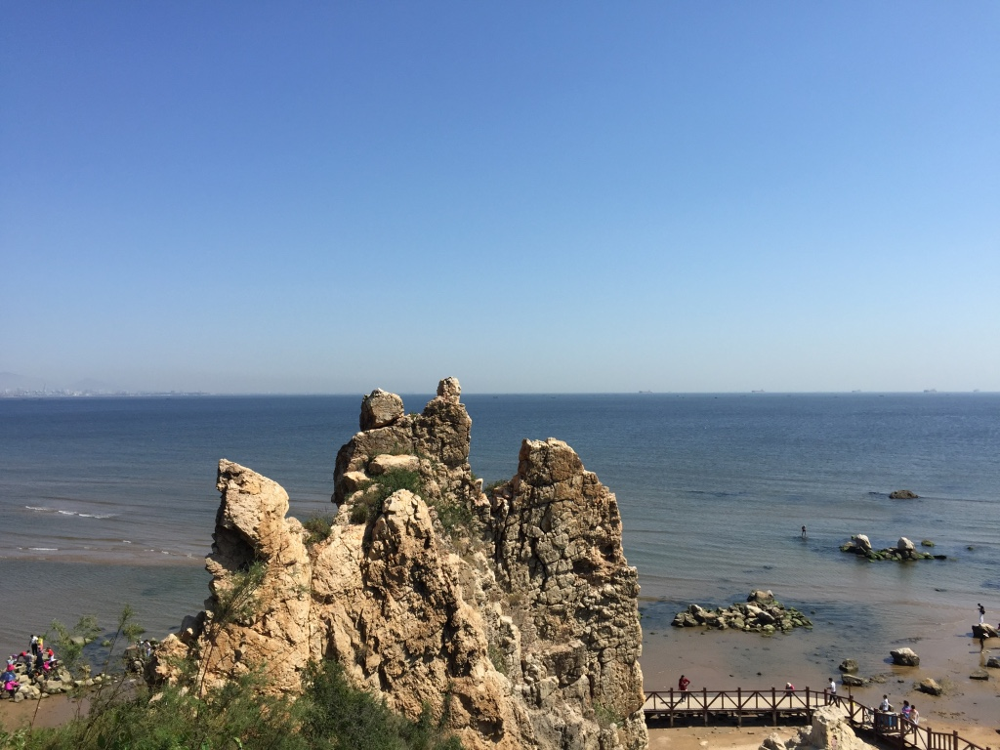
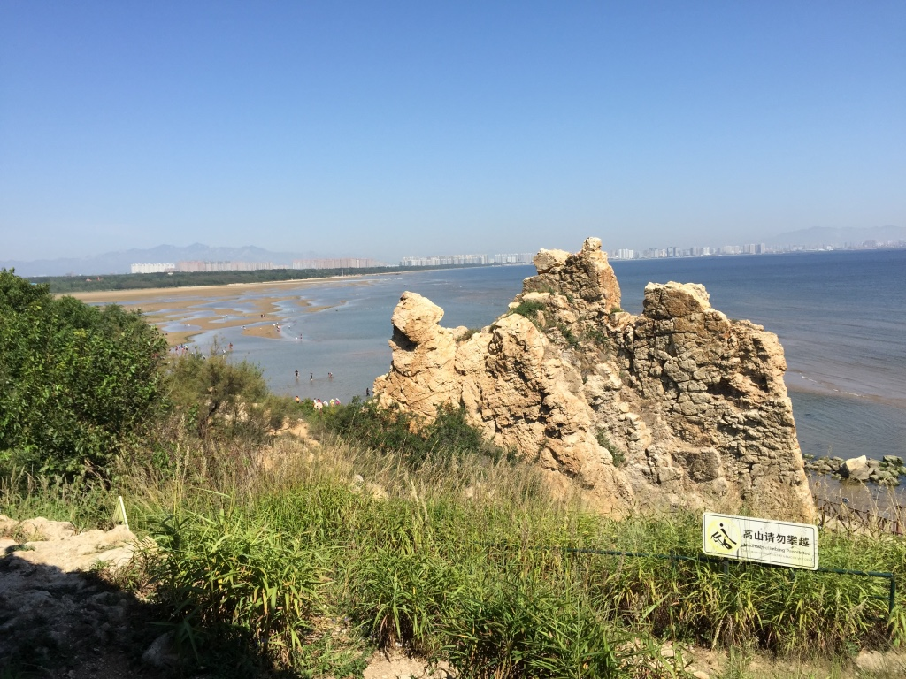
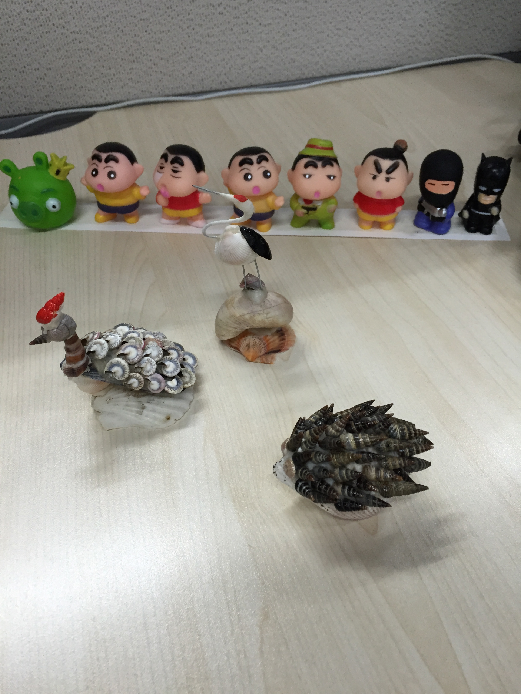
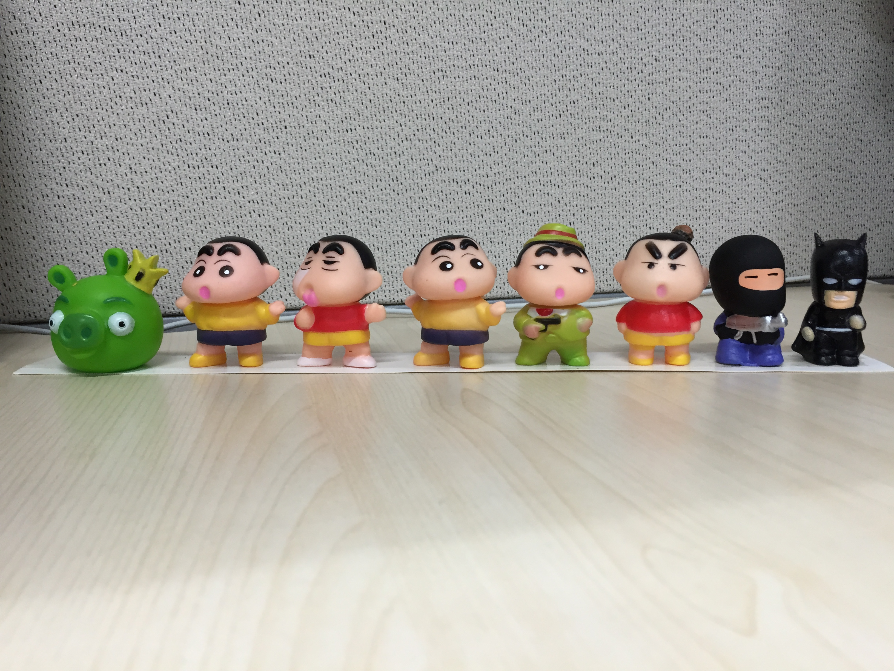

#### 黎明前的黑暗

话说7月份左右，团队有了出去 team building 的想法。一开始大家提议说想来次大的，去国外玩玩，但是因为钱的原因被搁浅。期间稀稀拉拉提过几次，也都无疾而终。

眼看着要步入 Q3了，老大就让我组织一下这次 TB。经过2星期的筛（tuo）选（yan），挑出了2个地方：坝上草原和北戴河。为啥挑这两个地方呢，其实主要是没钱 T_T，一个人也就300左右的 Bui 费。话说当初大家想去杭州，但是车费来回就1k 了，再加上玩，每个人大概得自费1.5k 左右，肯定很多人不想去的。所以，就选择了"京津冀后花园"的北戴河和美丽的坝上草原。

其实淘汰坝上草原一开始我是拒绝的，因为对我个人来说，比较喜欢原生态的自然风光，尤其是蓝天白云大草原，完全没有抗拒力。但是因为不是一个人，所以需要综合考虑大家的情况，团队里很多人希望玩的多，不要走太多路。而草原嘛，本来就是让又跑又跳的，所以只好忍痛舍弃。

于是，在8月中旬敲定最终方案去北戴河。因为有蚂蜂窝的存在，找旅游攻略简直不能再简单了，用了一个周末就把北戴河的情况摸的八九不离十。接下来就是安排行程了，在蚂蜂窝上根据评价和排名选择了几个备选旅馆，挨个打电话了解情况后选择了一家，又几次骚扰老板娘询问当地的天气、什么时候下水、需不需要防晒、海鲜如何之类的。最终在8月底发出了完整的旅游行程安排邮件。唯一不爽的是，虽然北京到北戴河只有2、3个小时的车程，但是周五晚上的火车票已然卖光，十一以前都没有合适的车票了。而团队里就2个人有车（还都不去 T_T），所以自驾游也是没戏。汽车票则是又贵又慢，还木有合适的时间。最后不得已选择了周六早上坐 Y509（7：50）的旅游车出发，周日晚上坐 D22（20：30）的动车返程。

#### 神说：要有光

一眨眼的功夫就到了9月11日，本来请了“度娘”来分享一个产品，结果人家临时出差放了我们鸽子= =晚上吃完饭一群人去会议室打 dota，可能是打的比较嗨？第二天就有人迟到没赶上火车，233.

因为北京周四周五连着下雨，怕北戴河也一样，很是担心。但是快到的时候发现北戴河竟然是蓝天白云，简直不能更爽。来一张等公交时候的照片：）

下午去了刘庄附近的海滩，表示玩的挺嗨。而且，还现场学了一下游泳。以前洗澡时候耳朵进水过，特别不舒服，所以一直对游泳特别恐惧= =结果听同事一说，只要侧着跳跳水就出来了。于是一狠心直接扎到水里，果然耳朵进水了T_T试着侧头跳了两三下，水真的出来了！！于是恐惧感完全消失。接下来就是尝试学习如何漂浮、用腿、划水、呼吸等，但是因为水太咸，而且看不清，所以就都是浅尝辄止了。总之，对游泳已经没有任何不适了，打算接下来在网上看点视频，然后直接杀到游泳馆实战。

下面是我们在海滩浪的照片，我的抓奶神功。2333

第二天一大早打车去了鸽子窝公园，因为收费，所以这里沙滩好软，水也特别清澈。表示玩的更嗨皮了：）直接放图

晚上回来的路上还买了几个贝壳的小工艺品，是个慈祥的老奶奶卖的。一个贝壳贴的笔筒，3个贝壳粘的小动物，一共才花了10块钱，简直不能更赞~~~

还有在夜市上买到的蜡笔小新，哈哈哈哈。等啥时候还想搞一套灌篮高手手办 T_T

#### 众神归位

TB 之旅很快就结束了，虽然只有短短的一天半，但是玩的还是非常开心的。现在回味一下，觉得心态很重要：

> 因为在北京上班，所以心理上总是很排斥。觉得北京就是工作的地方，既不是在家那种闲情逸致，也不是游玩时探索未知的新奇，而是带着某种庄重严肃，所以对北京少了一丝期许。

我觉得以后应该积极调整心态，工作是工作，生活是生活，不能让工作影响自己的生活。Work hard，Play hard.客观来讲，北京毕竟是祖国的首都，有意思的东西太多了，以前在知乎上看到光北京值得一去的博物馆就有大几十个，而自己在北京二年多，也没有兴趣去探索一下，真是呜呼哀哉。看来以后要坚决摆脱宅男的队伍，多出去走走看看。嗯，那就套用一句装逼的话作为结尾吧。

北京辣么大，我想去看看：）