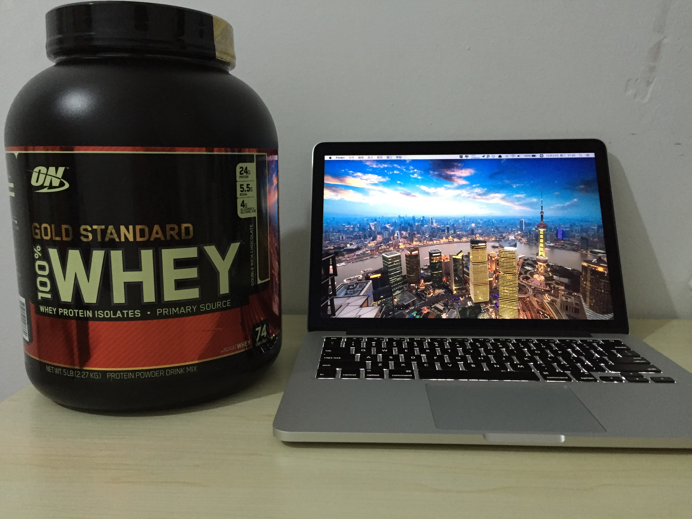
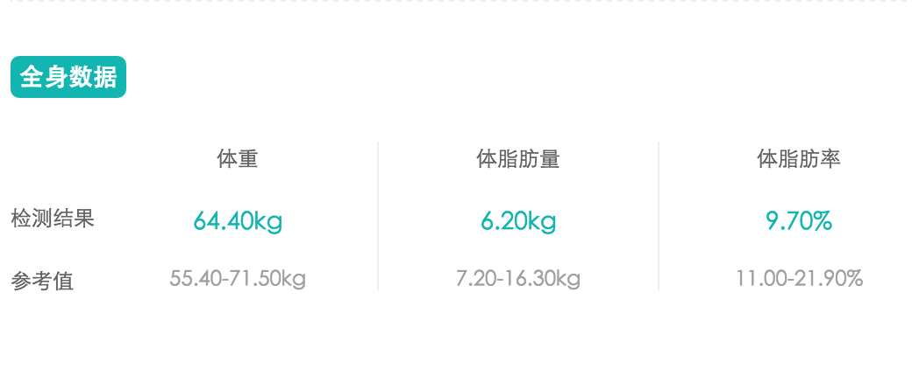
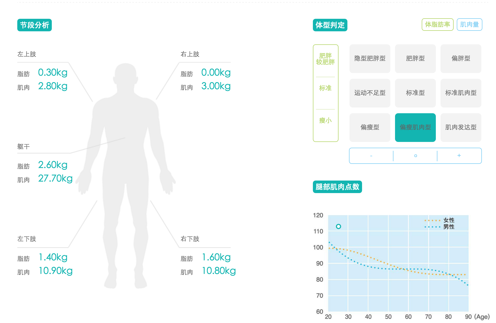

###冲动是魔鬼

话说前不久逛什么值得买的时候，看到有推蛋白粉的优惠。因为总和一个同事去健身房，他说自己买了一桶用来增肌，自己平时也偶尔在网上看到过这方面的知识，就一冲动下单了。然后今天晚上回家的时候，房间门口悄无声息的放着一个箱子，室友帮忙收的快递。话说顺丰也是够奇葩的，包装箱小了一码，隐约能看到里面的东西，加上我买的蛋白粉又是巧克力味道的黑桶，当时打开箱子还是挺像炸药的→_→额，上个图你们感受一下：

我都无法想象我得吃到啥时候T_T不过既然买了，也想好好练一练肌肉（主要是保持健康，所以重点是颈椎、腰椎、核心力量和跑步需要的大腿及臀部肌肉）。就趁着这个机会开始吧。

###现状

今天中午去了一趟F6-A座那测体脂，测完发现身体状况"看起来"还是很屌的：

但是比较蛋疼的是，我坚持练了70天（真的非常非常非常非常久了）的腹肌八分钟，腹肌还是若隐若现。按理说我腰部这么瘦应该随便一练就出来的，估计是因为强度太小，导致腹肌分离度较低的缘故吧。虽然躺下的时候能明显摸到8块腹肌，但是丫还是随主人，太害羞了→_→

###展望

希望能在三个月内有一个改变，那么就分成12周训练计划，但是一想到马上要过年了，就暂时变成5周吧。

希望每周要完成的任务：

* 每天：徒手深蹲 * 50
* 3次健身房：每个器械连续3组 * 12次，每次针对某个部位再练3组 * 12
* 5次腹肌8分钟
* 每天：泡沫轴放松 * 10分钟

###签到

* 第一周：
	* 深蹲：Done
	* 健身房：Done
	* 腹肌8分钟：Done
	* 泡沫轴放松：Fail
* 第二周：
	* 深蹲：Done
	* 健身房：Done
	* 腹肌8分钟：Done
	* 泡沫轴放松：Fail
* 第三周：
	* 深蹲：Fail
	* 健身房：Done
	* 腹肌8分钟：Done
	* 泡沫轴放松：Done
* 第四周：
	* 深蹲： Fail
	* 健身房：Done
	* 腹肌8分钟：【上周去健身房练大了，腰有点疼，估计要歇个10天吧】
	* 泡沫轴放松：Done
* 第五周：
	* 深蹲：
	* 健身房：
	* 腹肌8分钟：
	* 泡沫轴放松：