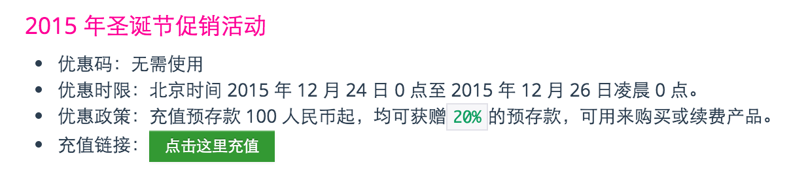

### 结缘

去年时候，用了4、5年的 goagent 突然抽风，花了很多时间去论坛问、或者去网上搜解决方案，最后都是好使几天就不行了。于是决定买个 VPN，当时在微博上有人推荐了 shadowsocks，去网上看了评价还行，就买了1年，从此过上了太平日子。

当然，期间也因为 GFW 升级，导致了几次访问延迟 or 无法访问，要么官方第一时间发邮件告知升级方案，要么自己提交 issue 反馈，一般也会在6小时以内答复。所以整体而言，还是非常省心的。

### 使用感受

使用了差不多1年了，1月份到期。感觉还是很好的一个 VPN，简单罗列一下我的感受：

* 优点：
	* 很便宜，99一年，真的很良心了
	* 速度非常快，目前打开 google 的速度都能赶超百度了
	* 不限流量，当然了，90%都是文本类型的流量，偶尔上上 YouTube 看看1080P 的视频，不能更爽
	* 节点挺多，如果偶尔抽风，换个节点就 ok 了
* 缺点：
	* IOS 端不能用，虽然是 IOS 的限制，但是你们做的真是太屎了，其他 VPN 都能用！
	* 客户端配置较为麻烦，对于计算机小白来说，很多配置都不知道干啥的：全局模式和 PAC 模式是什么鬼！
	* 比较知名，所以老被有关部门盯上
	* 没有在线客服之类的，每次都得提交工单等待。不能即时响应
	* WEB 页面做的很屎，经常找不到自己想要的信息（这次充值本来想续费2年，结果搞成购买了2年的新服务。。。）

当然了，整体上可用性还是非常靠谱的，对于程序员来说必须得上一套，平时 google、github、stackoverflow、reddit 啥的都是生活必需品吧。

于是今天我又续费了2年，179还是非常划算的说。。。

### 限时优惠

恰逢圣诞，shadowsocks 推出了限时优惠【2015-12-24 00：00至 015-12-26 00：00】：

想买的话就用下我的推荐链接，我可以拿到10%的提成（目前已推荐2个同事购买，评价都不错）：[购买请猛戳](https://portal.shadowsocks.com/aff.php?aff=416)，祝开心：）