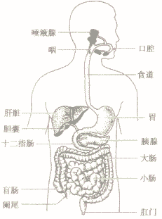
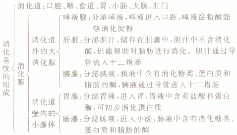

### 前言

开始锻炼身体，于是从豆瓣上搜到一本评价非常高的小册子——《Bigger Leaner Stronger》，因为是英文版的，正好趁着这本书练习一下英语。。嗯，下面是一些笔记，感觉要被各种健身单词虐了 T_T

 ---

### Introduction

在座的都是垃圾，完毕。

### 第一章

很多健身常识都是错误的，错误的原因是因为他们根本就不理解他们说的话，比如：应该记录卡路里、多吃蛋白粉、先有氧再无氧等等。你可以直接问他：

> 什么是卡路里？什么是蛋白质？什么是碳水化合物？

如果一个经常健身的人连这些都不懂，说明他其实并没有掌握基础的健身知识，更别说高级的了。因为这些名词都非常准确，如果你只是通过上下文或者相似的词去猜测它的意思，你和作者表达的意图就差之毫厘谬以千里了。所以，我们要从最基础的关键词开始。

### 第二章

下面是本书中将要使用的名词，说实话，最简单还是去网上找本初中生物看一看：

* Energy，能量：能量是一种能量，它可以从电、燃料、食物和其他资源获得，目的是工作或者产生动作
* Chemistry，化学：自然科学的一个分支，旨在研究物质的组成、分析它们的特征、和它们之间如何相互作用、结合、改变等
* Chemical，化学物品：就是能发生化学反应的物质。**一般情况下，人们所说的化学物品都是人造的，但是定义并不仅仅包括人造的**
* Organism，生物：一个人、一个动物、一个植物，都是生物
* Cell，细胞：是生物的基本组成单元，一些生物仅仅由细胞组成，比如草履虫。但一般来说，一个生物大概有60-100万亿个细胞组成
* Tissue，组织：是动物和植物体内、由大量细胞组成、具有相似形态和功能的结构
* Muscle，肌肉：是由大量组织构成的，紧贴骨头，能通过拉紧和放松让机体产生动作
* Fat，脂肪：是皮肤下面，由天然油性物质或者多余的脂肪性物质构成
* Organ，器官：是生物的一部分，由两个及以上相互协助的组织构成，可提供一些完整的功能。**肌肉不是器官，因为肌肉只是一种组织，而器官最少由两种组织构成**
* Gram，克：计量单位，1磅=454克
* **Calorie，卡路里：是一种计量食物产生多少能量的单位，一卡路里能让1kg 的水提升1摄氏度。所以说到卡路里，就是说食物里面潜在的能量。身体摄入的卡路里，除了维持身体运作和构建肌肉，其他会以脂肪的形式存储**
* Nutrient，营养：是一种提供生物生存和成长的物质，比如水、水果、蔬菜、肉
* Food，食物：不解释
* Matter，物质：宇宙中存在的有质量、有形状的所有东西
* Element，元素或者单质：不能通过化学反应分解为更小的物质，就是元素周期表中的元素
* Compound，化合物：由两种或两种以上的元素组成
* Molecule，分子：是保持物质化学性质的最小粒子
* Acid，酸：化合物，尝起来有酸味
* **Protein，蛋白质：构成人体细胞的基本物质，参与损伤细胞的修复和更新；为人体的生理活动提供能量。肌肉组织含有大量的蛋白质，蛋白质能让人强壮、让骨头更健康，是生命必不可少的营养物质**
* Amino Acid，氨基酸：构成蛋白质
* Carbon，碳：非金属元素，地球上绝大多数物质都含碳，所有生物都含有碳元素
* CarboHydrate，碳水化合物：由碳、氢、氧三种元素组成的化合物
* Metabolism，新陈代谢：食物分解释放能量的过程，这些能量用于为细胞提供能量或者为机体创造更加复杂的分子。当饥饿的时候，机体的新陈代谢会减弱
* Anabolism，合成代谢：就是简单物质合成为复杂的物质
* Catabolism，分解代谢：和上面相反

### 第三章

* Sugar，糖：是一种尝起来有甜味的碳水化合物，它可以来自多种植物，水果，蜜等等。
* Sucrose，蔗糖：是一种糖，常被称为蔗糖，粉末状形式，通过人工和自然方式都可以获得
* Glucose，葡萄糖：是一种非常简单的糖，也是生命体很重要的能量物质。大多数碳水化合物分解后会产生葡萄糖，它也是细胞供能的主要来源
* Glycogen，糖原：是在身体组织中发现的，用于储存碳水化合物的东西。当机体含有额外的葡萄糖，它会存储在肌肉中，这种形式存在的葡萄糖称为糖原。糖原就像身体的后备能源，当身体急需能量时，糖原会将葡萄糖释放到血液中
* Blood Sugar，血糖：血糖水平就是血液中葡萄糖的含量，葡萄糖在血液中传输，释放能量供细胞使用或储存
* Simple CarboHydrate，简单碳水化合物：是一种非常简单的糖，能非常迅速的分解为葡萄糖
* Complex CarboHydrate，复杂碳水化合物：就是由多种简单碳水化合物组成的，所以分解起来会比较慢
* Starch，淀粉：复杂碳水化合物，一种粉末状物质，是人体非常重要的能量物质，虽然淀粉是一种复杂碳水化合物，但是许多富含淀粉的物质却能迅速分解为葡萄糖
* Insulin，胰岛素：由蛋白质构成，在胰腺中合成。胰岛素就是让细胞吸收血液中的葡萄糖，降低血糖水平。然后可以了解一下糖尿病是怎么回事
* Glygemic Index，血糖指数（GI）：是衡量不同碳水化合物在人体内的血糖水平的单位，碳水化合物分解慢的，释放到血液中的葡萄糖也会比较慢，血糖指数就低；反之则高；**GI 小于55认为低，高于70认为高，纯净葡萄糖的 GI 为100**
* Grain，谷物：是不同种类草的种子，也可作为食物。谷物常加工为粉末状的面粉
* Wheat，小麦：小麦是一种产生谷粒的植物，常用于制作面包和意大利面
* White Bread，白面包：是一种面包，它由将部分谷物去掉且经过漂白的小麦面粉制作而成，这样会更容易烘焙和保存。是简单碳水化合物
* Whole Grain，全麦：就是没有去掉部分谷物，是复杂碳水化合物
* Fiber，纤维素：是一种在谷物、水果、蔬菜中发现的，不能被人体消化的物质。它可以吸收水分，并帮助将无用的食物排出体外，防止这些食物存在于消化系统并堵塞消化系统。纤维素被认为在防止消化疾病中扮演了一个很重要的角色。
* Fatty Acids，脂肪酸：组成脂肪的分子，用于帮助构建部分细胞和组织。脂肪酸含有两倍于碳水化合物和蛋白质的能量，所以脂肪酸多用于在脂肪组织储存能量
* Oil，油：是一种常温下以液体形式存在的脂肪，摸起来比较滑，而且不能和水融合。橄榄油、植物油、花生油都是食用油
* Essential Fatty Acids，必不可少的脂肪酸：有些脂肪酸是许多重要人体功能锁需要的物质，可以从植物油或者鱼类中获取。比如芝麻种子、南瓜子、胡桃等

嗯，虽然看过了这么多定义。但是都是分散的、没有系统性的。所以，我在网上 google 了初中生物，并且在 youtube 上观看了很多关于消化的视频，在这里做个总结吧。

### 第三章 —— 番外篇

说营养，首先要说先人体的七大营养素。他们是：

* 糖类(组成细胞的主要有机物)：人体内主要的供能物质
* 脂类(组成细胞的主要有机物)：这个分两类，一个是脂肪，也就是我们最深恶痛绝的；另一个是类脂，身体里的大部分激素是类脂，包括合成代谢类固醇也属于类脂的范畴
* 蛋白质(组成细胞的主要有机物)：这是你能进行生命活动的关键物质，为生长发育以及受损细胞的修复和更新提供原料。蛋白质也能供能，但效率很低
* 水：细胞的主要组成成分，人体60%-70%都是水，营养物质流动、代谢废物运输只有溶于水才能运输
* 无机盐：比如含钙的、含磷的、含锌的、含碘的无机盐，无机盐在体内的含量不大，但作用却很大
* 维生素：人体需求量少，因为它不是构成细胞的主要原料，不能供能，但生命活动又必不可少的物质。普遍存在于水果和蔬菜中，比如重要的维生素 C，没有它就容易得败血症
* 膳食纤维：除淀粉以外复杂的糖类，包括纤维素、果胶等。是植物细胞细胞壁的组成部分。大量存在于蔬菜瓜果、海藻、粮食（主要是粗粮）中。但是人体消化不了这东西，因为没有对应的微生物（牛羊等食草类动物有）。膳食纤维主要是帮助胃肠蠕动，防止便秘，也能促进有害物质排出体外，对预防大肠癌、高血脂、高血糖、心脑血管疾病、糖尿病等有一定作用

三大产能营养素的消化：

* 口腔：淀粉——淀粉酶——麦芽糖——麦芽糖酶——葡萄糖
* 胃：蛋白质——蛋白酶——多肽——肽酶——氨基酸
* 小肠：脂肪——胆汁——脂肪微粒——脂肪酶——甘油 + 脂肪酸

科学研究证明，脂肪和蛋白质在口腔中不能被消化，只有淀粉在唾液淀粉酶的作用下，部分转化为麦芽糖。而又因为淀粉没有甜味、麦芽糖有甜味，所以像米饭、馒头等嚼久了，就会感觉有一丝丝甜味。当然，麦芽糖不能直接被人体吸收，所以口腔只需有初步的消化作用。那么，什么是消化呢？

> 食物中的淀粉、脂肪和蛋白质都是分子大、结构复杂的有机物，进入消化系统后，逐步分解为简单的物质才能被人体吸收，这个过程叫做消化。**消化系统由消化道和消化腺组成。**消化主要是通过多种消化酶的作用而进行的，除口腔中的唾液淀粉酶以外，胃、小肠等器官中还有许多种消化酶。

#### 消化道：

1. 口腔：口腔是消化道的开始部位，里面有牙齿、舌和唾液腺。牙齿的主要功能是切断、撕裂和磨碎食物，牙齿损伤以后，食物就不能得到充分的咀嚼，因而会加重胃、肠的负担。
2. 咽：是食物和空气的共同通道，无消化和吸收能力。
3. 食道：是物物进入体内的通道，可以蠕动将食物推入胃。
4. 胃：位于腹腔的左上方，是消化道最膨大的部分。胃呈囊状结构，由外至里依次由浆膜，肌肉层、黏膜下层，黏膜4层绀成，黏膜具有腺体，能分泌盐酸和胃蛋白酶等
胃具有暂时储存食物并蠕动进行物理性消化．以及利用盐酸、蛋白酶对食物进行化学性消化的作用。
5. 小肠：小肠盘曲在腹腔里，长约5～6米，开始的一段叫十二指肠。小肠是消化道中最长的段，是消化食物和吸收营养物质的主要场所。小肠壁也分为4层，与胃壁相似。小肠黏膜的表面有许多环形皱襞，皱襞上有许多绒毛状的突起——小肠绒毛(如图)。小肠绒毛间的黏膜凹陷形成肠腺，可以分泌肠液消化食物。小肠内表面具有的皱襞和小肠绒毛，大大地增加了消化食物和吸收营养物质的面积、小肠绒毛中有毛细血管和毛细淋巴管。小肠绒毛壁、毛细血管壁和毛细淋巴管壁都很薄，都只由一层上皮细胞构成。这种结构特点有利于吸收营养物质。
6. 大肠：大肠开始的一段叫盲肠，盲肠上有一细小突起叫阑尾，肓肠位于腹腔右下部，所以患阑尾炎时．右下腹部疼痛。大肠无消化能力，但有较弱的吸收能力，能吸收少量的水、无机盐和部分维生素。
7. 肛门：未消化的食物残渣在大肠内形成粪便，由肛门排到体外。

#### 消化腺：

人体出的消化腺包括唾液腺、胃腺、肝脏、胰腺和肠腺。其中，唾液腺、肝脏和胰腺是位于消化道外的消化腺，胃腺和肠腺是位于消化道壁内的腺体。

1. 唾液腺：唾液腺能分泌唾液，唾液的主要作用是湿润口腔和食物，便于吞咽；唾液中含有的唾液淀粉酶，能促使一部分淀粉分解为麦芽糖；唾液中含有的溶菌酶有一定的杀菌作用。
2. 胃腺：胃腺是由胃壁内黏膜上皮凹陷而形成的，胃腺开口在胃壁的内表面。胃腺能分泌胃液。胃液呈酸性，pH为0．9～1．5，成人每天分泌的胃液为1．5～2．5升。胃液的主要成分有胃蛋白酶、盐酸(即胃酸)和黏液。
3. 肝脏：肝脏是人体内最大的腺体，成人的肝重约1．5千克，大部分位于腹腔的右上部。肝脏具有多方两的生理功能。肝脏在蛋白质、糖类和脂肪的代谢中起着重要作用。肝脏还具有解毒功能。肝脏能够分泌胆汁，并将其储存在胆囊内。当食物进入口腔、胃和小肠时，可以反射性地引起胆囊收缩，胆汁经过总胆管流入十二指肠。成人每天分泌的胆汁约为0．8～1．0升。胆汁中没有消化酶，主要成分是胆盐和胆色素。胆盐的作用是激活胰脂肪酶，将脂肪乳化成极细小的微粒，增加脂肪与胰脂酶的接触面积，有利于脂肪的消化和吸收；可以与脂肪酸和脂溶性维生素结合，形成水溶性复合物，以促进人体对这些物质的吸收。
4. 胰腺：胰腺分泌胰液，胰液呈碱性，pH为7．8～8．4，成人每天分泌的胰液约为l～2升。胰蛋白酶作用于蛋白质，蛋白质被分解为多肽和少量氨基酸。存在于胰液中的胰淀粉酶和少量的胰麦芽糖酶，又可以分别促使淀粉和麦芽糖分解为葡萄糖。胰脂肪酶在胆汁的协同作用下，促使脂肪分解为脂肪酸和甘油。肠腺是有由小肠壁内黏膜上皮凹陷而形成的，开口于相邻的两个小肠绒毛之间。肠腺能分泌肠液，肠液呈弱碱性，pH约为7．6，成人每天分泌的肠液为1～3升。肠液内含有多种消化酶，如淀粉酶、麦芽糖酶、蔗糖酶、乳糖酶、肽酶、脂肪酶等，通过这些酶的作用，进一步分解糖类，蛋白质和脂肪，使之成为可以吸收的物质。

然后推荐2个讲解消化系统的视频，第一个巨搞笑，科普性质的，第二个讲器官，比较专业。总之，讲的真挺好的：

* [消化](https://www.youtube.com/watch?v=qE5_jtH1z7c)
* [讲解消化道](https://www.youtube.com/watch?v=aS5KF4IvNfI)

### 第四章

* Cholesterol，胆固醇：是一种很轻、蜡状的物质，存在于许多脂肪中。植物中没有胆固醇，
* Saturated fat，饱和脂肪：会增加血液中有害胆固醇的数量，它们存在于黄油、熏肉、牛肉和蛋黄中
* Unsaturated fat，不饱和脂肪：会降低血液中胆固醇的浓度，而且对修复细胞起作用。虽然它有益，但本质还是脂肪，含有的卡路里很高。比如在鱼油、坚果油、菜籽油中就含有不饱和脂肪
* Tran Fat，反式脂肪：就是人工合成用来炸东西用的，比如肯德基啊、大脸鸡排（我基本不买，还是怕油不好）、甜甜圈啊、薯条等等炸的东西，哦，还包括一些饼干
* BMI，body mass index，身体质量指数：体重/(身高*身高)，其中体重单位是 kg，身高单位是 m。一般而言是18.5-25正常，18.5以下是偏瘦，25以上是偏胖

### 第五章：6个关于肌肉生长的秘密和错误

#### 1.组数不是越多越好

很多健身房的 newbies 觉得精疲力尽的做完17组动作才能最大化的刺激肌肉生长，但事实却可能相反。因为机体修复肌肉生长的时间和数量有限，破坏的多却得不到及时修复，那么肌肉就会减少。

所以正确的方式是最大化刺激肌肉的同时，能让机体有效的修复。让肌肉修复、成长在一个正确的道路上。那么问题来了，我咋知道啥时候才算是**最大化刺激肌肉**？

> 当你训练时，机体会释放一系列的激素，比如：睾酮、生长激素、胰岛素来促进肌肉生长。同时机体也会释放一种叫做*皮质醇*的激素，它可以提高血糖水平、预防炎症，但它也会降低机体利用蛋白质的能力、影响肌肉生长。一个最好的办法是：**让你的训练周期短一些。力量训练周期控制在45-60分钟，有氧运动控制在30-45分钟，这样会最大化的刺激促进肌肉生长的激素释放，最小化的刺激皮质醇的释放。**

#### 2.必须让“肌肉燃烧”起来

很多在健身房举铁的都会嘶吼，然后旁边的打气会说“再来一组！”，但是 No Pain, No Gain 是最大的谬论之一。

一般，当觉得肌肉特别“疼”的时候，都是因为累积了乳酸。而乳酸随着肌肉一次次的收缩会越来越多。乳酸会导致“合成级联”现象，就是机体把各种生长类型的激素混合。但是研究发现，如果乳酸的含量太高，会削减肌肉的生长、同时组织（这里可能是肌肉组织）会开始分解。

#### 3.错误的练习就是浪费时间

在健身房的正确步骤是：

1. 循序渐进的增加重量
2. 正确的吃
3. 给予身体充足的休息

而作者建议的都是最最简单的健身器械：哑铃、杠铃、长凳上躺着可做的器械。而对于那些大型器械，作者表示效果不是很好。我个人觉得是因为大型器械是在锻炼肌肉的基础上加上了安全考虑，比如深蹲架会固定前后方向，只需要关注上下。而不借助深蹲架则需要在力量训练的基础上兼顾平衡。

而且有研究表明，更有效的肌肉训练是**混合训练**，顾名思义，就是同时锻炼不同的肌群，比如深蹲、硬拉；相反则是局部训练，每次只能锻炼到一个肌群，比如哑铃卷曲，或者腿部伸展。总结一下就是，局部训练有用，但是没那么有用。所以训练时，局部训练不会是重点。

另一个常见错误就是：你需要不断改变训练计划去度过平台期，或者在练习时改变个角度就能更大的刺激肌肉，这些都不是建立在科学研究的基础上，有效的话也仅仅针对某个个体，没有参考意义。

#### 4.像一个白痴一样举重

健身房最惨不忍睹的场景就是一群自大的举重者因为突然的痉挛而扔掉器械。如果不想受伤，重点就在于把姿势做的完美，而不是看起来很酷，不然迟早要受伤。

#### 5.像一个懦夫一样举重

健身不易，不要放弃。

#### 6. 练与吃

如果猛练、吃的不够，肌肉不会增加；反之吃的太多，会被脂肪掩盖。和前面说的一样，要有充足的营养补充和休息才行。

### 第六章
