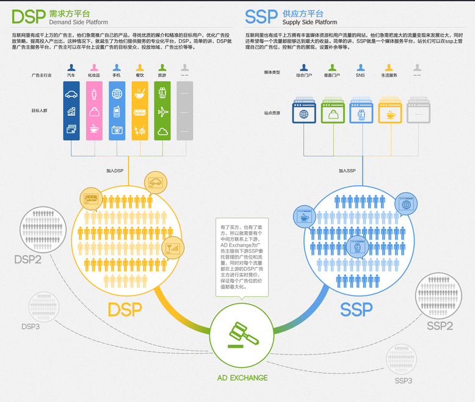
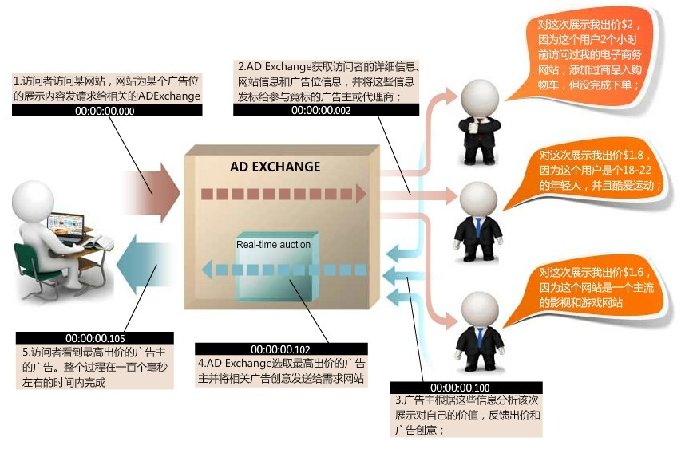
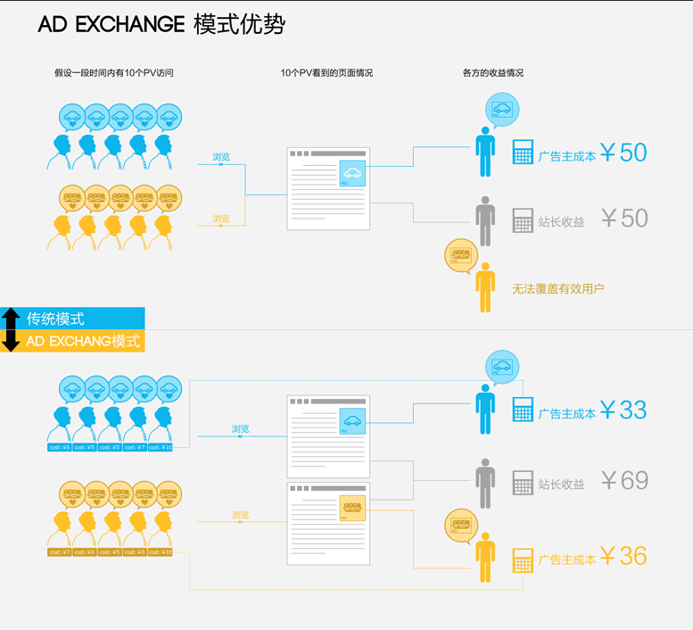

### 一、互联网广告的出现

随着互联网的普及，越来越多的人注意到这是一个商机。于是互联网广告应运而生。随着互联网的高速发展，互联网广告成为互联网行业盈利最多的方式之一（貌似最烧钱的是网游？比如腾讯，60%都是游戏营收）。它的实现方式也很简单：**如果网站有很大的流量，那么我只要在合适的位置（广告位）投放合适的广告（创意），让合适的人（用户）看到，进而转化为行动（如购买、点击、注册等）**。

### 二、互联网广告的发展

* 通投：在互联网广告发展的早期，因为技术、经验的问题，广告投放都是通投。顾名思义，通投就是给所有的用户不加区分的投放同一个广告。
* 精准投放：渐渐地，通投被更为高效的精准投放代替。精准投放也很容易理解，就是根据用户的行为（比如常去体育频道），投放与用户兴趣相关的广告（投放nike或者adidas）

我拿一个简单的例子来分别说明一下上述两种方式的工作原理：

* 通投：李雷和韩梅梅都喜欢在新浪网站上看新闻，同时李雷喜欢打篮球，韩梅梅喜欢看小说。今天他们打开新浪后，页面上面位置出现了一个苏宁的促销活动。“这广告真烦人啊”，这是李雷和韩梅梅的第一反应。于是他们赶紧关闭了广告，然后才安心的看自己感兴趣的部分。
* 精准投放：李雷和韩梅梅都喜欢在新浪网站上看新闻，同时李雷喜欢打篮球，韩梅梅喜欢看小说。今天他们打开新浪后，李雷发现页面上方显示的是nike最新款的篮球鞋，李雷看了感觉不错，于是点进去详细了解了一番，发现这款篮球鞋性价比很高，于是就买下来了。而韩梅梅发现页面上面显示的是韩寒的《一个：很高兴见到你》，因为韩梅梅非常喜欢韩寒，于是她也点进去看了一下介绍，发现正是自己喜欢的类型，于是她也买了下来。

通过上面的例子，应该能很容易分辨哪种广告形式更好。第一种不但遭到用户的讨厌，而且商家也没有赚到钱；而第二种，用户遇到了喜欢的东西，商家也挣到了钱，两全其美。所以，现在所有的互联网公司都有专门的广告团队来干这件事。记得在网上看到一句很经典的话：为什么这些聪明人都在绞尽脑汁让人点击广告？其实想一下就知道了，google之所以被称为印钞机，就是因为它的广告营收。记得在哪里看过，google广告团队占整个google团队人数的3%，但是这3%却支撑起了整个google帝国的营收。而广告营收的方式一般有三种：

* CPM:每千次展示扣费
* CPC:每次点击扣费
* CPD:按天扣费

这个没什么说的：如果是大品牌，做广告肯定是为了宣传品牌的效果，所以在新浪首页包一天的广告位，肯定效果非凡；如果是普通商家，可以选择CPM或者CPC，这个看是想扩大知名度还是纯粹为了捞钱了。

### 三、Ad Exchange —— 互联网交易平台

Ad Exchange是一个互联网广告交易平台，它联系的是广告交易的卖方和买方，卖方是广告位提供商，买方是广告主。

一个典型的例子是酱紫滴：

> 新浪首页最上面有一块横幅式广告（广告位提供商），因为临近“11·11”，苏宁策划了一个促销活动，于是它登陆Ad Exchange寻找合适的广告位（广告主），它挑了半天，选中了新浪首页的这块横幅式广告位。于是它通过Ad Exchange买下了为“11·11”准备的广告位。

上面只是一个简单的例子，其实，互联网广告发展到今天。已经发展为3个独立的平台：

* Ad Exchange，广告交易平台：提供平台，连接DSP和SSP
* DSP(Demand Side Platform)，需求方平台：互联网里有成千上万的广告主，他们急需推广自己的产品。所以他们会寻找优质的媒介和精准的目标用户，优化广告投放策略，提高投入产出比(ROI)。简单的讲，DSP就是广告主服务平台，广告主可以在平台上设置广告的目标受众、投放地域、广告出价等
* SSP(Supply Side Platform)，供应商平台：互联网里也有成千上万拥有丰富媒体资源和用户流量的网站，他们急需把庞大的流量变现来发展壮大，同时还希望每一个流量都能够达到最大的收益。简单的讲，SSP就是一个媒体服务平台，网站可以在SSP上管理自己的广告位，控制广告的展现，设置补余等

下面是三者之间的关系图：

由于Ad Exchange是一个广告交易平台，连接SSP和DSP。那么，一个Ad Exchange显然可以有多个SSP和DSP。那么，当用户请求一个SSP的广告位时，究竟由哪个DSP来展示它们的广告呢？这就得说说RTB(Real Time Bidding)实时竞价了。

* RTB(Real Time Bidding) 实时竞价：跟传统购买形式相比，RTB是由SSP提供一个广告位，由DSP竞价来获得广告展示机会的机制。一次展示广告的机会，就是一个用户PV（page view，用户浏览行为），然后所有DSP都会进行一次展现竞价，谁出价高，谁的广告就会被这个用户PV看到。
如果你了解互联网广告的话，会发现RTB机制是一个极其重要的环节。我们可能有这样的疑问：为什么广告主（买方）会为了一个用户PV而竞相出价呢？这个广告位有什么了不起，会让广告主心甘情愿出最高价来竞标？

秘密就在于，Ad Exchange广告平台售卖的已经不是传统意义上的广告位了，而是访问这个广告位的具体用户。这个用户会有自己的兴趣爱好，广告如果能够投其所好，就能产生最大的收益。这样的用户在互联网海洋里可是稀缺资源，他完全有魅力让广告主来竞相竞价获得在用户面前展现自己的机会。那么，Ad Exchange是怎么知道这个访问用户是谁，他会对什么更感兴趣呢？这就要引出互联网数据平台DMP了。

* DMP(Data Management Platform)，数据管理平台：把所有涉及到第一方（SSP方）广告位售卖和第三方（DSP方）广告主购买的信息整合、分析，进而导入现有的营销环境中，提高广告的精准定位。

这样，Ad Exchange有了DMP，就可以知道访问某个广告位的用户对什么感兴趣，这样RTB就有了运作的资本，而DSP就乐意出较高的价钱来竞争该PV。从而实现各个平台的共赢。

### 四、Ad Exchange运作方式

前面李雷和韩梅梅是站在用户的角度分析一次广告展示的过程，当然，这个广告是怎么筛选出来的用户不会知道。下面，我们就深入到Ad Exchange中来了解一下这个广告是怎样一步一步脱颖而出的。

1. 用户打开某个SSP的网站页面，如新浪首页
2. SSP通知Ad Exchange有一个用户PV，并把广告位的具体信息，例如所属站点、最低出价等告知Ad Exchange
3. Ad Exchange通过DMP将SSP传来的信息进行加工分析，得出用户的兴趣、基本信息等
4. Ad Exchange将DMP整合的用户信息发送给各个DSP
5. 各个DSP收到Ad Exchange的竞价通知后，判断该用户是否符合广告主设置的定向信息（符合度越高，出价越高），之后进行出价
6. Ad Exchange对各个DSP的出价进行比较，采用荷兰拍方式决出获胜者，之后在该广告位展示该DSP提供的广告
7. 完成整个竞价流程后，结算。SSP收费，DSP付费,Ad Exchange收取中介费

下图展示一个样例：

五、Ad Exchange的优势

上面我们介绍了Ad Exchange的由来，并通过一个例子了解了Ad Exchange是如何联系SSP和DSP进行工作的，那么，究竟Ad Exchange有哪些优势呢？

Ad Exchange是针对具体用户通过DMP分析后推送的广告，这种针对具体用户的广告投放方式相较于传统的购买固定广告位包天或者包月展现，优势还是很明显的。它既能够有效的提高广告主（DSP）的投入产出比，也能够让广告位供应商（SSP）的收益最大化。

* 传统交易模式：假设一个汽车广告主按CPM方式花50块买了10个PV的展现，10个PV里有5个人对汽车感兴趣，另外5个人对美食感兴趣。那么汽车广告主覆盖有效用户的成本是50块，站长的收益也只有是50块，而那些美食广告主无法覆盖目标用户，没有展现机会。
* Ad Exchange模式：广告主只需要针对5个目标用户竞价展现就好，即使每个目标用户的出价会高于CPM方式的平均出价，但是由于精准，广告主的成本不但没有增加反而有所下降，他们花更少的钱覆盖到了更多的用户，有效的提高了广告主的投入产出比；同样，美食广告主也可以通过Ad Exchange来覆盖到另外5个对美食感兴趣的用户，获得广告展示机会。对站长而言，一个广告位不再被某一个单一广告主购买后独占，而是对每一个用户PV都竞价获利。这种方式，对SSP、DSP、Ad Exchange都是有利的，所以这是一个共赢的平台。

### 六、Ad Exchange的瓶颈

我接触互联网广告的时间还是太短，所以也说不上来Ad Exchange有哪些劣势。上网找了一些文章看了看，发现瓶颈应该还是对海量数据的分析。总结了一下大概有3点：

* SSP：广告位如何分布？
* DSP：定向如何精准？
* Ad Exchange：用户数据如何加工？

这里面涉及到了很多学科，数学模型的提炼、海量数据的运算、广告创意的质量等等。所以以后也会学习互联网广告相关的知识，任重而道远。

